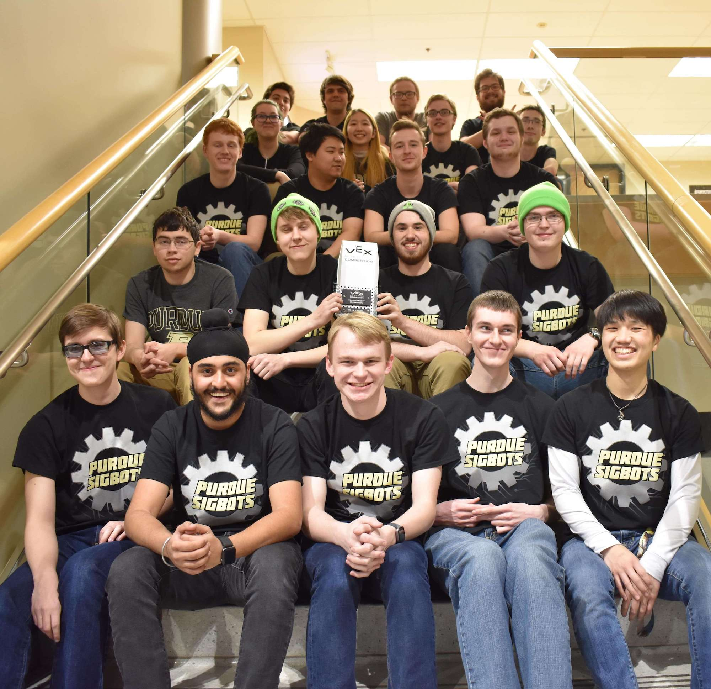

# Welcome!

### Here you'll find electronics and software information that we've made public for the VRC, VEXU, and VEX AI Challenge, everything from [PID Control](software/control-algorithms/pid-controller.md), to [UART](electronics/uart.md). 

This wiki is built on the backs of many SIGBOTS alumni and we are grateful for their contributions to the VEX Community. We will keep this wiki up to date with new products and new knowledge as we head into the next 10 years of SIGBOTS History. New articles on the new VEX AI competition will also be added as we get closer to the launch of a new VEX Competition. 

As always if you have any questions or concerns feel free to contact us at:  [sig.robotics.purdue@gmail.com](mailto:Sig.robotics.purdue@gmail.com)

