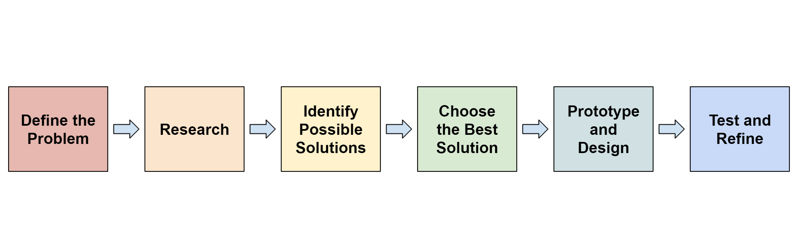

# The Engineering Design Process

## Why Use the Engineering Design Process?

Outside of gaining points on the Design Rubric, using the Engineering Design Process provides an organized method to consistently research and develop solutions based on a defined problem. Following steps to research and choose the best solutions, as well as for planning, building, and testing, provides an organizational structure that is very beneficial towards creating effective solutions.

## Following the Steps:

#### 1. Define the Problem

Simply put, this step consists of stating, clarifying, or determining the problem to be solved. This could be as big as "what should the first design be," or as small as "how to fix the intakes."&#x20;

#### 2. Research

In addition to coming up with original ideas, researching for potential design ideas is essential. Many great designs from previous seasons can serve as inspiration for new ideas in the current season, and it is always worth knowing what other teams might end up doing.

#### 3. Identify Possible Solutions

Starting this step can consist of creating a list of a handful of designs or solutions that have been  researched or created, thoroughly describing each. While having a full robot completely designed is not necessary, being able to completely establish the capability of potential solutions will help tremendously with the next step.

#### 4. Choose the Best Solution

With the information gathered and compiled in previous steps, it is now time to choose which design or solution would solve the proposed problem most effectively. There are many decision matrices that can help with this, in order to thoroughly compare the benefits and drawbacks of each solution in order to determine which is best.&#x20;

#### 5. Prototype and Design

In this step, primary actions will be designing and planning out the solution in much more detail, before finally building or enacting the design. In terms of robot construction, [CAD software](../../vex-cad/making-a-chassis/) can help to construct a fully virtual rendition of a prototype, before spending time and resources building it with real parts. &#x20;

#### 6. Test and Refine

With the completed design or solution, testing is now required to make sure it works. When testing, recording both qualitative data, such as whether or not the robot can score, and quantitative data, such as whether the robot functions consistently, helps to recognize any failure points or inconsistencies to refine. Ideally, repeat this step until every recorded data-point is optimal.

#### 7. Repeat

The Engineering Design Process is not something that should be used once at the start of the season for your robot, nor is it something that should only be used on major iterations. The Engineering Design Process can, and should, be used for all work on the robot, no matter the size. Whether using it for a large-scale iteration of the robot, or for figuring out how to fix drive burnouts, the Engineering Design Process is an essential tool for improving any robot's performance.

### Teams Contributed to this Article:

* [BLRS](https://purduesigbots.com) (Purdue SIGBots)
