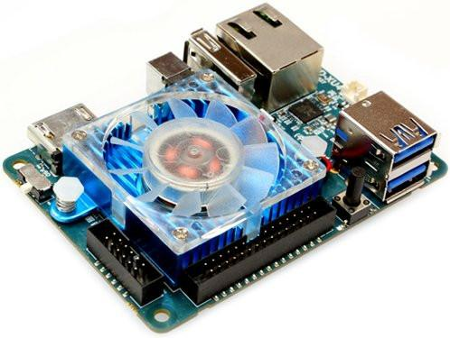
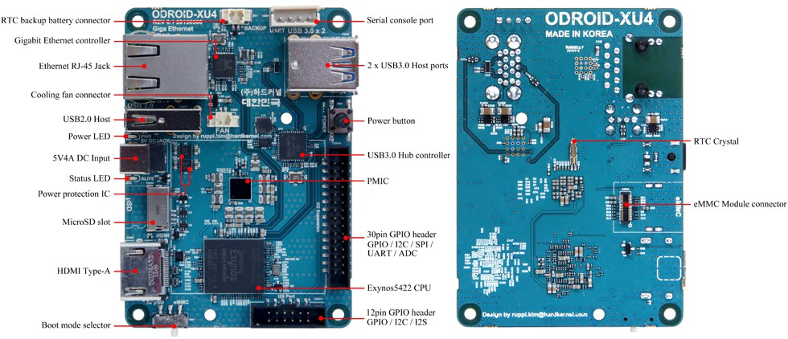

# ODROID-XU4

## Features

The[ ODROID-XU4](https://www.hardkernel.com/shop/odroid-xu4q-special-price/) is a new single board computer with hardware that's more powerful and has a smaller form factor. Built on open-source software, the XU4 supports various flavors of Linux including the latest Ubuntu 18.04 running MATE desktop and Android 4.4 KitKat and 5.0 Lollipop. It has 2 USB 3.0 Host Ports something not all newer boards have. There is however no onboard WIFI or BT. A MicroSD card or an eMMC module is required to boot the OS. It features a 30 pin [GPIO](../gpio.md) header with support for [I2C](../../i2c.md), [SPI](../../spi.md), [UART](../../uart.md), and [ADC](../analog-digital-converter.md). And a smaller 12 pin [GPIO](../gpio.md) header with only [I2C](../../i2c.md) and I2S.

## Specifications

| Processor | Samsung Exynos5422 ARM® Cortex™-A15 Quad 2.0GHz/Cortex™-A7 Quad 1.4GHz |
| :--- | :--- |
| Memory | 2Gbyte LPDDR3 RAM PoP \(750Mhz, 12GB/s memory bandwidth, 2x32bit bus\) |
| 3D Accelerator | Mali™-T628 MP6 OpenGL ES 3.1 / 3.0 / 2.0 / 1.1 and OpenCL 1.2 Full profile |
| Audio | HDMI Digital audio output. Optional USB sound card |
| USB3.0 Host | SuperSpeed USB standard A type connector x 2 port |
| USB2.0 Host | HighSpeed USB standard A type connector x 1 port |
| Display | HDMI 1.4a with a Type-A connector |
| Storage \(Option\) | eMMC module socket : eMMC 5.0 Flash Storage \(up to 64GByte\) MicroSD Card Slot \(up to 128GByte\) |
| Fast Ethernet LAN | 10/100/1000Mbps Ethernet with RJ-45 Jack \( Auto-MDIX support\) |
| WiFi \(Option\) | USB IEEE 802.11 ac/b/g/n 1T1R WLAN with Antenna \(External USB adapter\) |
| HDD/SSD SATA interface \(Optional\) | SuperSpeed USB \(USB 3.0\) to Serial ATA3 adapter for 2.5″/3.5″ HDD and SSD storage |
| Power Input | 4.8Volt~5.2Volt  \(5V/4A Power supply is recommended\) |
| System Software | Ubuntu 16.04 + OpenGL ES + OpenCL on Linux Kernel 4.14 LTS Android 4.4.2 on Kernel LTS 3.10 Android 7.1 is available as a community driven OS development. Full source code is accessible via our Github. |
| Size | 83 x 58 x 20 mm \(weight: 38gram\) without cooler approx |


This section below is for the original ODROID-XU


| **Architecture:** 32-bit [Cortex-A15](http://www.arm.com/products/processors/cortex-a/cortex-a15.php/) |
| :--- |
| **Processor:** [Exynos 5 Octa](http://www.samsung.com/global/business/semiconductor/minisite/Exynos/products5octa.html/) _\(quad-core\)_ |
| **Languages:** C, C++, Many others |
| **Clock:** 1.6 GHz |
| **Vcore:** 1.2 V |
| **Vio:**1.8 V |
| **Power:** 7 W |
| **Flash:** MicroSD Card |
| **RAM:** 2048 MB |
| **GPIO:** 10? _\(none_ [_5 Volt Tolerant_](https://github.com/theol0403/BLRS-Wiki/tree/d5c517253c2e4369a647e51e200d5175ad2be2ea/w/wiki/ee/5_volt_tolerant/README.md)_\)_ |
| **Peripherals:** 2x USB 3.0, 4x USB 2.0, Mini-HDMI, DisplayPort, 3.5mm audio out, Ethernet, [UART](https://github.com/theol0403/BLRS-Wiki/tree/d5c517253c2e4369a647e51e200d5175ad2be2ea/w/wiki/ee/uart/README.md) |

The ODROID-XU is the first development board for the ARM Cortex-A15 platform available for sale, featuring the big.LITTLE architecture [\(ref\)](http://www.arm.com/products/processors/technologies/biglittleprocessing.php) which allows an outstanding standby power usage of less than 3 W, yet unprecedented quad-core Cortex-A15 power on demand at a unit cost of only $170 before shipping.

### Features

A diagram of the **ODROID-XU** with all ports labelled

The ODROID-XU is smaller than many competing platforms at about 95 x 70 mm [\(ref\)](http://www.hardkernel.com/renewal_2011/products/prdt_info.php?g_code=G137510300620&tab_idx=2) and comes with its own protective plastic case. At low speeds, four ARM Cortex-A7 cores at 1.2 GHz handle system tasks with a low power consumption of under 3 W; when these cores surpass a predefined CPU usage threshold, four ARM Cortex-A15 cores transparently take over at runtime to boost performance. A small variable speed cooling fan operates whenever the Cortex-A15 cores switch on, which can be quite noisy at high loads. The ODROID-XU lacks a hard drive but can be equipped with either a microSD card [\(ref\)](http://www.amazon.com/SanDisk-Ultra-Class-Memory-SDSDU-016G-U46/dp/B007BJHETS/ref=sr_1_4/187-6017561-5043339?ie=UTF8&qid=1382319410&sr=8-4&keywords=sandisk+ultra) or a much faster eMMC module [\(ref\)](http://www.hardkernel.com/renewal_2011/products/prdt_info.php?g_code=G137454882497).

Unlike competing platforms such as the [BeagleBoard](https://github.com/theol0403/BLRS-Wiki/tree/d5c517253c2e4369a647e51e200d5175ad2be2ea/w/wiki/ee/beagleboard/README.md) and [PandaBoard](https://github.com/theol0403/BLRS-Wiki/tree/d5c517253c2e4369a647e51e200d5175ad2be2ea/w/wiki/ee/pandaboard/README.md), the ODROID-XU ships with a mostly ready-to-run version of Ubuntu [\(ref\)](http://forum.odroid.com/viewforum.php?f=61&sid=a7e701b4e15d534864cff67192073c71) which has well-implemented drivers for the on-board peripherals. No USB bandwidth issues plague the ODROID-XU in stark contrast to the USB implementations on other ARM development boards. The onboard USB 3.0 port is up to the challenge of a high-performance USB flash drive or a Microsoft [Kinect](https://github.com/theol0403/BLRS-Wiki/tree/d5c517253c2e4369a647e51e200d5175ad2be2ea/w/wiki/ee/kinect/README.md).

### Usage

The ODROID-XU's stellar performance combined with only marginally higher power consumption allows it to easily supersede past development boards used by Purdue SIGBots. Starting with VEX Toss Up, Purdue SIGBots is using two ODROID-XU units, one on Atlas and one on Prometheus, to handle the algorithms required for Microsoft Kinect data processing for [Object Recognition](../../../software/object-recognition/). Two additional cores, double the RAM, and a much higher clock speed allow for simultaneous processing of the 3-D image with the color channel, and the USB 3.0 port opens up a possible increased image capture resolution.

### Teams Contributed to this Article:

* [BLRS](https://purduesigbots.com/) \(Purdue SIGBots\)

