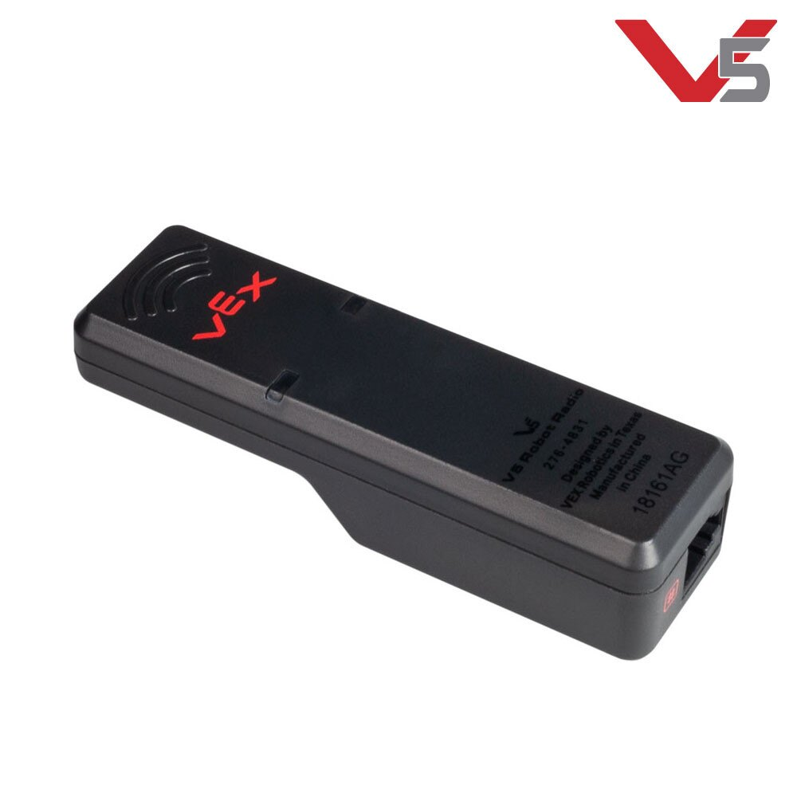

# VEXnet and V5 Robot Radio

The V5 Robot Radio and V5 Controller use the VEXnet 3 protocol, VEXnet 3 supports 500 simultaneous robot channels. 

Both V5 radios also support Bluetooth 4.2, it uses the Texas Instruments CC2640 Bluetooth Smart Wireless MCU. With this, tablets will be able to download programs to the Robot Brain. This also allows connectivity to multiple devices at once. Future updates will add Robot-to-Robot communications. VEXnet 3 and Bluetooth can be used for driving, downloading, and debugging. Controllers can be tethered together for dual driver support.


This section refers to the old VEXnet for Cortex which is no longer competitive.


 A **VEXnet** _2.0_ key used for wireless communication

**VEXnet** is a wireless robot communications system developed by VEX Robotics. It replaced the 75 MHz crystal system originally used with the PIC Microcontroller and was designed to work with the [VEX Cortex](/w/wiki/ee/cortex/). A later VEXnet Upgrade \(\([http://www.vexforum.com/wiki/index.php/VEXnet\_Upgrade\)](http://www.vexforum.com/wiki/index.php/VEXnet_Upgrade%29)\) was released for a brief period of time to upgrade older PIC microcontrollers to the new standard.

## Protocol \(2.0\)

After the obsolete WiFi radio used in the VEXnet 1.0 key was discontinued, VEXnet 2.0 uses a custom 2.4 GHz radio based on the TI CC2544 and CC2591 \(\([http://www.vexforum.com/showpost.php?p=345684&postcount=64\)](http://www.vexforum.com/showpost.php?p=345684&postcount=64%29)\). To increase connection reliability, paired keys are split up into three groups of channels \(\([http://www.vexforum.com/showpost.php?p=344554&postcount=47\)](http://www.vexforum.com/showpost.php?p=344554&postcount=47%29)\): _Pit_ \(264 channels\), _Competition_ \(80 channels\), and _Debug_ \(24 channels\). In practice, the number of connection failures is dramatically less than VEXnet 1.0; a USB A to A cable may be substituted for both USB keys to run robots on a tether.

Wireless programming, while less likely to drop, has additional issues as VEXnet 2.0 must re-link on a debug channel if switched out of regular mode. The extra delays cause headaches for the [PROS](/w/wiki/cs/pros/) flash utility, and a possible issue with invalid downloads has yet to be resolved. VEXnet communications must also deal with the initial delay, and the maximum sustained upload rate from Cortex to the PC is lower than VEXnet 1.0 \(\([http://www.vexforum.com/showpost.php?p=352457&postcount=204\)](http://www.vexforum.com/showpost.php?p=352457&postcount=204%29)\) at just 2 KB/sec. On the plus side, download speeds are higher at 3 KB/sec compared to 2.5 KB/sec for VEXnet 1.0.

 A **VEXnet** _1.0_ key used for wireless communication

## Protocol \(1.0\)

VEXnet uses a standard 802.11g wireless USB key \(\([http://www.vexrobotics.com/276-2245.html\)](http://www.vexrobotics.com/276-2245.html%29)\) as the competition control system; it thus carries the advantages of a standard, fairly reliable communications protocol. Although standard features such as Media Access Control are used by VEXnet, no recognizable 802.11 wireless signal is produced and regular computers cannot join the network. A USB A to A cable may be substituted for both USB keys to run robots on a tether.

The [VEX Joystick](/w/wiki/ee/joystick/) is only powered by six standard AAA batteries, so the high current draw of a full wireless protocol often exhausts the joystick power in only a few days. Despite the fact that the underlying protocol is supposedly reliable, VEXnet does drop communications from time to time \(\([http://content.vexrobotics.com/docs/VEXnet\_Cortex\_UserGuide\_081811.pdf\)](http://content.vexrobotics.com/docs/VEXnet_Cortex_UserGuide_081811.pdf%29)\), which can cause catastrophic robot failures if during a match. VEXnet wireless has even more issues when programming wirelessly, although a [Powered Programming Adapter](/w/wiki/ee/powered_programming_adapter/) helps mitigate these problems.

It may be possible to spoof or interfere with VEXnet communications, but no [research](/w/wiki/cs/behind_the_scenes/) has yet been done.

## Robot Communication

**VEXNet** can be used for bidirectional serial debug communication, opening the possibility of communicating between two robots \(possibly even in a match\). In order to ensure reliable communications, only printable ASCII characters should be sent at 115200 baud, and the RTS flow control line must not be asserted during communications. A space \(ASCII 0x20\) _must_ be sent to initially open the channel; programs using VEXnet communication should repeatedly send spaces until a connection is established.

A simple, robust protocol has been developed by Purdue SIGBots to handle these limitations while ensuring reliability. This protocol can send variable length packets and is thus also useful on [UART](/w/wiki/ee/uart/) or [SPI](/w/wiki/ee/spi/) communications to send bunches of data. Example communication to send the data "A" is shown below:

| Index | Value | Description |
| :--- | :--- | :--- |
| ''0-1'' | ''0xAA\\ 0x55 "U"'' | Byte values with the most number of bit toggles. 0xAA is not actually printable, but it is unique from any other character in the packet. |
| ''2-3'' | ''0x30 "0"\\ 0x31 "1"'' | The number of bytes in the data packet encoded as two ASCII hex digits. This is **not** the number of bytes remaining to read.\\ As the data is Base64 encoded, the number of bytes to read \(excluding checksum\) is ''ceiling\(4 \* length / 3\)'' |
| ''4-7'' | ''0x51 "Q"\\ 0x51 "Q"\\ 0x3D "="\\ 0x3D "="'' | The data payload, Base64 encoded. The Base64 protocol also encodes the data's true length; this should be used to check the length byte. |
| ''8-9'' | ''0x30 "0"\\ 0x30 "1"'' | The checksum byte encoded as two ASCII hex digits, which should be equal to the XOR of all the data byte values _including the length bytes_.\\ Beware of [sign extensions](/w/wiki/cs/sign_extension/) when checking. |

As the overhead of this protocol is substantial for small packets, larger packet sizes should be used to group data as appropriate.

## Hardware

To ease the connection of two VEX Joysticks in a competition situation and improve the reliability of the connection, a VEXnet shield was developed for a [Netduino](/w/wiki/ee/netduino/). This device uses a logic level translator \(\([http://www.ti.com/product/txb0104\)](http://www.ti.com/product/txb0104%29)\) to switch the VEX Joystick signals to 3.3 V, which are subsequently mirrored by the Netduino from one joystick to another. However, the Netduino has full control over the bytes passed, and can send space bar characters to re-open communications or output debug information to an attached LCD \(\([http://www.pololu.com/product/356\)](http://www.pololu.com/product/356%29)\). The Netduino can draw power from micro USB, a wall-wart, or either VEX Joystick; in addition, a joystick with low power can be powered in an emergency with the power override switch from the shield.Last Author[baylessj](/p/baylessj/)Last EditedAug 25 2017, 8:29 PM

