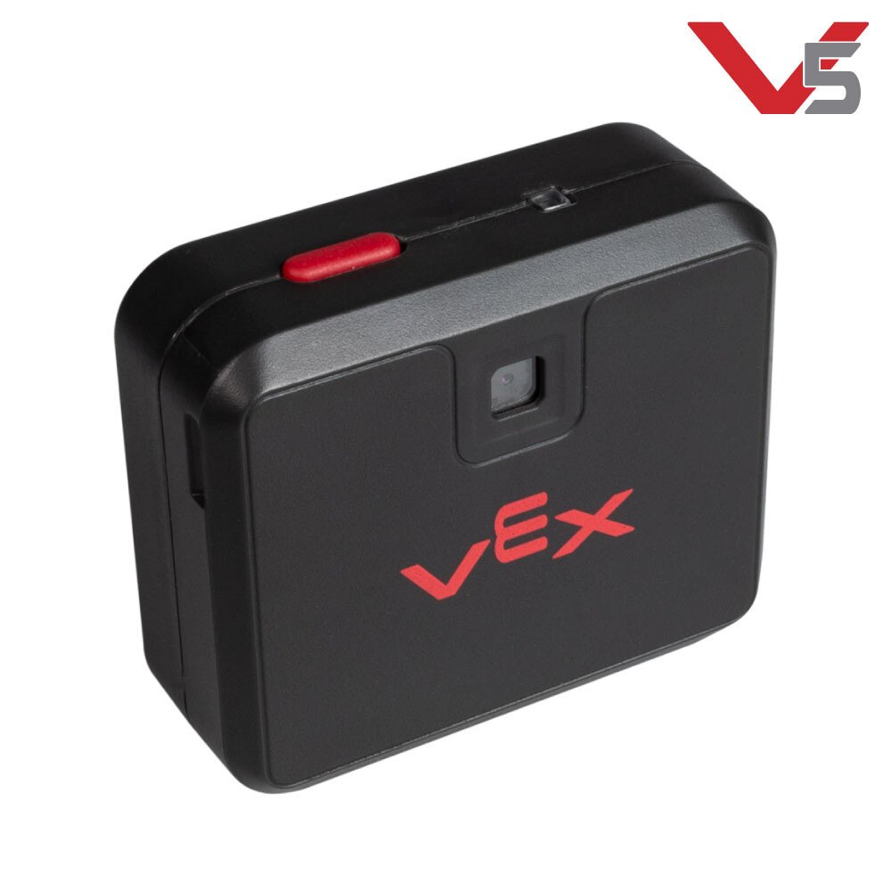

# Vision Sensor

## Features

At its most basic mode, the sensor tells you where a colored object is located. The location's X value gives you the right and left position. When the camera is tilted down, the Y value gives you the distance to the object, with a little basic trigonometry on your part.

The Vision Sensor combines a dual ARM Cortex M4+M0 processor, color camera, WiFi, and USB into a single sensor. The sensor can be trained to locate objects by color. Every 200 milliseconds, the camera provides a list of the object found matching up to eight unique colors. The object’s height, width, and location is provided. Multi-colored objects can also be programmed, allowing color codes to provide new information to the robot. Color-codes can represent anything you want, including location, object type, street signs, movement instructions, robot identifiers, etc. The Vision Sensor has USB for a direct connection to your computer. The Vision Sensor also has WiFi Direct and acts like a web server. This allows you to wirelessly view “live” video from any computer equipped with a browser and WiFi.

## Specifications

|  **V5 Vision Sensor** |  |
| :--- | :--- |
| Vision Framerate | 50 Frames per second |
| Color Signatures | 7 independent colors |
| Color Codes | 2 3 or 4 color signatures per color code |
| Image Size | 640 x 400 pixels |
| Microcontroller | Dual ARM Cortex M4 and M0 |
| Connectivity | V5 Smart Port IQ Smart Port USB Micro |
| Wireless | 2.4 GHz 802.11 Wi-Fi Direct hotspot with built in webserver |
| Compatibility | Any device with WiFi and a Browser |
| Weight | 0.77lbs \(350g\) |

#### Teams Contributed to this Article:

* [BLRS](https://purduesigbots.com/) \(Purdue SIGBots\)

