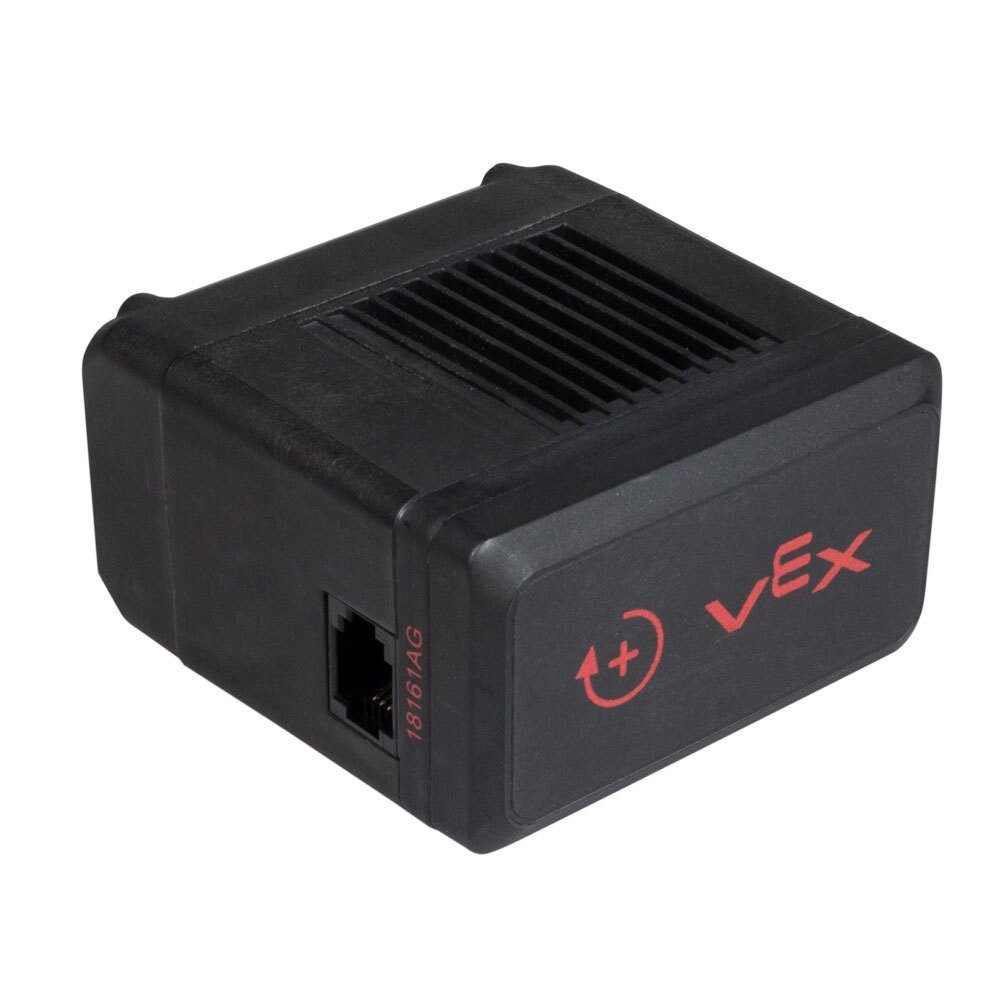
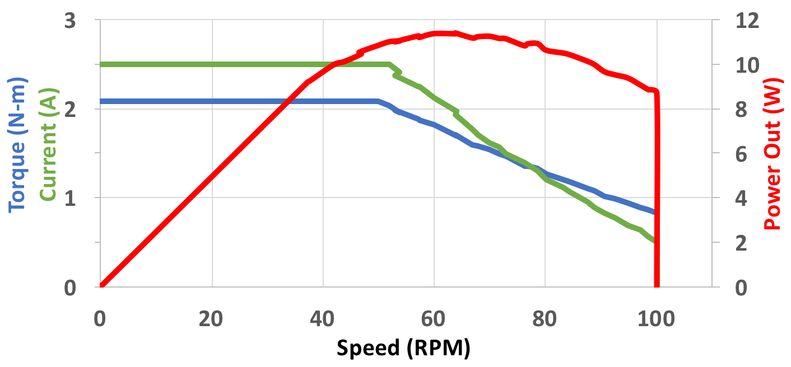
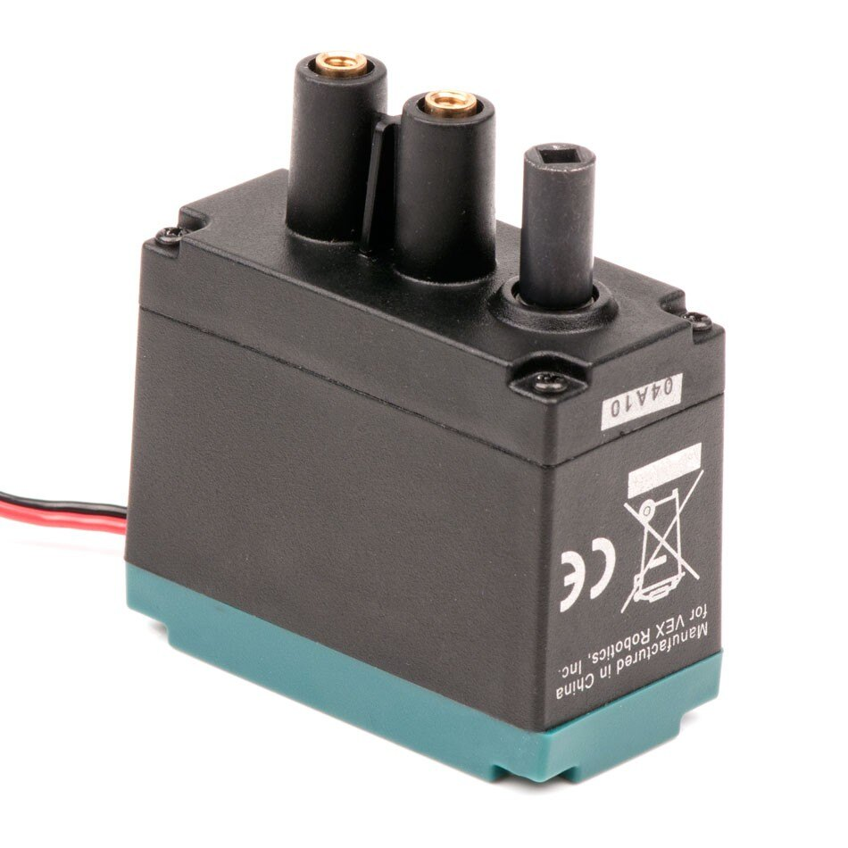

# VEX Motors

A VEX motor converts stored electrical energy from the [VEX battery](vex-battery.md) into mechanical motion, and is controlled by the [V5 Brain](vex-v5-brain/).

Maximum power is 11W continuous and maximum torque is 2.1 Nm. Free speed is software-limited by the motor’s processor to keep consistent performance motor-to-motor and to allow top speed under loads. Metal gears are used in all high torque locations for strength. Plastic gears are used in the low load, high speed locations for smooth and efficient operation. An internal gear cartridge is user changeable for output gear ratios of 6:1, 18:1, and 36:1. The motor’s internal circuit board has a full H-Bridge and its own Cortex M0 microcontroller to measure position, speed, direction, voltage, current and temperature. The microcontroller runs its own [PID](../../../software/control-algorithms/pid-controller.md) with velocity control, position control, torque control, feedforward gain, and motion planning. [PID](../../../software/control-algorithms/pid-controller.md) is internally calculated at a 10 millisecond rate. The motor’s [PID](../../../software/control-algorithms/pid-controller.md) values are pre-tuned by VEX for performance across all operating conditions.

[Stall](../../general/stalling.md) current is limited to 2.5A to keep heat under control without affecting peak power output. Limiting [stall](../../general/stalling.md) current eliminates the need for automatic resetting fuses \([PTC devices](../../general/resettable-fuse-ptc.md)\) in the motor, which can cause unintended motor outages. The 2.5A limit essentially removes the undesirable region of the motor’s performance curve, ensuring users do not unintentionally create stall situations. Finally, to make sure the motor lasts, the internal temperature is monitored. If a motor is approaching an unsafe temperature, the user gets a warning. If the motor reaches its temperature limit, performance is automatically reduced to ensure no damage occurs.

## Specs

|  | **V5 Smart Motor Specifications** |
| :--- | :--- |
| Speed | Approximately 100, 200 or 600 rpm |
| Peak Power | 11 W |
| Continuous Power | 11 W |
| Stall Torque \(with 100 RPM cartridge\) | 2.1 Nm |
| Low Battery Performance | 100% Power Output |
| Feedback | Position Velocity \(calculated\) Current Voltage Power Torque \(calculated\) Efficiency \(calculated\) Temperature |
| Encoder | 1800 ticks/rev with 36:1 gears 900 ticks/rev with 18:1 gears 300 ticks/rev with 6:1 gears |
| Dimensions | 2.26” W x 2.82” L x 1.30” H 57.3 mm W x 71.6 mm L x 33.0 mm H |
| Weight | 0.342 lbs 155 grams |

## Troubleshooting

One on the main issues that arises with the VEX V5 motors are dead motors. Many times this means that a motor stops working often without any notice. Sometimes the led in port compartment of a motor may flash red. This could be sign that the motor is dead or there is a loose wire connection. A good idea to make sure a motor is dead is to test it with another wire and if possible test is with another [V5 Brain](vex-v5-brain/). If these steps are unsuccessful there is as of right now no reproducible method of fixing a dead motor.

## Old Vex Cortex Motors


This section refers to the old VEX Cortex Motors which are no longer competitive.


Two-wire motors such as the 393 can be connected directly to the VEX Cortex by using one of the 2-wire motor connection ports. These motors can also be connected to a 3-wire port on either the Cortex or the VEX PIC Microcontroller by using a [VEX Motor Controller](../legacy/motor-controller.md). They also include internal [resettable fuses](../../general/resettable-fuse-ptc.md) that replace the now discontinued clutch that was needed to protect a 3-Wire Motor during a [stall](../../general/stalling.md).

While one might be tempted to design a mechanism based on the rated "stall" torque or free speed of the motor, **these are not actually realistic specifications**. For the most commonly used motors, the torque and speed at the points of maximum efficiency, power, and torque are listed. For the longest life and least power loss, motors should operate between the _maximum efficiency_ and _maximum power_ points during typical circumstances, with anything exceptional detected quickly by [operators](../../../software/competition-specific/operator-control.md) or autonomous code. While running motors at the "maximum torque" operating point should not cause lasting damage, it wastes power and risks performance loss or a stall during routine operation.

Unfortunately, due to their nature, all VEX motor types are known to both cause and be affected by [Line Noise](../../general/line-noise.md).

The main workhorse of the VEX motion lineup, the **2-Wire Motor 393** is larger and has approximately 60% more torque than the visually similar 2-Wire Motor 269. These motors are primarily used in drive trains or heavy lifting scenarios. Only 4 motors of this type were allowed per robot in and before VEX Gateway, but in VEX Sack Attack and later, no restrictions are placed on the usage of this motor. Its high [Power Consumption](../../general/power-consumption.md) under load may cause problems if several 2-wire Motor 393s are used at the same time.

Despite the higher current consumption, these motors are more efficient and robust than the 2-Wire Motor 269 and actually consume less power for a given torque output than any similar motor. Care must only be taken that a [stall is detected](../../../software/general/stall-detection.md) quickly.

The stock internal gears of the 2-Wire Motor 393 can be replaced with another set of "high speed" gears included with the motor. This reduces the output torque to the equivalent of a 2-Wire Motor 269, but increases the speed to 160 rpm, making it the fastest motor currently in production. Sets of replacement gears for both the low-speed and high-speed options are available separately as well.

| Operating Point | Speed | Torque | Current |
| :--- | :--- | :--- | :--- |
| Free \(no load\) | 100 rpm _\(160 rpm\)\*_ | 0 **in**∗lbs | 0.15 A |
| Maximum Efficiency | 75 rpm _\(120 rpm\)\*_ | 3.7 **in**∗lbs _\(2.25 **in**∗lbs\)\*_ | 1.4 A |
| Maximum Power | 50 rpm _\(80 rpm\)\*_ | 6.7 **in**∗lbs _\(3.5 **in**∗lbs\)\*_ | 2.5 A |
| Maximum Torque | 40 rpm _\(64 rpm\)\*_ | 9.0 **in**∗lbs _\(4.3 **in**∗lbs\)\*_ | 3.0 A _\(fuse trips eventually\)_ |
| Stall | 0 rpm | 13.5 **in**∗lbs _\(8.4 **in**∗lbs\)\*_ | 4.8 A _\(fuse trips quickly\)_ |

_\* Indicates specifications when using the "high speed" internal gearing option_

All motor specifications are at 7.2 volts. Actual motor specifications can fall within 20% of the values above.

### Teams Contributed to this Article:

* [BLRS](https://purduesigbots.com/) \(Purdue SIGBots\)

