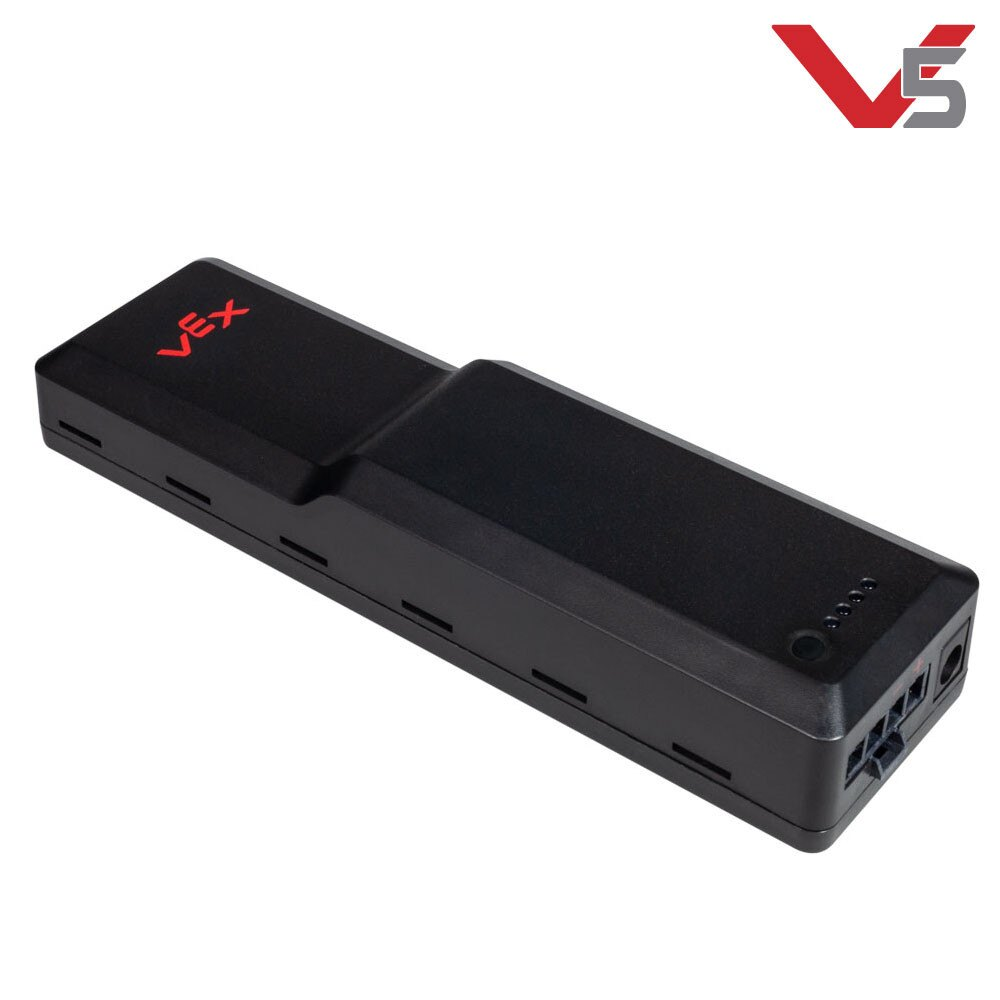
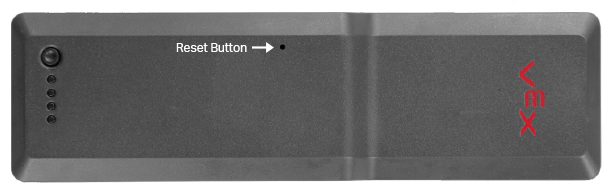

# VEX Battery

The V5 Robot Battery Li-Ion 1100mAh was designed to run ten [V5 motors](motors.md) at full power continuously. The V5 Robot Battery has a higher 12.8v nominal voltage. The battery charges up to 14.6v and runs down to 10v. Due to the very steady output voltage of these batteries, the [V5 Brain](vex-v5-brain/) cannot determine remaining capacity using the typical method of measuring voltage and estimating capacity. Instead, the V5 battery pack has an battery management system that measures changes in electrical charge \(coulombs\) into and out of the battery during charge and discharge. From this data, the battery determines the actual amount of remaining power.

Competition teams should be able to use one Robot Battery for 2 or 3 matches without recharging. Remember that with [V5](vex-v5-brain/), a low battery does not change the motor’s performance. The V5 Battery can output 20 amps continuously, providing enough power to run 10 motors at peak power output.

## Specifications

|  | **V5 Robot Battery Li-Ion 1100mAh** |
| :--- | :--- |
| Battery Chemistry | Lithium Iron \(LiFePO4\) |
| Approx Lifespan | 2000 full recharge cycles |
| Nominal Voltage | 12.8 Volts |
| Maximum Current | 20 Amps |
| Maximum Output Power | 256 Watts |
| \# Motors at Peak Power | 10 |
| Low Battery Performance | Motors output 100% Power |
| Capacity | 14 Wh |
| Weight | 0.77lbs \(350g\) |

## Troubleshooting

On of the main issues that has been noted with V5 batteries is the flashing red lights issue. Sometimes while charging or using a V5 battery a loss of power will occur and the battery LEDs will flash red. The V5 Battery LED codes can be seen [here](https://kb.vex.com/hc/en-us/articles/360035589652). The current steps to solve this problem are to first allow the battery to charge to full capacity. If this doesn't solve the problem another solution could be to update the firmware [using the firmware updater](https://www.vexrobotics.com/vexedr/products/firmware). And lastly a hardware reset of the battery by inserting a paperclip into the reset hole.


This section refers to the old VEX Cortex Battery which is no longer competitive.


VEX manufactures a wide variety of **VEX batteries**, but the only model still in wide use is the 7.2 V, 3 Ah NiMH robot battery. The VEX Joystick now uses standard AAA batteries of any chemistry, and power can optionally be provided to either the joystick or using USB over [VEXnet](vexnet.md).

### Characteristics

The 7.2V VEX battery is a moderate-quality 6-cell NiMH pack , weighing in at about 350 grams and coming with a standard Tamiya polarized power connector compatible with the [VEX Cortex](../legacy/vex-cortex.md) and pic. It is designed for powering most of a single VEX robot; a [Power Expander](../legacy/power-expander.md) may be used to add a second battery to the robot for high-current loads, and a third battery may be added under VEX Robotics College Challenge rules to power External Sensors.

As stated on the package, the nominal output voltage is 7.2 V. However, the voltage actually begins much higher, at up to 8.0 V when fully charged, and can be measured between 7.6 V and 7.0 V for most of the discharge cycle. Note that the battery's voltage measured when unplugged, as what one might obtain using a voltmeter or battery charger, is higher than the voltage that will be displayed under load. Sudden loads such as the startup or [stall](../../general/stalling.md) of a [Motors](motors.md) may drop the voltage lower; if a backup battery is not installed, this may cause a reset of the [VEX Cortex](../legacy/vex-cortex.md) or pic.

A NiMH charger compatible with **VEX batteries**

The battery's nominal capacity is 3000 mAh or 3 Ah, dictating that in theory the battery will provide 3000 mA \(3 A\) for one hour, 1500 mA for two hours, or 6000 mA for 30 minutes. In practice, the capacity decreases with higher current draw, so that one might get closer to 20 minutes of runtime at 6 A. However, discharge at such high rates will reduce the battery's overall lifespan, and will generate excess heat. Tests have measured around 83 milliohms of internal impedance, which is average for a NiMH battery but much higher than what is commonly accepted in similar battery packs used for electric car racing.

### Precautions

When in doubt, **check it out**!

This battery must be charged with a NiMH compatible charger, not a NiCd or lithium device. Batteries should not be stored in hot or cold conditions, and should be removed from robots during storage. A fresh battery measures at about 7.8 - 8.0 V open-circuit, whereas anything under 7.4 V should be charged before use in a robot.

The VEX batteries have high self-discharge rates; a battery charged one day may be dead after only a few weeks on the shelf. When in doubt, measure the voltage and charge accordingly. Battery lifespan is increased by occasional refresh cycles and lower charging currents \(but higher charging currents charge faster\).

### Usage

Batteries are traditionally mounted on VEX robots using battery straps. However, this is slow to switch and cumbersome to install. A better solution comes from using a slightly modified rack and pinion gearbox with a rotating latchable top to hold the battery securely in place, yet allow fast swapping in under five seconds.

