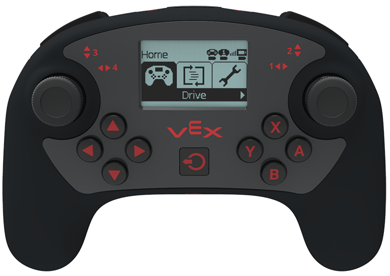

# VEX Controller

The V5 Controller has a monochrome LCD screen. The screen allows users to start and stop programs remotely, view the robot’s battery level, and see the radio’s status. During competition, drivers and tethered co-drivers can see the competition clock and game state. Programmers can send data and multilingual text to the screen for debugging and driver information.

The Controller uses an internal rechargeable battery with a 10 hour run time. Charging is done via a micro USB cable, and takes about 1 hour.

## **Features**

* Two Smart Ports are used for tethering to the Brain and Tethering two Controllers.
* One Field Control port for competitions
* USB for charging and for wireless programming and debugging
* 12 buttons are fully configurable by the user’s programs
* Buttons are also used for menu navigation when a program is not running
* Two 2-axis joysticks for robot control

## Specifications

|  | **V5 Controller Specifications** |
| :--- | :--- |
| User Interface | Built-in monochrome LCD 128 x 64 pixels Backlight with white or red LEDs |
| Interface Features | Select, Start, Stop Programs Robot and Controller and Partner battery level Radio link type and signal strength Competition mode indication Language selection \(10 choices\) |
| User Feedback | Up to \(3\) lines of multilingual text to the LCD Up to \(3\) graphical widgets with \(1\) line of text |
| Wireless | VEXnet 3.0 and Bluetooth 4.2 Download and Debug at 200 kbps |
| Analog Axis | 2 Joysticks |
| Buttons | 12 |
| Extra Feature | Haptic rumble motor |
| Battery Type | Li-ion |
| Battery Run Time | 8-10 hours |
| Battery Charge Time | 1 hour |
| Partner Controller Type | V5 Controller |
| Weight | 0.77lbs \(350g\) |

## Troubleshooting

Some of the known issues with the V5 Controller are disconnects and freezes. In most situations these problems can be solved by using a paperclip or screwdriver to press in the reset button on the back of the controller. If this doesn't solve the problem another solution could be to update the firmware [using the firmware updater](https://www.vexrobotics.com/vexedr/products/firmware).


This section refers to the old VEX Cortex Controller which is no longer competitive.


The **VEX Joystick** \(\([http://www.vexrobotics.com/276-2192.html\)](http://www.vexrobotics.com/276-2192.html%29)\) is the principal human interface for a VEX robot since the introduction of [VEXnet](https://github.com/theol0403/BLRS-Wiki/tree/1a2da1c73039274a2ed05a8c941d9ebf94bcac97/w/wiki/ee/vexnet/README.md). It replaces the bulky 75 MHz transmitter module with a smaller controller resembling a typical PC joystick.

## Features

Two directional thumb sticks, a three-axis accelerometer, and up to twelve buttons are available for the user \(\([http://www.vexforum.com/wiki/index.php/VEXnet\_Joystick\)](http://www.vexforum.com/wiki/index.php/VEXnet_Joystick%29)\) in [Operator Control](https://github.com/theol0403/BLRS-Wiki/tree/1a2da1c73039274a2ed05a8c941d9ebf94bcac97/w/wiki/cs/operator_control/README.md) mode. Each thumb stick is composed of two axes which return numbers from -127 to 127 with a resolution of two to three units, and two sets of four buttons along with two dual triggers return 1 if pressed and 0 if not pressed. Joystick inputs are still transmitted \(but are usually restricted by the firmware\) during the autonomous mode.

NiMH rechargeable batteries perform much better than alkaline batteries in high-current applications like the **VEX Joystick**

A VEXnet key or USB A to A cable may be plugged into a USB port on the back of the device; the USB cable can be used to tether a robot or to upgrade the Joystick firmware. An 8-pin RJ-45 jack on the top connects to a [VEX Competition Switch](https://github.com/theol0403/BLRS-Wiki/tree/1a2da1c73039274a2ed05a8c941d9ebf94bcac97/w/wiki/ee/competition_switch/README.md) or VEX Field Control adapter to switch the robot between [autonomous\_code](https://github.com/theol0403/BLRS-Wiki/tree/1a2da1c73039274a2ed05a8c941d9ebf94bcac97/w/wiki/cs/autonomous_code/README.md) and driver control. A six-pin RJ-14 adapter is available for transferring programs or optionally power through a [Powered Programming Adapter](https://github.com/theol0403/BLRS-Wiki/tree/1a2da1c73039274a2ed05a8c941d9ebf94bcac97/w/wiki/ee/external_sensors/powered_programming_adapter/README.md). Lastly, a four-pin RJ-11 adapter is used for connecting a second joystick, which can be operated as a slave to allow two operators to control a robot.

The VEX Joystick accepts six AAA batteries accessible via a back cover; the high current consumption of an active wireless VEXnet key limits battery life. To preserve battery power, use of tethering, a wall adapter, or a powered programming adapter is highly encouraged when possible.

A substantially less expensive version \(\([http://www.vexrobotics.com/276-1891.html\)](http://www.vexrobotics.com/276-1891.html%29)\) of the VEX Joystick is available as the **VEX Partner Joystick**. It lacks VEXnet or [VEX Competition Switch](https://github.com/theol0403/BLRS-Wiki/tree/1a2da1c73039274a2ed05a8c941d9ebf94bcac97/w/wiki/ee/competition_switch/README.md) functionality and must be connected using an RJ-11 telephone cord to a functioning joystick's partner port for operation.

## Troubleshooting

_Main article:_ [_VEX Cortex Troubleshooting_](https://github.com/theol0403/BLRS-Wiki/tree/1a2da1c73039274a2ed05a8c941d9ebf94bcac97/w/wiki/ee/cortex/README.md)

The VEX Joystick's lights mirror the robot lights when connected. If all of the lights blink red briefly, it indicates a joystick reset, which usually occurs upon loss of VEXnet communications. Frequent occurrences may mean a weak battery or a VEXnet key blocked by too many metal parts.

### Teams Contributed to this Article:

* [BLRS](https://purduesigbots.com/) \(Purdue SIGBots\)

