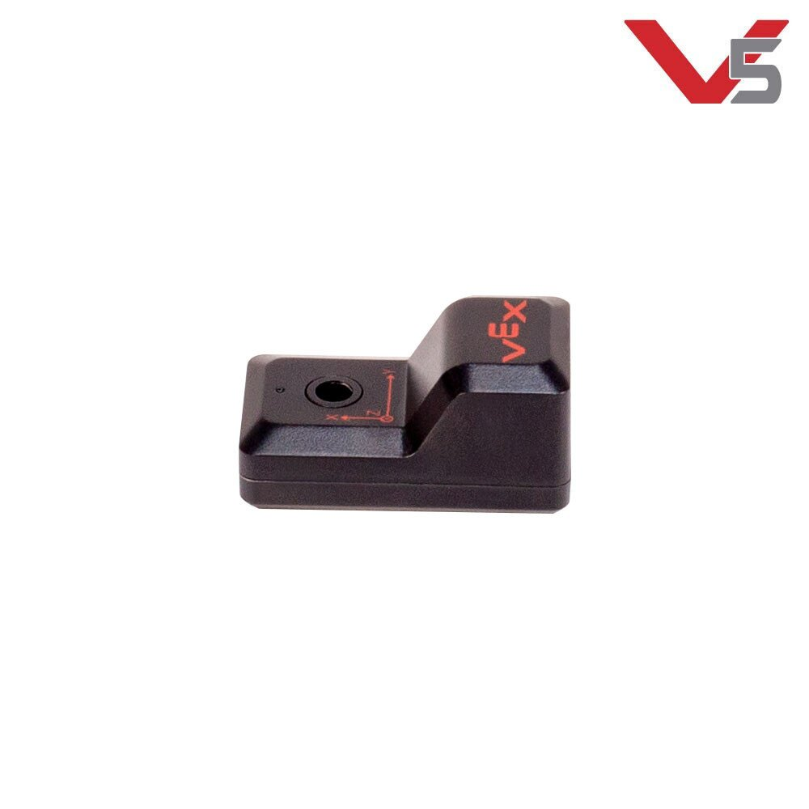

# V5 Inertial Sensor \(IMU\)

The Inertial Sensor is a combination of a 3-axis \(X, Y, and Z\) [accelerometer](accelerometer.md) and a 3-axis [gyroscope](gyroscope.md). The accelerometer will detect a change in motion \(acceleration\) in any direction and the [gyroscope](gyroscope.md) electronically maintains a reference position so it can measure a rotational change of position in any direction against this reference. A detection of a change in motion can help decrease the chance of a robot falling over when it is driving or while it is climbing over an obstacle.

The housing of this sensor has a single mounting hole which allows it to be easily mounted to the robot’s structure. In addition, there is a small indentation in front of the mounting hole which marks the sensor’s reference point. On the bottom of the housing, there is a round boss which is sized to be inserted into a square hole of a piece of structural metal. This will keep the sensor fixed to its attachment point. On the back of the sensor housing is a V5 Smart Port.

Both the [accelerometer](accelerometer.md) portion and the [gyroscope](gyroscope.md) portion of this sensor produce a smart signal feedback to the V5 Brain.

\*\*\*\*[**Accelerometer**](accelerometer.md)**:** The [accelerometer](accelerometer.md) measures how fast the sensor changes its motion \(accelerates\) along the X-axis, the Y-axis, and/or the Z-axis. These axis are determined by the orientation of the Inertial sensor. For example, one orientation could have a robot’s X-axis as its forward and backward motion, its Y-axis as its side to side motion, and its Z-axis as its up and down motion \(such as the robot lifting itself up off the field on a suspension pole\).

The [accelerometer](accelerometer.md) measures a change in motion when its internal electronics detect a change in inertia and this creates a change in its reading. The faster the change in motion the more the reading changes. Note: This may be a larger positive value or a larger negative value depending on the direction of the motion along the axis.

Acceleration is measured in g’s \(unit of gravitational acceleration\). The maximum measurement limit for the [accelerometer](accelerometer.md) portion of the Inertial Sensor is up to 4g. This is more than enough to measure and control most robot behaviors.

\*\*\*\*[**Gyroscope**](gyroscope.md)**:** The [gyroscope](gyroscope.md), rather than measuring linear motion along the 3 axis, measures the rotational motion around the 3 axis. The sensor measures this rotation when the internal electronics create a fixed reference point. As the sensor rotates away from this reference point it changes the output signal.

It takes a short period of time for a [gyroscope](gyroscope.md) to establish its reference point \(calibration\). This is commonly called the initialization or startup time. \(Note: It is recommended using 2 seconds for a calibration time or start the sensor’s calibration within the pre-auton portion of the competition template. When using the sensor within the VEXcode V5 Blocks/Text drivetrain functions, the calibration is included within the function.\)

An electronic [gyroscope](gyroscope.md) also has a maximum rate of rotation. That is, if the object the sensor is measuring is spinning faster than the [gyroscope](gyroscope.md) can measure its rotation, the sensor will return incorrect readings. The maximum rotation rate for the Inertial Sensor is up to 1000 degrees/second. Once again, this is more than enough to measure and control all but extreme robot behaviors.

## Teams Contributed to this Article:

* [BLRS](https://purduesigbots.com/) \(Purdue SIGBots\)

