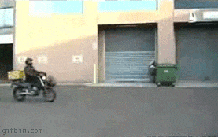

# Center of Mass

The [center of mass](https://en.wikipedia.org/wiki/Center\_of\_mass) (COM) or center of gravity (COG) of a robot is the mean location of all the mass of a robot.

When a robot brakes, the friction between the wheels and the floor rapidly decelerates the robot ( velocity of the robot in opposite direction of the acceleration of the robot). This creates a torque around the center of mass of the robot, jerking the back of the robot up. In many cases, the rear wheels lose grip with floor as well.

<figure><figcaption>
Extreme Example
</figcaption></figure>

The magnitude of the [torque](torque.md) is proportional to the height and magnitude of the braking/slowing force.

To mitigate jerking in opcontrol, reduce the height of the center of mass off the ground or decrease the max acceleration available to the driver. In programming periods, motion profiling and other motor [control techniques](../../software/control-algorithms/) can be used as well.

<figure><figcaption></figcaption></figure>
