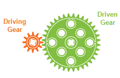

# Gear Ratios

<figure><figcaption>
Sourced from RoboMatter
</figcaption></figure>

A `Gear Ratio` is defined as the ratio of the rotational speeds of the first and final gears in a train of gears or of any two meshing gears. Essentially, the ratio of the input speed to the output speed of a geared set of shafts. These can be decided to choose a ratio of **Speed** (large gear driving small gear) or [**Torque**](torque.md) (small gear driving large gear).

Gear ratios are often simplified fractions of the number of teeth on each gear. This is because (at least in Vex) gears have a proportional number of teeth to their diameter which defines the difference in output speed. From the above image, there is a 12 tooth gear, driving a 36 tooth gear which would constitute a 3:1 ratio.&#x20;

$$
Gear Ratio = \frac{Driven}{Driving} = Driven : Driving
$$

The benefit of gear ratios is the ability to choose **speed** vs **torque** in a system. These have an inverse relationship however where a faster output will have lower torque. With the above example, the output shaft has 3x the torque, but also 1/3 the speed.&#x20;

### Teams Contributed to this Article:

* [BLRS](https://purduesigbots.com/) (Purdue SIGBots)

&#x20;
