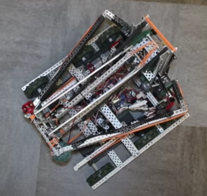

# Flip Out Mechanisms

A lot of times a robot will need to have a mechanism that "flips out", or expands outside of the 18 inch box at the start of the match. There are a few different ways to do this.

A lot of teams will make flip out mechanisms that are triggered by the robot's lift going up - it's fairly easy to hold something in place that moves horizontally with a lift, since the lift is constrained horizontally.

Starstruck was a game that required a flip-out mech for the popular claw design. Many flip out mechanisms were triggered by the claws opening. Similar use of the intake to trigger a flip out is good for other games too.

One example of several flip-out mechanisms being utilized on one robot was [97934V's Starstruck Deploy](https://www.youtube.com/watch?v=u9XEYpPA-H4). Most notably, its claw was held behind its lift tower until the lift was raised.

Another successful flip-out mechanism was the [2019 Ri3D team's intake flipout](https://youtu.be/BC4ZlIcBB7I?t=145). It utilized a standoff to hold in the intakes until the lift was raised. Then, the intakes flipped out and locked with another standoff.

This mechanism was not a "flip-out" mechanism in the conventional way, but [Antichamber's Modular Cone Launcher](https://www.youtube.com/watch?v=zHS9VIAxNNM) was certainly interesting. In Vex In the Zone, several teams utilized their preload by launching it across the field to block another teams autonomous function. This was one particular mechanism for doing so.

 (2) (1).png>)

## Contributing Teams to this Article:

* [2775J](https://www.youtube.com/channel/UCxpfFq6ShDvgmU9P4y6rc_Q?view_as=subscriber) (Jackson Area Robotics)
