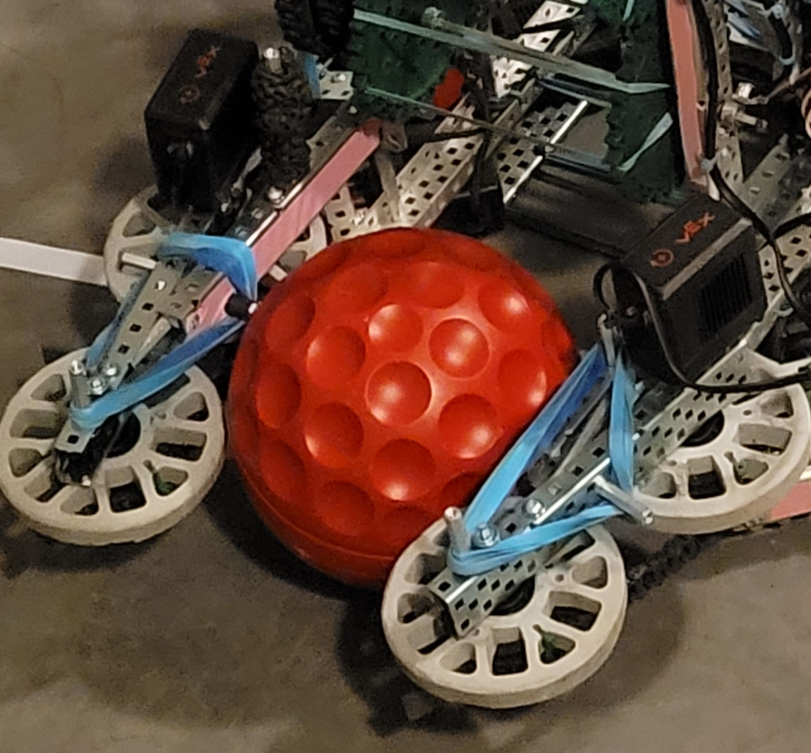
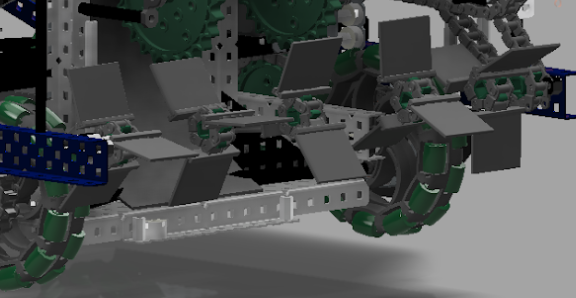

# Intakes

Intakes are one of the most common, versatile, and useful mechanisms in VEX Robotics, as they are able to manipulate a wide variety of game objects, while appearing in many different forms. As a general rule, some form of intakes are able to manipulate any smaller regular-shaped game object, such as balls or cubes. This is compared to large irregularly shaped game objects, such as stars from the 2016-2017 game Starstruck.

It's difficult to generalize intake design principles, since the majority of intake designs will be largely dependent on the game objects for the year. There are, however, two general principles that tend to identify the best intakes - side roller intakes, intakes with rollers on each side of a game object, and top down rollers intakes, which consist of horizontal roller intakes that contact the top of a game object.

As a note, the necessary speed of your intake is dependent once again on the game object in question, but generally faster is better. If the game object is able to be easily moved and carry motion on its own, such as a rollable ball, the intake speed will need to be faster than your robots [drivetrain](vex-drivetrains.md) speed to consistently and efficiently pick up the game object. If the game object does not carry motion efficiently, such as a cube from Tower Takeover, the intakes do not necessarily need to faster than the drivetrain, and more of a consideration can be giving to the torque of your intakes if necessary.

## Side Roller Intakes

Primarily used for game objects that are relatively stationary on the field, or in areas where the intake needs to reach into a specific area, side roller intakes consist of separate rollers parallel from each other in order to intake game objects on both sides. Side roller intakes are often used for actions that need some measure of torque, such as de-scoring, while also being useful for picking up balls, cubes, and other assorted game objects.

One difference from top down roller intakes, as elaborated on in the [next section](intakes.md#top-down-roller-intakes), is the considerably lesser fielding range of side roller intakes. As opposed to a top down roller intake, which can cover a much wider area to field game elements, side roller intakes only have so much fielding range as allowed by the material of the rollers. This is, while not inconsequential, not ideal for rollers of which the only purpose is to field game elements.

Because there are two separate rollers that compose side roller intakes, however, it is much easier to adjust the intakes for compression. Increased compression means a stronger grip on the game objects being manipulated, which can help de-score from tighter spaces or hold a heavier load. This does, however, have the impact of decreasing the fielding range due to the shorter space between rollers. Separating the rollers, by using the same principle, decreases compression and grip while increasing the fielding range.

## Top Down Roller Intakes

As opposed to two parallel rollers combining to form one intake subsystem, the top down roller intake features one singular roller parallel to the ground spinning to intake game objects into the robot. Where side rollers have the ability to be used in a more torque based setting, the top down roller should aim to be a very fast spinning mechanism, faster than the speed of the drivetrain in order to efficiently intake game objects.

Unlike side roller intakes, with which the inner distance between rollers has to be roughly equal to the size of the game elements, limiting fielding range, top down roller intakes can span the entire width of a robot, provided the game object has a constant height. Because of this, the game object should be able to be picked up by the intake regardless of where it contacts the roller. This increased fielding distance is ideal for situations where picking up game objects quickly, without a glaring need for accurate fielding.

Although compression can be altered, by changing the material of the roller and the distance between the roller and the ground, this intake should not be used in high torque or high compression situations. While the level of control over the compression in a top down roller intake is ideal for creating a fast, low torque intake, it is not great enough to prevent jamming a game object between the ground and the roller. This is because there are less moving rollers contacting the game elements than in side roller intakes, which are ideal for the task.

### Teams Contributed to this Article:

* [BLRS](https://purduesigbots.com) (Purdue SIGBots)
* [94999E](https://www.youtube.com/channel/UCp1jTU7WF3PEVukDW3qOGpA) (Yokai Robotics)
