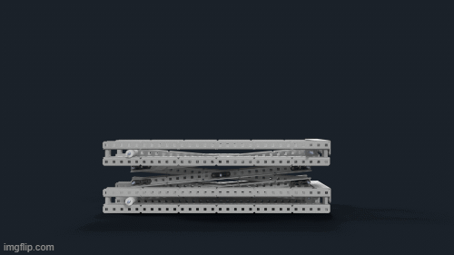

# Scissor Lift

The scissor lift is named because of its overlapping metal bars that open and close similarly to scissors. Scissors lifts are comprised of two sets of overlapping bars, one on each side, that are able to freely rotate in respect to one another. The lift can be as simple as two crossed bars on either side of the lift, but it can also contain many repeated iterations, stacked vertically, of the first one and be able to extend to many feet off of the ground. The upward motion is created by motors located at the base of the lift that move one edge (either the front or the back) while the other edge remains stationary but is allowed to rotate. Moving the two edges closer together will extend the lift upwards and moving them apart will lower it.

.png>)

One of the biggest advantages of a well-designed scissor lift is the fact that the weight of the load will always remain over the base of the robot and thus help the robot to remain upright. With lift systems like the four and six bar lifts, the load will be moved up in front of the base which can cause the robot to fall forward. Another advantage of the scissor lift is its collapsible nature. A scissor lift can often compress to almost completely flat which allows for the robot to fit within size restrictions or pass under overhead obstacles, such as those that appeared in the Toss Up competition. One of the issues with scissors lifts is the precise calibration that they demand. Both the left and right sides of the lift must move up and down in almost perfect unison. If the two sides are not aligned properly, the lift may start to bend to one side or another. This could cause a loss of game object due to a non-horizontal containment field or cause the robot to tip over due to a center of gravity that is no longer above the base of the robot. In order to prevent this, the lift must be carefully constructed, constantly inspected, and the code should take advantage of many sensors to ensure that the motors controlling the lift are working at the same speed and power.

### Pros and Cons Analysis

| Pros                                                                                                                                                                                                                                            | Cons                                                                                                                                                                                                                                                                                                                                                                                       |
| ----------------------------------------------------------------------------------------------------------------------------------------------------------------------------------------------------------------------------------------------- | ------------------------------------------------------------------------------------------------------------------------------------------------------------------------------------------------------------------------------------------------------------------------------------------------------------------------------------------------------------------------------------------ |
| <ul><li>Best height to weight ratio (for a tall lift)</li><li>Minimal lifting recoil</li><li>Minimal center of mass shifting</li><li>Potential for a very large mounting platform for holding many game objects or larger subsystems.</li></ul> | <ul><li>Vex parts linear slides are sub-optimal due to their high friction<a href="scissor-lift.md#joint-vs-slide-vs-gear-base"> (can be circumvented)</a></li><li>The resting position of the lift is high</li><li>Requires a large number of parts (specifically C-Channels) compared to other lifts.</li><li>Despite best height to weight ratio, is still heavy nonetheless.</li></ul> |

### Good Practices and Optimizations

Below is a video from 53999f showing scissor lift optimization. Although not built in an ideal way, it does a great job in showing the potential optimizations that can help improve the scissor lift.



As shown in the video above, [cross bracing](best-practices.md#x-bracing) and other [bracing](best-practices.md#bracing) is used to help further stabilize the lift. This is crucial given the height of the lift, so both sway and other movements do not effect the lift's functionality.

## Joint vs Slide vs Gear Base

Since the scissor lifts have terrible friction when built with VEX linear sliders, some teams have found an alternative in this by building their base with a gear mechanism. This reduces the friction and increases mechanical efficiency when built properly.

Below are some examples, all credits belong to their respective teams.







This building technique is something that is often overlooked as the stigma behind scissor lifts (hence the controversy) is the reason most teams do not even take this design into consideration. However, by using gearing rather than linear sliders the largest downside of using a scissor lift can be overcome.

## Consensus

Scissor lifts are generally harder to build than [Double Reverse Four Bars](dr4b.md). However, its advantages over the [DR4B](dr4b.md) should not be overlooked. Most notably, its the much higher maximum size, its relatively stable platform, and its potentially large platform size for mounting other subsystems. When deciding which lift to build, teams should consider what the right tool for the right job is as well as if their members realisitcally have enough skill for certain lifts, as scissor lift construction has a very high skill ceiling.&#x20;
