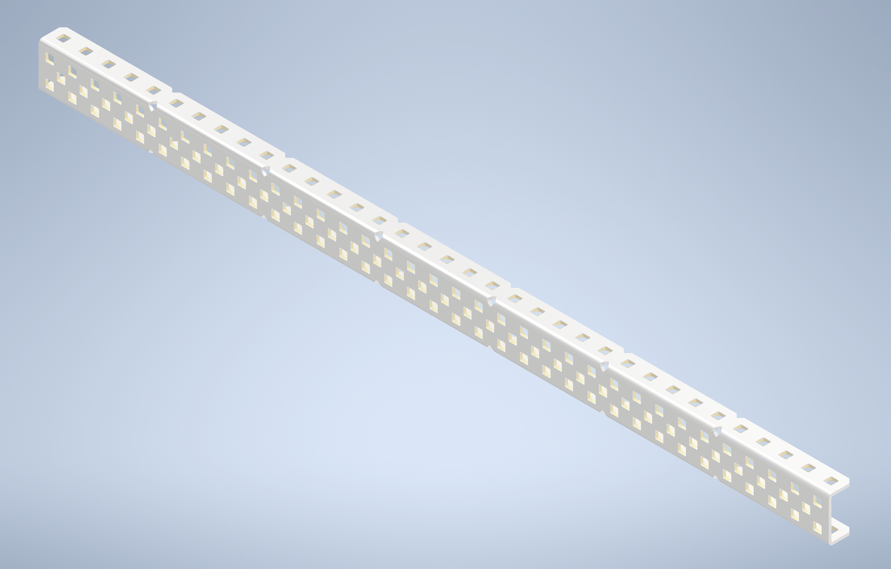
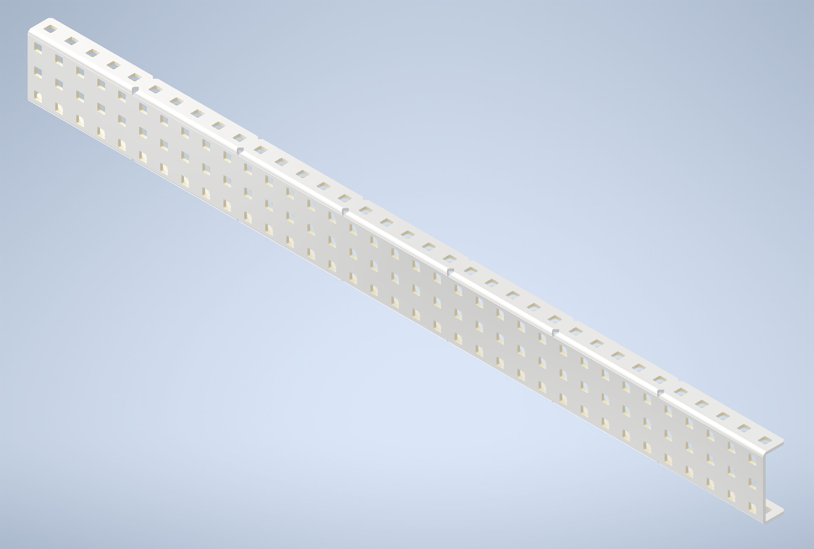
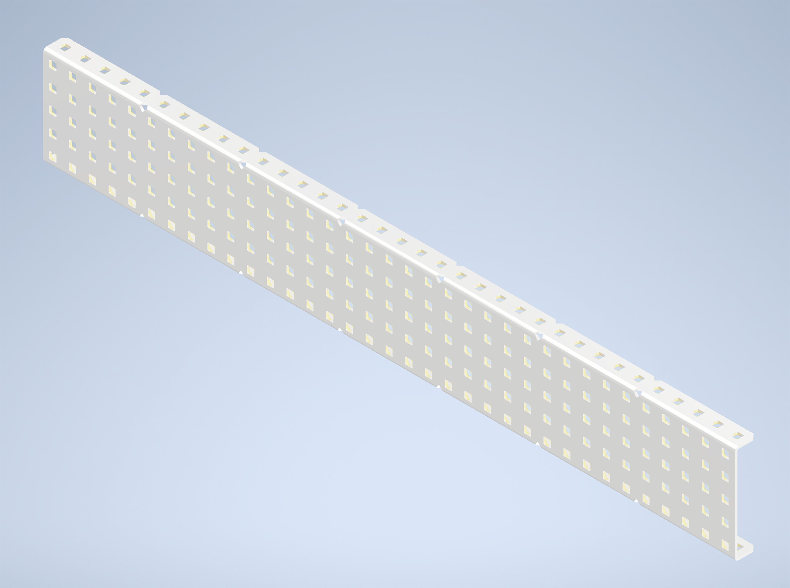
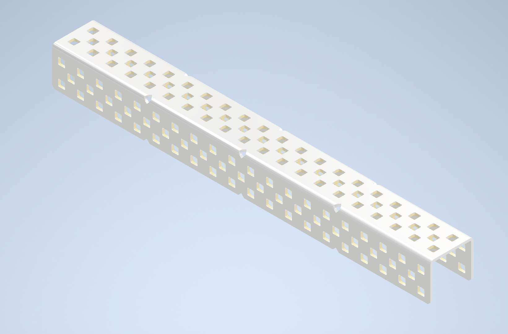
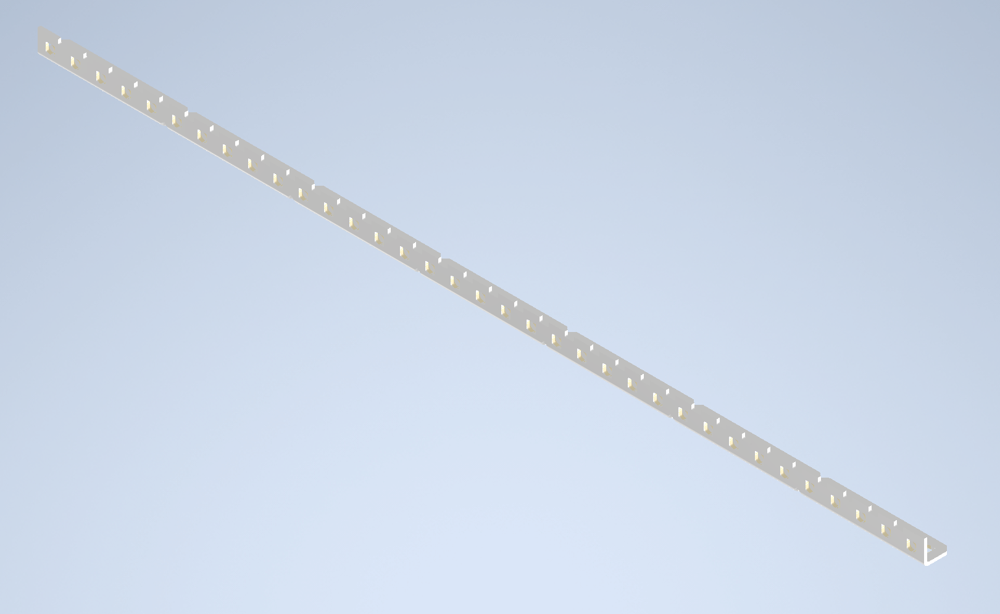
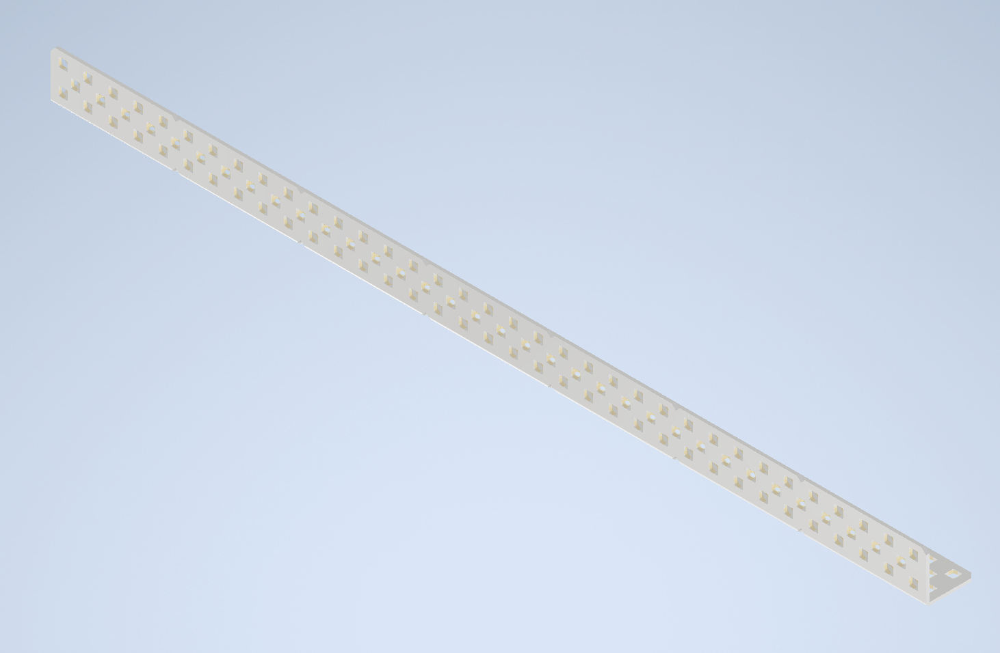

# Introduction to VEX Parts

## Introduction

This page focuses on parts used in VEX Robotics, ranging from differences between variations, as well as when specific parts should be used. This should serve as an introduction, instead of a definitive guide.

## Types of Metal

There are many different types of metal that VEX sells, along with selling different [materials](misc.-vex-parts.md#metal-material) of metal. The three primarily used variations of metal are the C-Channel, U-Channel, and Angle Bar.

### C-Channel

The most commonly used type of metal in VEX, C-Channels provide a stable, secure grounding for a majority of subsystems that can be used. The “C” shape contains two corners, which give the C-Channel a strong, sturdy form, making it ideal for structural use and bracing. **** There are three variations of C-Channel, in terms of their width:

#### 2 Hole Width

This variety is the most used of the three, as the relatively small form factor makes it ideal for conserving space and weight.

#### 3 Hole Width

A balance between the smaller 2-hole and larger 5-hole widths, the 3-hole width c-channels are great for saving space and weight, while giving slightly more room for mounting subsystems to the chassis.

#### 5 Hole Width

The largest of the three widths, 5 hole width maximizes space for mounting, while taking up considerably more space and weight. Ideal for making your bot heavier, and less susceptible to defense as a result.

### U-Channel

A variation of the C-Channel, the U-Channel has an extra hole on the bracket portion of the stock, giving it a more “U” shaped appearance. This stock is great for bracing different towers and other supports, as the “U” shape can envelope the towers, adding additional space for box-bolts, making the towers more secure.

### Angle Bar

Forming the shape of an “L,” these stocks of metal have either 1 or 2 holes on each end of the L, forming a 1x1 or 2x2 angle bar. Both are mainly used for support, rather than as a main piece of structure.

#### 1x1 Bars

1x1 angle bars are mainly used for cross bracing, in the form of triangle or X bracing.

#### 2x2 Bars

2x2 angle bars can be used to brace to parallel towers, while providing additional mounting space in the up or down direction.

## Gears and Sprockets

Gears and sprockets are both used to transfer motion from a powered to an unpowered object, with the difference between the two being how they carry that motion.&#x20;

### Gears

Gears transfer motion by meshing with each other, turning other gears in a sequence/ratio. They are ideal for covering shorter distances, or larger distances with a long gear sequence. It should be noted, however, that the more gears are added to a sequence, the more friction and energy loss incur, reducing the overall effectiveness.

In addition to carrying motion in a 1:1 ratio, gears can be used to amplify and detract from the speed and torque generated by the motor. For more information on ratios, click [here](misc.-vex-parts.md#gear-and-sprocket-ratios). Gears are produced in the following varieties, differentiated by the number of teeth on each gear:

| Gear Sizes: |
| :---------: |
|   12 Tooth  |
|   24 Tooth  |
|   36 Tooth  |
|   60 Tooth  |
|   84 Tooth  |

In addition to the different sizes of gear, gears are also produced in both low and high strength thickness grades. Both high strength and low strength gears can mesh with one another.

### Sprockets

Sprockets transfer motion by using chain to link multiple sprockets together, as individual sprockets themselves should not be physically meshed together. They are ideal for covering longer distances with minimal moving parts, or in scenarios where gears cannot be properly spaced. Although sprockets and chain are more flexible than gears, chain carries the inherent risk of snapping while in use, rendering the driven component motionless.

Similar to gears, sprockets can also function in a ratio. For more information on ratios, click [here](misc.-vex-parts.md#gear-and-sprocket-ratios). Sprockets are produced in the following varieties, again being differentiated by the number of teeth:

| Low Strength | High Strength |
| :----------: | :-----------: |
|   10 Tooth   |    6 Tooth    |
|   15 Tooth   |    12 Tooth   |
|   24 Tooth   |    18 Tooth   |
|   40 Tooth   |    24 Tooth   |
|   48 Tooth   |    30 Tooth   |

As described in the chart, sprockets are produced in a both high and low strength varieties. Unlike gears, however, low and high strength sprockets are linked with different size chains, making it impossible to mess high and low strength sprockets.

## Types of Nuts

### Standard Hex Nuts

These nuts are the least used in VRC, as they have no teeth to keep them tight without heavy maintenance, nor rubber to maintain their position on the screw.

### Keps Nuts

The most common type of nut used in VEX, these nuts have teeth on the inner portion of the nut (the end that contacts the attached surface), which keeps the nut solidly in place without much maintenance.

Able to be used most everywhere without problems.

### Nylock Nuts

Nylock Nuts, or Nylocks, these nuts have a rubber ring on the top portion of the nut (that faces away from the attached surface), which keeps it in place on the screw. Able to be used in the same places as Keps Nuts, but generally should not be, as Keps Nuts are easier and more efficient to use.

Most commonly used in Screw Joints, as it is not advisable to tighten the outer nut on a screw joint all the way (this would stop whatever is on the joint from moving). Using a Nylock for this purpose allows the nut to retain its place on the screw, without needing to be tightened as far as it can go.

## Low Strength vs High Strength

This section covers the difference between various High Strength and Low Strength components in VEX. While the two variations do function as the same part, there are often different use-cases, as well as extra considerations that need to be taken into account.

### Metal Shafts

Outside of screw joints, metal shafts are the main way of transferring energy in VEX, by use of sprockets or gears mounted to the shaft.&#x20;

#### Low Strength Shafts

Low strength shafts are the much more commonly used variant of shaft. the main reason for this being that low strength shafts fit through standard bearings and metal without any alterations.&#x20;

This variant of shaft is much more flexible and likely to be bent in high torque situations, and should often be checked and replaced if needed as such.

#### High Strength Shafts

High strength shafts, while useful, are not used in nearly as many places as low strength shafts. The main reason for this being that high strength shafts do not fit through the standard holes in metal, meaning that larger holes will have to be manually drilled out.

High strength shafts, as the name implies, are much more durable than low strength shafts, being able to be used in much higher torque situations as such. For instance, high strength shafts are ideal for linking both sides of a lift through a common shaft.

### Gears and Sprockets

#### Sprockets

As high and low strength sprockets have different size teeth, the different size sprockets cannot be linked to one another, as each requires different size chain.&#x20;

In the vast majority of cases, high strength sprockets and chain should be used over low strength. The main reason for this being that you want to make chain as unlikely to snap off as possible, and using high strength chain further decreases those odds.

#### Gears

Unlike with sprockets, the teeth on high and low strength gears are the same size, and can therefore be used in conjunction with one another.

Dissimilar to sprockets, there is not so much a clear cut boundary of when to use high and low strength gears. In higher torque situations, using high strength gears is advisable, as the extra thickness reduces the odds of the gear snapping. In lower torque areas, or in places where space is a concern, using low strength gears may be a better option.&#x20;

Due to the popular use of [gears in a drivetrain](vex-drivetrains.md#tank-drive), it is worthwhile to note that low and high strength gears can be alternated in the gear chain. This is a good balance between the risk of gears snapping in an all low strength gear drive and the bulkiness of an all high strength gear drive.

### Teams Contributed to this Article:

* [BLRS](https://purduesigbots.com/) (Purdue SIGBots)
* [94999E](https://www.youtube.com/channel/UCp1jTU7WF3PEVukDW3qOGpA) (Yokai Robotics)

