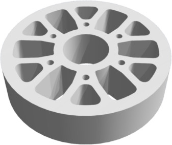
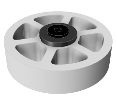
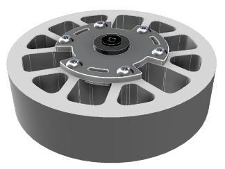
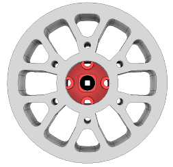
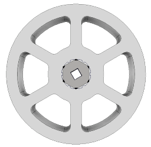

# Flex Wheels

<figure><figcaption>
A 4 inch, 30A Flex Wheel.
</figcaption></figure>

Flex Wheels, formally known as "Straight Flex Wheels" are compressible cylinders with spokes made of a blend of rubber silicone. The compressible nature of the Flex Wheels makes them versatile for many use cases, such as intakes, flywheels, and drivetrains. Additionally, because their composition includes rubber, their coefficient of friction is higher leading to a significant amount of traction.&#x20;

Flex Wheels are an unusual exception to other motion components: they do not utilize the typical square insert, but instead utilize a hex bore which is typically filled using a VersaHex as well as a VersaHub if it is necessary depending on the size of the Flex Wheel.

## Sizes of Flex Wheels

For VRC, Flex Wheels come in four sizes.

| Outer Diameter | Width Diameter |       Inserts       |
| :------------: | :------------: | :-----------------: |
|     1.625"     |      0.5"      |       VersaHex      |
|       2"       |      0.5"      |       VersaHex      |
|       3"       |       1"       | VersaHub & VersaHex |
|       4"       |       1"       | VersaHub & VersaHex |

There is also a Flex Wheel with a 5 inch outer diameter, although this is not legal for VRC.

## Hardness of Flex Wheels

Each Flex Wheel has a given durometer reading, which measured how difficult it is to compress the wheel. There are three variants:

* 30A
  * Light grey in color
  * Easiest to compress
* 45A
  * Grey in color
  * Compresses moderately
* 60A
  * Black in color
  * Incredibly difficult to compress

For flywheels and drivetrain traction wheels, 60A Flex Wheels are typically ideal. However, for intakes, 30A Flex Wheels might be more ideal. 45A Flex Wheels do not have many use cases, however they could hold some merit for use on 1.625" Flex Wheels.

## Attaching Flex Wheels to Axles

Because Flex Wheels utilize a hexagonal bore rather than a square bore, it means that you have to utilize unique methods to attach them to axles compared to any other motion component.

### Using "Versa" Adapters

There are two types of adapters relevant to Flex Wheels: VersaHexes and VersaHubs. These two adapters are the most common method of attaching Flex Wheels to square axles. However, while VersaHubs and VersaHexes are reliable, they also may not be available always due to their consistent high demand.

#### VersaHex Adapters

<figure><figcaption>
A 2 inch Flex Wheel with a VersaHex Adapter.
</figcaption></figure>

The VersaHex Adapter is the primary adapter used for any Flex Wheel with an outer diameter smaller than 3 inches. The adapter is slightly larger than the hexagonal bore in the Flex Wheel, meaning the wheel has to be stretched a bit to allow the adapter to fit. This is easy to use on small wheels with durometer readings of 30A or 45A, but it may make it difficult for the adapter to fit on a very hard wheel like a 60A wheel.&#x20;

VersaHex Adapters are also necessary to convert a VersaHub Adapter's hexagonal bore into a square bore.

#### VersaHub Adapters

<figure><figcaption>
A 4 inch Flex Wheel with a VersaHub and VersaHex Adapter.
</figcaption></figure>

The VersaHub Adapter is the primary adapter used for any Flex Wheel with an outer diameter of 3 inches or larger. It also is used in tandem with a VersaHex Adapter as its secondary adapter. Large Flex Wheels have large, circular holes in the center of them. The purpose of the VersaHub Adapter is to convert the large circular bore into a hexagonal bore, which then allows for the VersaHex Adapter to convert the hexagonal bore into a square bore. Unlike the VersaHex Adapter, the VersaHub Adapter is not as much of a friction fit, in the sense that it does not need to stretch the circular hole in order to fit. This makes it easy to fit a VersaHub Adapter into a hard wheel, such as a 60A 3 inch Flex Wheel, whereas it would be difficult to fit a VersaHex Adapter into a 60A 2 inch Flex Wheel.

### "Press Fit" Custom Adapters

It is possible to use common VEX components rather than VersaHexes and VersaHubs to create a square bore within a Flex Wheel. Typically, you would use a circular component that has an area for a high strength shaft insert (such as a square insert) to be placed inside of it. You would then fit the circular component into the Flex Wheel by stretching the wheel's circular bore with the component to create a friction fit.

### Press Fitting a Gear/Sprocket

<figure><figcaption>
A 4 inch Flex Wheel with a 36T High Strength Gear fitted into it.
</figcaption></figure>

One way to create a custom adapter would be to fit gears into the center of a Flex Wheel. For 3 inch and 4 inch wheels, a 36T High Strength Gear should suffice as a friction fit, although it should be noted that it would be incredibly difficult to fit it into a Flex Wheel with a hardness of 60A since a 36T High Strength Gear stretches the circular bore considerably.

<figure><figcaption>
A 2 inch Flex Wheel with a 12T Pinion fitted into it.
</figcaption></figure>

For smaller Flex Wheels, a 12T Pinion is perfect as a friction fit in the hexagonal bore of the Flex Wheel. Additionally, this method does not stretch the bore as much as a 36T High Strength Gear would stretch the circular bore, so it may be possible to use this method with a small Flex Wheel that has a hardness of 60A.

### Hardware-Based Custom Adapters

Various hardware components can be used to create custom adapters. These usually don't deform the Flex Wheel as much unlike a press fitted custom adapter, making them easily compatible with wheels that have a 60A durometer reading.

Some useful components that could be used when creating a custom adapter include:

* Lock Bars
* Steel/Aluminum Plates
* Polycarbonate when used in tandem with a laser cutter or CNC mill&#x20;

<table data-view="cards"><thead><tr><th></th><th></th><th></th><th data-hidden data-card-cover data-type="files"></th></tr></thead><tbody><tr><td>Lock Bar</td><td>BLRS</td><td></td><td><a href="../../../.gitbook/assets/image (1) (1).png">image (1) (1).png</a></td></tr><tr><td>1x5 Flat Bar</td><td>91A</td><td></td><td><a href="../../../.gitbook/assets/IMG_7031 - Copy.JPG">IMG_7031 - Copy.JPG</a></td></tr><tr><td>Polycarbonate</td><td>81P</td><td></td><td><a href="../../../.gitbook/assets/IMG_9706 - Copy.JPG">IMG_9706 - Copy.JPG</a></td></tr><tr><td>Polycarbonate</td><td>9364E</td><td></td><td><a href="../../../.gitbook/assets/IMG_1563 - Copy.jpg">IMG_1563 - Copy.jpg</a></td></tr></tbody></table>

## Cutting Flex Wheels

3" and 4" Flex Wheels are manufactured with a 1" thickness, much too high for many use cases. Because Flex Wheels are made of silicone, they are very difficult to cut, so guides are often used to ensure a precise division and increase safety. 3D printed cutting guides for all Flex Wheel sizes can be found here: [https://github.com/owen169/Flex-Wheel-Guides](https://github.com/owen169/Flex-Wheel-Guides).&#x20;

<figure><figcaption>
Owen 169
</figcaption></figure>

If you don't have access to a 3D printer, try making your own guides.

<figure><figcaption>
U-channel cutting guide - 81P Spin Up
</figcaption></figure>

## Teams Contributed to this Article:

* [BLRS](https://purduesigbots.com/) (Purdue SIGBots)
