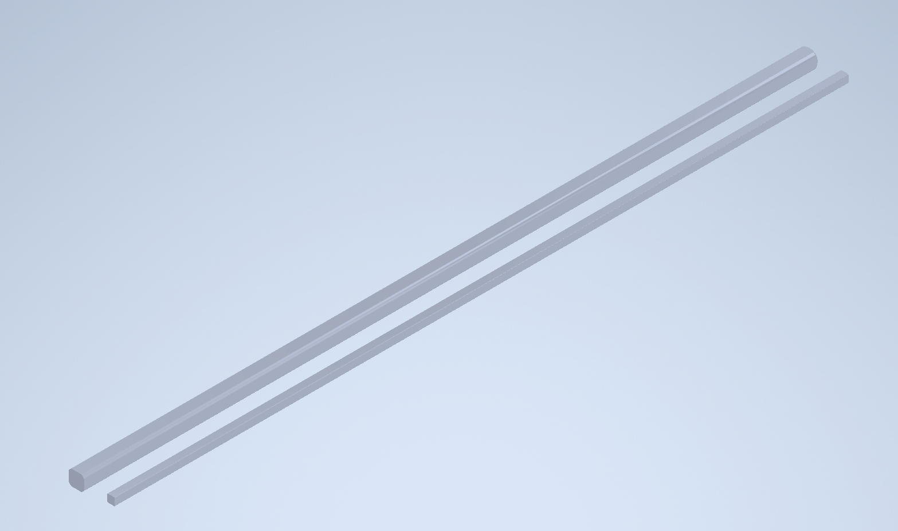
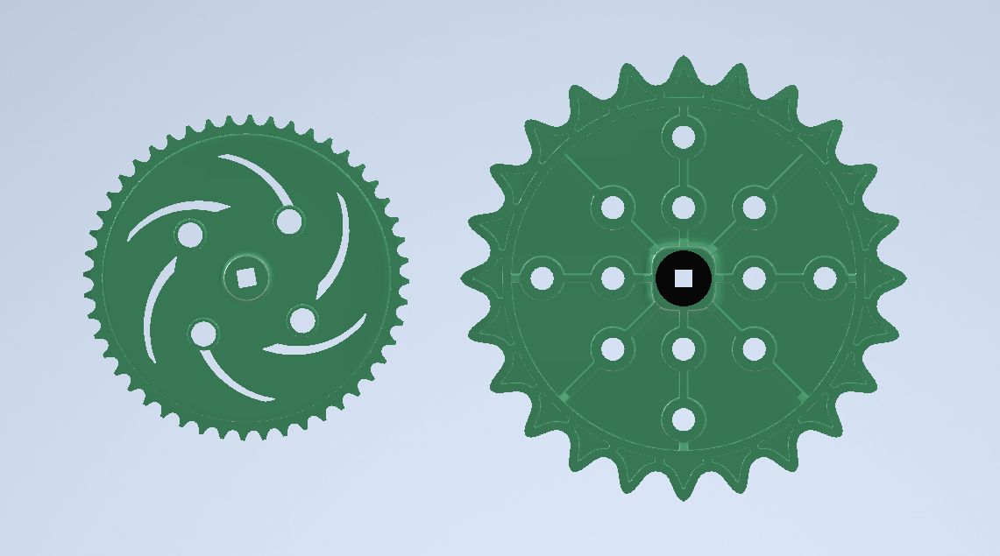
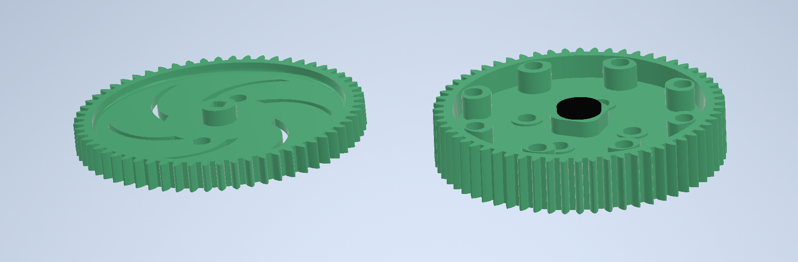

# High Strength Components

This section covers the difference between various High Strength and Low Strength components in VEX. While the two variations do function as the same part, there are often different use-cases, as well as extra considerations that need to be taken into account.

### Metal Shafts

Outside of screw joints, metal shafts are the main way of transferring energy in VEX, by use of sprockets or gears mounted to the shaft.&#x20;

#### Low Strength Shafts

Low strength shafts are the much more commonly used variant of shaft. the main reason for this being that low strength shafts fit through standard bearings and metal without any alterations.&#x20;

This variant of shaft is much more flexible and likely to be bent in high torque situations, and should often be checked and replaced if needed as such.

#### High Strength Shafts

High strength shafts, while useful, are not used in nearly as many places as low strength shafts. The main reason for this being that high strength shafts do not fit through the standard holes in metal, meaning that larger holes will have to be manually drilled out.

High strength shafts, as the name implies, are much more durable than low strength shafts, being able to be used in much higher torque situations as such. For instance, high strength shafts are ideal for linking both sides of a lift through a common shaft.

### Gears and Sprockets

#### Sprockets

As high and low strength sprockets have different size teeth, the different size sprockets cannot be linked to one another, as each requires different size chain.&#x20;

In the vast majority of cases, high strength sprockets and chain should be used over low strength. The main reason for this being that you want to make chain as unlikely to snap off as possible, and using high strength chain further decreases those odds.

#### Gears

Unlike with sprockets, the teeth on high and low strength gears are the same size, and can therefore be used in conjunction with one another.

Dissimilar to sprockets, there is not so much a clear cut boundary of when to use high and low strength gears. In higher torque situations, using high strength gears is advisable, as the extra thickness reduces the odds of the gear snapping. In lower torque areas, or in places where space is a concern, using low strength gears may be a better option.&#x20;

Due to the popular use of [gears in a drivetrain](../../vex-drivetrains.md#tank-drive), it is worthwhile to note that low and high strength gears can be alternated in the gear chain. This is a good balance between the risk of gears snapping in an all low strength gear drive and the bulkiness of an all high strength gear drive.

### Teams Contributed to this Article:

* [BLRS](https://purduesigbots.com/) (Purdue SIGBots)
* [94999E](https://www.youtube.com/channel/UCp1jTU7WF3PEVukDW3qOGpA) (Yokai Robotics)
