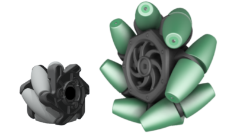
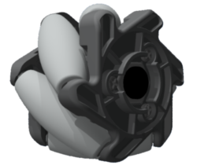

# Mecanum Wheels

<figure><figcaption>
A 2 inch mecanum wheel (left) next to a 4 inch mecanum wheel. (right)
</figcaption></figure>

**Mecanum wheels** are advanced wheels used widely in the scope of robotics and often in compeitive robotics due to their ability to introduce fully omnidirectional movement onto a drivetrain. These wheels take advantage of angled rollers which restrict their degrees of freedom onto one axis, allowing them to move freely diagonally. When spun in a uniform direction, the mecanum wheel functions as a typical wheel and propels a drivetrain forwards. However, when spun in conflicting directions with the wheel adjacent from it (in terms of a four wheel drivetrain), the robot begins to strafe thanks to its angled rollers.&#x20;

## Possible Movement Vectors

<figure><figcaption></figcaption></figure>

## Variations

In VRC, there are only two legal sizes of mecanum wheels: 2 inch and 4 inch. Each size has two variations which are crucial to the functionality of the drivetrain: a left and a right variant. The difference between those two variants is that the rollers angle themselves inherently differently.

<figure><figcaption>
Left/right variants arranged next to each other.
</figcaption></figure>

The proper placement of these wheels based on their variants is described in the article "[VEX Drivetrains](../../vex-drivetrains.md)"; this placement holds true for any mecanum wheel, regardless of its size.

## Traits and Performance

While these wheels theoretically allow a robot to strafe in all directions, the mecanum wheels manufactured by VEX Robotics are riddled with a number of tradeoffs that can make them difficult to use effectively. However, they can be elegant when paired with the right builder, programmer, and/or driver.&#x20;

Generally speaking, mecanum wheels inherently suffer from a few tradeoffs that can be mitigated through a smart design, but never eliminated completely. For example, because of inevitable frictional losses from the rollers, a realistic mecanum wheel drivetrain cannot strafe as fast as it can move forward. For a similar reason, mecanum wheels require a lot of torque to power in tandem with each other since they must move in conflicting directions in order to strafe, making it very difficult to strafe with them at any linear velocity above 3.29 m/s (300 RPM on 4 inch wheels). Additionally, these wheels are burdened by any shift in center of gravity, meaning that if the center of gravity is not close enough to the center of the robot, the wheels will simply fail to strafe and will cause the drivetrain to turn instead.

### 2 Inch Wheels

<figure><figcaption>
A 2 inch mecanum wheel.
</figcaption></figure>

First manufactured as a part of the VEXpro line and then made legal for use in VRC in 2021, the 2 inch mecanum wheels appear to be a compact solution to the complexities of holonomic movement. They measure 1.5 inches (around 38 mm) in width, and of course boast a very small diameter. Unlike most other wheels used on drivetrains, this size of mecanum wheel in particular utilizes a hexagonal bore, meaning it is necessary to use a VersaHex to convert the bore into a square bore.

The functionality of the 2 inch mecanum wheel has been an enigma that competitors have been desperate to understand further. Although mechanically rated to be suitable for a VEXU drivetrain (therefore also making it compatible with a VRC robot), it has been observed that these wheels actually have trouble supporting the weight of the robot. This is because the architecture of the wheel's frame gives a near-zero amount of clearance between the frame and the rubber roller, causing the frame to actually sink into foam tiles if the robot is too heavy. For this reason, it has mostly been limited to usage on intakes. If used on the drivetrain of a moderately heavy robot, the robot will struggle to strafe as the angled rollers will be unable to make sufficient contact with the tiles.

Multiple plausible solutions to the wheel's clearance issue have been proposed, although it is unclear how effective each solution actually is because there has been limited testing of this wheel in drivetrain usage.

The first obvious solution that has been attempted is to shave down the area of the frame near where the pin connects to the roller, thus artificially increasing the clearance between the tile and the wheel's frame. This would allow the wheel to be more "tolerant" of sinking into the tiles under the robot's weight. One potential issue that could arise from this is the chance that shaving down the frame too far may lead to a detrimental decrease in structural integrity near the pins of the roller, which may cause the wheel to disintegrate altogether if used in a high-stress situation.

The second suggested solution is to use eight wheels instead of only four on the drivetrain, thus spreading out the weight of the robot amongst more wheels which would lead each wheel to sink into the foam tiles less. This comes with two major tradeoffs, though: it is expensive to purchase four extra wheels to do this, and it also requires much more space since there is not only more wheels but also the necessity to introduce an additional gear train to ensure each wheel moves in the proper direction.

The final solution is to simply make the robot lighter, but this is incredibly difficult considering that the weight threshold of the 2 inch mecanum wheels appears to be relatively low; through testing done by [BLRS3](https://www.robotevents.com/teams/VEXU/BLRS3), it seems to not be possible to have a drivetrain of four 2 inch mecanum wheels that strafes properly if the robot weighs anywhere above 13 pounds, and even going below that still may not ensure optimal performance.

### 4 Inch Wheels

<figure><figcaption>
A 4 inch mecanum wheel.
</figcaption></figure>

Manufactured since 2011 as a part of the then-named "VEX EDR" line, 4 inch mecanum wheels are a reliable but somewhat bulky option to use in creating a holonomic drivetrain. These wheels measure in at around 2.5 inches in width, and, deceptively, their diameter actually happens to be 4.125 inches, not 4 inches.&#x20;

Although not afflicted by the same clearance issue as the 2 inch mecanum wheels, the roller profile of the 4 inch wheels cause a couple of issues.&#x20;

First of all, the rollers are arranged in a dual-sided cantilevered setup, which causes immense amount of friction for the rollers. This limits how quickly the mecanum wheel can strafe, making it such that the strafing speed is somewhere around 80% of the forward speed from frictional losses alone. These frictional losses are of course subtly seen on the 2 inch wheels, although its not clear how close or far they are in magnitude to the 4 inch wheels' losses due to a lack of data.&#x20;

Second of all, each roller utilizes a conical sort of shape, more specifically that of a cone's frustum. This minimizes the wheel's traction because the wheel covers less surface area, giving it more of a chance to slip because the force of friction is acting on a smaller area. Other, more effective mecanum wheels appear to utilize cylindrical rollers instead.

### Teams Contributed to this Article:

* [BLRS, BLRS3](https://purduesigbots.com) (Purdue SIGBots)
