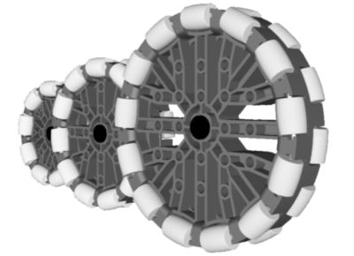
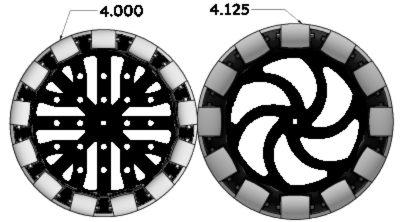
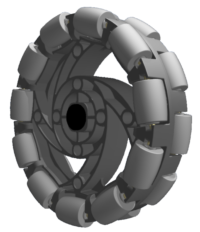
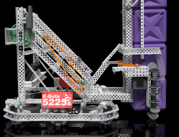

# Omnidirectional Wheels

<figure><figcaption>
From left to right: 2.75", 3.25", and 4" omnidirectional wheels
</figcaption></figure>

**Omnidirectional wheels** are a commonly used wheel type within the VEX Robotics Competition that make use of many cylindrical rollers to ensure that the wheel itself has more degrees of freedom.&#x20;

Unlike a typical wheel which only has one degree of freedom in the forward/backwards direction, the omnidirectional wheel has an additional degree of freedom with sideways movement. Some benefits to this additional degree of freedom include being able to make fluid turns and the potential for holonomic drivetrains to be created. However, this behavior also means that a robot utilizing only omnidirectional wheels on its drivetrain is much more prone to defense from adjacent robots. Teams have historically used omnidirectional wheels in tandem with traction wheels at the robot's center of turning in order to mitigate the effects of defense.

## Variations

| Wheel                                                                                                 | Width (in.) | Diameter (in.) |
| ----------------------------------------------------------------------------------------------------- | ----------- | -------------- |
| 2.75" Omnidirectional Wheel                        | 1.225       | 2.75           |
| 3.25" Omnidirectional Wheel                        | 1.00        | 3.25           |
| 4" Omni-Directional Wheel                             | 1.125       | 4.125          |
| 2.75" Omnidirectional Anti-Static Wheel  | 1.00        | 2.75           |
| 3.25" Omnidirectional Anti-Static Wheel  | 1.00        | 3.25           |
| 4" Omnidirectional Anti-Static Wheel        | 1.00        | 4.00           |

There are six variations of the omnidirectional wheel that are legal for use in VRC. The wheels come in three sizes, and also have two functional variants: original or anti-static.&#x20;

Anti-static wheels were developed in order to try and mitigate the amount of static built up from the wheels rubbing against the field, therefore decreasing the odds of damage to electronics due to electrostatic discharge. These wheels also happen to be thinner than the original wheels for all sizes and have smaller rollers.

### Unique Traits

<figure><figcaption>
A 4 inch omnidirectional wheel diameter comparison.
</figcaption></figure>

In the case of the 4 inch omnidirectional wheel, the anti-static version is genuinely 4.00 inches in diameter as compared to the 4.125 inch diameter of its original counterpart. This makes it compatible geometrically with other wheels, like a 4 inch [flex wheel](flex-wheels.md) or a 4 inch traction wheel.

<figure><figcaption>
An original 3.25" omnidirectional wheel.
</figcaption></figure>

The original 3.25 inch omnidirectional wheels have been less favored by the VRC community because they are the only set of wheels which utilize plastic rollers rather than rubber rollers. This leads to an immense loss of traction, making it less reliable when facing off against defense or in the instance of a platform needing to be climbed, like in Turning Point and especially Tipping Point. However, these wheels do have their advantages. They are the thinnest of the original trio of omnidirectional wheels, coming in at the same width as the anti-static wheels, and it is also possible that the plastic rollers may bring less frictional losses when used on a holonomic drivetrain like an X-drive.&#x20;

## Usage

<figure><figcaption>
Omnidirectional wheels used on <a href="../../../vex-cad/remembering-the-best/5225a-tower-takeover.md">5225A's X-drive in Tower Takeover.</a>
</figcaption></figure>

Omnidirectional wheels have been commonplace on VRC drivetrains since their creation. They are especially useful when creating [X-drives](../../vex-drivetrains.md) or "Kiwi" (three wheel holonomic) drives because of their ability to expand the amount of degrees of freedom the drivetrain has. When the wheels are arranged diagonally, the robot is still able to move smoothly because as it moves in any direction, the wheel's rollers spin along with the wheel, accounting for the movement in both the sideways and forwards direction.

2.75" omnidirectional wheels can make great tracker wheels for odometry purposes due to their small diameter. In fact, 2.75" omnidirectional wheels used to only be used for odometry, until more recent seasons in which teams have begun to get more creative with their drivetrain gear ratios.&#x20;

### Teams Contributed to this Article:

* [BLRS](https://purduesigbots.com/) (Purdue SIGBots)
* [Matthew 1727B](https://www.youtube.com/@matthew1727b) (REX)
