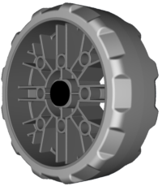
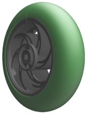
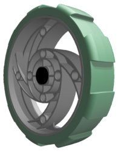
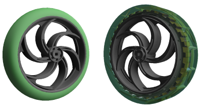

# Traction Wheels

<figure><figcaption>
From left to right: 2.75", 3.25", and 4" Anti-Static Wheels 
</figcaption></figure>

**Traction wheels**, mostly only referred to plainly as "wheels" by VEX, **** are the simplest wheel type offered in the VEX Robotics Competition, only having one degree of freedom (forward and backward). They are made up of two simple parts: an acetal frame and a tire that fits around said frame, typically made of rubber or a material similar to rubber. They are typically used in the center of drivetrains to restrict unwanted sideways movement (such as from defense).

## Variations

| Wheel                                                                                | Width (in.) | Diameter (in.) |
| ------------------------------------------------------------------------------------ | ----------- | -------------- |
| 2.75" Wheel                           | 0.75        | 2.75           |
| 3.25" Traction Wheel               | 0.75        | 3.25           |
| 4" Wheel                                 | 0.875       | 4.00           |
| 4" Wheel w/ High Traction Tire        | 0.75        | 4.00           |
| 2.75" Anti-Static Wheel  | 1.00        | 2.75           |
| 3.25" Anti-Static Wheel  | 1.00        | 3.25           |
| 4" Anti-Static Wheel        | 1.00        | 4.00           |

Although all anti-static wheels perform identically, the original wheels and traction wheels all have very different functionality.

### Anti-Static Wheels

<figure><figcaption>
A 2.75" anti-static wheel.
</figcaption></figure>

Anti-static wheels have a high amount of traction and, unlike their predecessors, have a uniform width and tire shape. Although they are wider than the original wheels, this is actually an advantage rather than a detriment since the larger tire surface area increases the odds that the wheel will make contact with the field tiles, allowing the tire's traction to have a larger effect on the wheel's overall performance. Additionally, the width for all three sizes only comes out to be 1 inch, a compact wheel in comparison to the various wheels VEX Robotics has manufactured.&#x20;

Conveniently, the hubs of the wheels come with many mounting holes which allows the user to fasten gears or other relevant motion objects onto the hub.

These wheels have tires with special properties that prevent the accumulation of static, which decrease the odds of damage to electronics due to electrostatic discharge. For this reason, the tire material feels slightly different from the original tires which are made entirely of rubber.

### Original Wheels

<figure><figcaption>
A 2.75" wheel.
</figcaption></figure>

2.75" wheels feature a small hub and a green, filleted tire. Although the traction of the rubber on the wheel's tire is excellent, the fillet of the tire causes massive loss of traction due to there being a very small point where the tire actually contacts the tile. The fillet of the tire can actually be useful in use cases other than a drivetrain, though, such as spinning a roller from a wide angle in the 2022-23 VRC game Spin Up, for example.

<figure><figcaption>
A 3.25" traction wheel.
</figcaption></figure>

3.25" traction wheels have the most unique structure of the original wheel variations, boasting mounting holes on its hub akin to the ones seen on the anti-static wheels and having a unique tire shape which features bumps protruding from its circumference. In its base state, the 3.25" traction wheel has been widely avoided because of its "bumpy" tire shape. Due to the topography of the tire being variable, it loses out on potential traction it could have gained by having the receding parts of the tire contacting the field tiles. However, legally modified 3.25" traction wheels used to be considered viable in Tipping Point before the release of 3.25" anti-static wheels. Using a belt sander, teams such as [99999V would sand away the bumps on the tire](https://www.vexforum.com/t/3-25-vs-4-wheel-traction/101094/9), making the tire's circumference constant. With this new wheel, teams would use it as a hub for a 3" [flex wheel](flex-wheels.md) tire (a flex wheel which has all of its spokes cut out).

<figure><figcaption>
A 4" wheel with a high traction tire (left) and base tire (right)
</figcaption></figure>

4" traction wheels have the unique property of having interchangeable tires, being the only wheel where this is an intended feature. There are two possible tires: the base tire and the high traction tire. The base tire lacks traction almost entirely and takes up a strange pattern of triangle and lines in an attempt to mimic car tire tread. The high traction tire has significantly more traction, but suffers from the same issue as the 2.75" wheel, in which the filleted tire causes the contact area of the tire to be very small.&#x20;

### Teams Contributed to this Article:

* [BLRS](https://purduesigbots.com/) (Purdue SIGBots)
