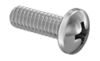
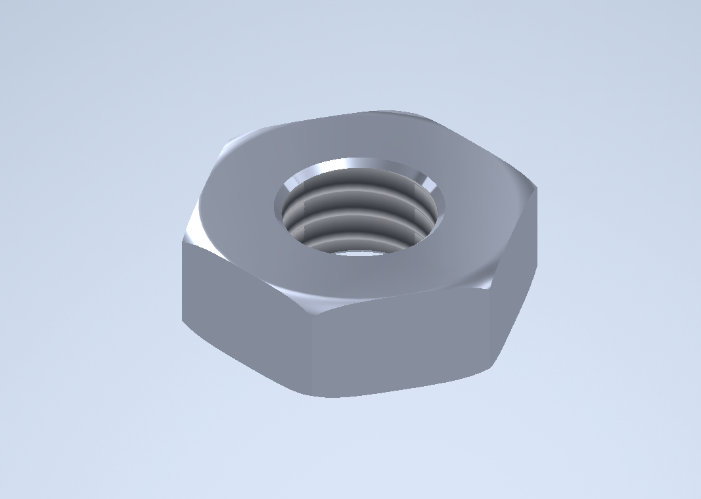
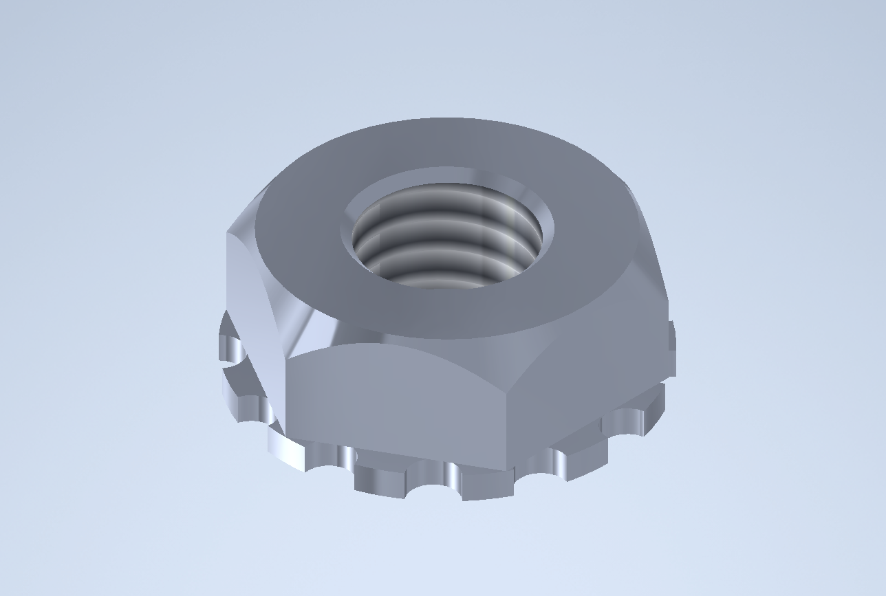
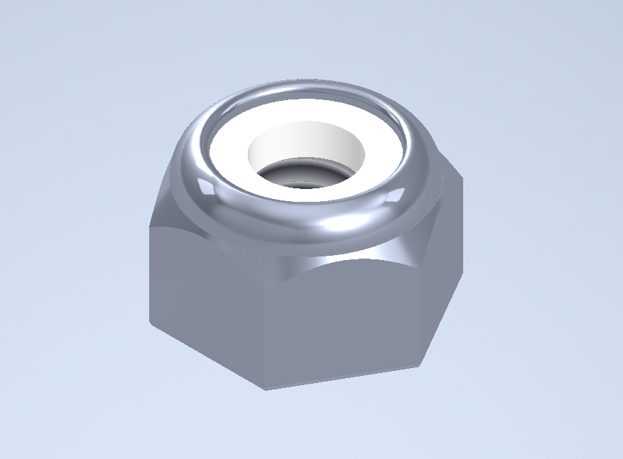

# Fasteners

## Screws

In the scope of the VEX Robotics Competition, the typical screw will be steel and will have an #8-32 thread size and can have a length anywhere from 0.25 inches to 2.5 inches. However, in VEXU, limits on the thread size, material, and length are lifted.

Of more importance to the user of a screw is the drive style and its specialty features.

### Drive Styles

#### Star/Torx Drive

 (2).png>)

Star Drive, otherwise known by its trade name as "Torx" Drive, is the most common drive style in VEX. It offers the advantage of being generally more resistant to stripping than its hexagonal predecessor, but has the tradeoff of being difficult to purchase at a hardware store. Convenient sources of these types of screws include the [VEX Robotics website](https://www.vexrobotics.com/all-screws.html), [Robosource](https://www.robosource.net/star-drive-screws-steel), and [McMaster-Carr](https://www.mcmaster.com/screws/thread-size\~8-32/drive-style\~torx/).

#### Hex Drive

 (2).png>)

Hex Drive was widely used in previous seasons of VRC, but has since been mostly eclipsed by Star Drive screws. Hex Drive is now largely unpopular due to the fact that it is notorious for stripping easily. Additionally, similar to the Star Drive style, it is difficult to find commercially. Potential sources of these types of screws include the [VEX Robotics website](https://www.vexrobotics.com/all-screws.html) and [McMaster-Carr](https://www.mcmaster.com/screws/thread-size\~8-32/drive-style\~hex/).

#### Phillips Head

Phillips Head screws are not screws that are commonly associated with VEX Robotics, but they can be utilized conveniently due to the fact that they are incredibly easy to purchase. Normally, most hardware stores will sell their #8-32 screws with a Phillips Head style. Additionally, those hardware stores will almost certainly sell tools that are compatible with these screws. You can purchase these screws at a hardware store such as Ace Hardware, Lowes or Home Depot.

### Specialty Features

Most screws will be normal screws that have no additional benefit. However, there are three particular types of screws that can perform special tasks.

#### Shoulder Screws

 (2).png>)

Shoulder screws are screws which are not threaded near the head. Usually, this lack of thread, referred to as the "shoulder", has a length that spans no more than 1/8 of an inch. The benefit of using a shoulder screw is that the shoulder is larger than the diameter of the threading. This means that, when passed through the hole of a C-channel or angle, the screw will always be nearly perfectly centered in the hole. This is excellent for any structural purpose, and should especially be utilized when constructing drivetrains to ensure that the drivetrain is "square" and aligned properly. Shoulder screws can be purchased in the Hex Drive variant from the [VEX Robotics website](https://www.vexrobotics.com/all-screws.html) or in the Star Drive variant from [Robosource](https://www.robosource.net/shoulder-screws).

#### Locking Screws

 (1).png>)

Locking screws are normal #8-32 screws that have thread locker brushed onto the ends of the screw's threading. They bring the added benefit of making the screw resistant to vibration, meaning that the screw cannot loosen unless a screwdriver interacts with it. They can be purchased from the [VEX Robotics website](https://www.vexrobotics.com/all-screws.html) with thread locker already brushed onto them, or they can be made by brushing any commercial thread locker, such as Loctite, onto an #8-32 screw.

#### Thumbscrews

 (1) (2).png>)

While not particularly useful, VEX's thumbscrews offer a simplistic way to tighten screws. The method of tightening these screws is as the name suggests: they can be tightened by hand using the knurled head. One benefit that competitors have found within the thumbscrew is the fact that it is made of plastic compared to the typical stainless steel. This would make it a lightweight alternative to using any other screw. They can only be purchased from the [VEX Robotics website](https://www.vexrobotics.com/all-screws.html).

## Types of Nuts

### Standard Hex Nuts

These nuts are the least used in VRC, as they have no teeth to keep them tight without heavy maintenance, nor rubber to maintain their position on the screw.

### Keps Nuts

The most common type of nut used in VEX, these nuts have teeth on the inner portion of the nut (the end that contacts the attached surface), which keeps the nut solidly in place without much maintenance.

Able to be used most everywhere without problems.

### Nylock Nuts

Nylock Nuts, or Nylocks, these nuts have a rubber ring on the top portion of the nut (that faces away from the attached surface), which keeps it in place on the screw. Able to be used in the same places as Keps Nuts, but generally should not be, as Keps Nuts are easier and more efficient to use.

Most commonly used in Screw Joints, as it is not advisable to tighten the outer nut on a screw joint all the way (this would stop whatever is on the joint from moving). Using a Nylock for this purpose allows the nut to retain its place on the screw, without needing to be tightened as far as it can go.

## Standoffs

Standoffs are a fairly common part with a wide variety of use-cases in the VEX Robotics Competition.

<figure><figcaption></figcaption></figure>

Comprised of a long, threaded interior formed into a hexagonal shape, standoffs are often used to space pieces of structure over long dimensions, as screws can be threaded into either end of the cylinder. Due to their versatile dimensions, standoffs are often used in bracing components of a robot, and are sometimes used as main structural components themselves.&#x20;

In the VEX Robotics Competition rules, there is a maximum length of 2.5 inches (63.5mm) for any commercially available standoff. Common sources of standoffs include the [VEX Robotics website](https://www.vexrobotics.com/standoffs-8-32.html), [RoboSource](https://www.robosource.net/screws-hardware), and [McMaster-Carr](https://www.mcmaster.com/products/spacers/female-threaded-hex-standoffs-6/thread-size\~8-32/hex-size\~1-4-1/).

### Teams Contributed to this Article:

* [BLRS](https://purduesigbots.com/) (Purdue SIGBots)
