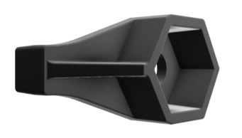
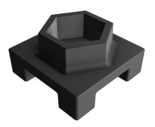
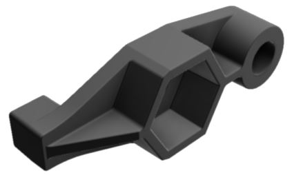

# Retainers

<figure><figcaption>
A row of different types of hex nut retainers.
</figcaption></figure>

**Retainers** are nylon, hexagonally-shaped parts which have varying protrusions depending on the type of retainer used. There are two overarching types of retainers: **hex nut retainers** and **standoff retainers**. Hex nut retainers all feature 11/32" wide hexagonal bores that are meant to keep [11/32" wide 8-32 nuts](fasteners.md#standard-hex-nuts) of any type captive. Similarly, standoff retainers can keep any hexagonal fastener that is 1/4" wide (such as a [standoff](fasteners.md#standoffs), [narrow hex nut](https://www.robosource.net/robot-parts/screws-hardware/nuts/508-narrow-slim-profile-hex-nuts?), or [4-40 nut](https://www.robosource.net/robot-parts/screws-hardware/specialty-screws/605-nylock-nut-440)) captive in its hexagonal bore. The resulting captivity of these fasteners allows the user to forgo using a crescent wrench altogether, as a screw can easily thread into the nut or standoff without any way for that fastener to rotate.

## Types

There are three types of retainers sold by VEX Robotics which come in both hex nut and standoff retaining forms.

### 1-Post Retainer

<figure><figcaption>
A 1-post hex nut retainer.
</figcaption></figure>

The most versatile of the three, the 1-post retainer simply keeps a nut or standoff captive for a screw to then thread into it. Like the name suggests, it has a single nylon post protruding out from it with a square peg that can extend through two surfaces of VEX aluminum, such as two [C-channels](c-channels-and-angles.md). This square peg is around the same size as common VEX square holes, allowing it to fit snugly into the hole.&#x20;

### 4-Post Retainer

<figure><figcaption>
A 4-post hex nut retainer.
</figcaption></figure>

Although less commonly used, the 4-post retainer can be a massive time-saver when developing perpendicular structure. Unlike the 1-post retainer, this retainer has four square pegs that surround a captive nut or standoff. Since the four square pegs also extend through two surfaces of aluminum, it completely eliminates any chance for play between two surfaces while only requiring one screw and one nut or standoff. However, because of the geometry of the retainer, it relies on the metal having diagonal holes, meaning it can only be used with two-hole wide C-channels, two-hole wide [angles](c-channels-and-angles.md), and U-channels, but not with three-hole wide C-channels, five-hole wide C-channels or one-hole wide angles.

### 1-Post Retainer With Bearing Flat

<figure><figcaption>
A 1-post hex nut retainer with bearing flat.
</figcaption></figure>

Ever helpful with motion components, the 1-post retainer with bearing flat can be a handy replacement for [normal bearing flats](bearings.md#bearing-flats) where space allows. The primary purpose of this retainer is to reduce friction where shaft are being used by using encapsulating a shaft with a nylon hole rather than having it contact the square hole of a C-channel. Other than its function as a bearing flat, the retainer otherwise acts the same as the 1-post retainer, and still has a square peg with the same dimensions on the opposite side of the bearing flat hole.

## Use Cases

Both hex nut retainers and standoff retainers alike have significant use cases thanks to their fastener captivity ability. Generally, these retainers can serve as a gateway to saving weight on a robot because they make previously obscure fasteners more viable by allowing them to stay captive. For this reason, nuts that would struggle to stay threaded onto a screw when faced with vibration, such as a basic steel hex nut, could be used liberally with the help of a retainer. Some helpful use cases for using a retainer could include:

* Attaching a hex nut/standoff retainer with bearing flat on a rotating mechanism to reduce friction while saving weight.
  * Unlike a normal bearing flat, which requires two screws and two nuts to attach to a robot, a retainer with bearing flat only needs one screw and one nut.
  * Since a retainer with bearing flat is mounted off-center (the bearing hole is on the side), attention to detail is required to ensure that the retainer properly aligns itself and is flush with the metal.
* Utilizing 1-post hex nut retainers to make the following fasteners impervious to vibrations and therefore viable:
  * Steel 8-32 hex nut
  * Nylon 8-32 hex nut
  * Aluminum 8-32 hex nut
* Utilizing 1-post standoff retainers to make the following fasteners impervious to vibrations and therefore viable:
  * Narrow 8-32 hex nut
  * 4-40 hex nut
* Using a 1-post hex nut/standoff retainer's protruding square peg to eliminate slop between two pieces of metal while also potentially saving weight in the process.
  * Rather than using two shoulder screws to fasten the two surfaces together, only one is needed since the retainer's square peg will inherently eliminate slop.&#x20;
* Using a 4-post hex nut retainer to save weight (by only requiring one pair of fasteners instead of two) and eliminate slop at an attachment point of two perpendicular C-channels.
  * This should only be done in low-stress situations. If done in a scenario where the perpendicular C-channels are likely to become deformed, the structural integrity of the 4-post hex nut retainer is ambiguous.

### Teams Contributed to this Article:

* [BLRS](https://purduesigbots.com/) (Purdue SIGBots)
