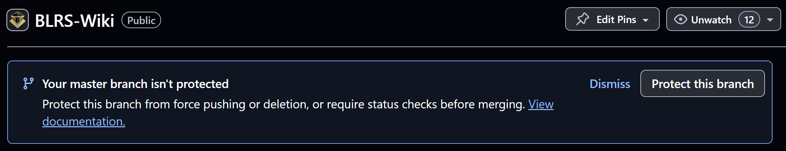

# Misc. Building Techniques

## Box Bracing

Box Bracing is a form of bracing that strengthens a subsystem comprised of c-channels, reducing slop, flexibility, and bending in the aforementioned bars. Box Bracing is composed of two c-channels, facing inwards towards each other, and attached together with a long screw running between both c-channels.

The space between the two c-channels should be filled with spacers wherever a screw runs between the c-channels in order to prevent over-tightening, which can deform the metal. Box Bracing is often used in coordination with other bracing techniques, which can be found [here](lifts/best-practices.md).

## Custom Plastic Parts

According to the current VRC rulebook, teams are allowed a certain amount of non-shattering plastic for use on robots. Any plastic that does not serve a function beyond decoration does not count towards the legal plastic limit. A piece is considered non functional if the performance of a robot or subsystem is not in any way altered by the removal of the piece(s). A piece that is used to shield game elements from entering or being stuck in a portion of the robot is considered functional.

Robots may use custom-made parts cut from certain types of non-shattering plastic. It must be possible to have cut all of the plastic parts on the Robot from a single 12” x 24” sheet, up to 0.070” thick.

Plastic parts do not have to be literally cut from the same original 12” x 24” sheet. However, all individual parts must be able to “nest” or rearrange into a 12” x 24” area.&#x20;

Legal plastic (**functional or decoration**) types include polycarbonate (Lexan), acetal monopolymer (Delrin), acetal copolymer (Acetron GP), POM (acetal), ABS, PEEK, PET, HDPE, LDPE, Nylon (all grades), Polypropylene, and FEP. Shattering plastic (like acrylic) is generally not allowed.

RoboSource - [https://www.robosource.net/plastic-sheets](https://www.robosource.net/plastic-sheets)

VEX - [https://web.archive.org/web/20240725100611/https://www.vexrobotics.com/polycarbonate.html](https://web.archive.org/web/20240725100611/https://www.vexrobotics.com/polycarbonate.html)


As rules can change from year to year, it is recommended that you check the rules for specifications on plastic amount and type.


### Manufacturing Components

#### Templating

Templating can be done in 2 ways but is critical for ensuring that custom plastic parts will fit well into the greater robot design.&#x20;

Manual templating can be done on a sheet of graph paper where key aspects of the design are sketched out (cuts, bends, holes, etc.) and the overall outline is cut from the paper and measured against an existing mechanism. The template can then be traced onto a sheet of plastic & cut.&#x20;


Use a Dremel, Hack-saw, Band-saw, or Scroll-saw to cut the plastic & a drill press for any holes.&#x20;


If the part, or entire robot, is being designed in a CAD program, then the face of the part can be exported, printed, and traced onto components. This is a great way to make more precise designs than may be possible with a pencil on paper, but without the need for additional tools like a laser cutter.

#### Nesting

Nesting is the process of arranging multiple parts efficiently on a sheet of material to minimize waste, reduce cutting time, and optimize material usage. This is especially useful for fitting parts within a 12” x 24” area. However, maintaining proper spacing between parts is important to minimize thermal distortion or cutting defects.

Tutorial for Fusion 360 Extensions: Nesting and Fabrication - [https://youtu.be/rVq4IdzaFlw?si=BEZIHB0E-Av\_Fkcy](https://youtu.be/rVq4IdzaFlw?si=BEZIHB0E-Av_Fkcy)

Specialized Software - [https://deepnest.io/](https://deepnest.io/), [https://nestingcenter.com/](https://nestingcenter.com/)

#### Laser Cutting


Laser Cutting is a legal technique in VRC & VURC as long as the material being cut itself is legal to be used. Find more information in the[ Laser Cutting Article](vexu/common-manufacturing-techniques/laser-cutting.md)


#### Bending

To bend plastic, use a [heat gun](https://a.co/d/hgvAxRp), first, securely clamp the plastic sheet along the desired bend line, ensuring it remains stationary. Gradually heat the bending area with the heat gun, moving it back and forth evenly until the plastic becomes pliable. Once softened, gently bend the sheet to the desired angle and hold it in place until it cools and solidifies in the new shape.


For polycarbonate and ABS, bend beyond desired angle as it will cool and settle into a lower angle.


The basic process steps are also shown here:




Make sure this is done with proper PPE (gloves, safety glasses, pliers, etc.) and under adult supervision. Do this in a well ventilated area & **don't use a hair dryer.**


### Applications

* [Skirts](misc.-vex-parts.md#skirts)
* Plastic Gussets

Using plastic to create custom gussets or brackets can be very beneficial when constructing angles not supported by VEX parts, or when designing with odd measurements. Whether by use of CAD or tin snips, using custom gussets or brackets can often lead to a more precise, stable mounting solution.

<figure><figcaption>
5225A Change Up Intake
</figcaption></figure>

## Connecting Gears to Wheels

Oftentimes, especially in drive trains, wheels are driven from gears, but the use of axles, or screw joints tends to allow for slop that is not wanted. To overcome this, it is a common practice to use additional bracing & hardware to attach the wheels & gears with improved rigidity in the joint.&#x20;


Vex has released new wheels which contain standard 0.5" spaced holes allowing for far easier attachment. This article portion will focus on alternative needs



Using stand-offs, it is possible to brace the core of most wheels against various gears. As shown below, 2 stand-offs act to apply torque directly to the wheel off of the face of the gear. These two points, along with the shaft itself, will reduce the slop in rotation.

<figure><figcaption></figcaption></figure>

Zip ties can be used, and are most commonly used with flex wheels. Making sure to evenly distribute zip ties & to overlap where possible will create the best outcome. Zip ties are not limited to only flex wheels & were a common way to reduce slop pre-V5

<figure><figcaption></figcaption></figure>

### Teams Contributed to this Article:

* [BLRS](https://purduesigbots.com/) (Purdue SIGBots)
* [94999E](https://www.youtube.com/channel/UCp1jTU7WF3PEVukDW3qOGpA) (Yokai Robotics)
