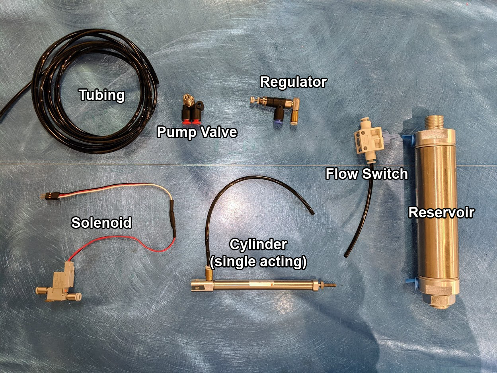

# Pneumatics

## Introduction

The first place to start is always understanding what a specific system is. Pneumatics refers to any mechanism that uses compressed gas to create motion, usually with a linear piston. The VRC legal pneumatics come in two variants, single and double acting. A single acting system uses the compressed gas to move the piston outwards, but have an internal spring which retracts the piston. Double acting systems have the compressed gas being used for both extending and retracting the piston.&#x20;

## Components

Pneumatics consist of seven major components:

* **Tubing**
  * Physical carrier for the pressurized air.
* **Pump Valve**
  * Bike pump fitting to pressurize entire system.
* **Regulators**
  * Valve to regulate the pressure of air in the system.
* **Flow Switch**
  * Simple on/off switch for airflow.&#x20;
* **Solenoids**
  * Components which turn electrical signals into opening valves for pressurizing tubes.
* **Cylinders**
  * Linearly actuating component.
* **Reservoirs**
  * Storage for the pressurized air.

The valve, regulator, and reservoir can be sequenced in whichever order, but for the other three components there is one safe configuration. The flow switch must lead into the solenoid, which must lead into the cylinder. The solenoid is the control unit, so it must be directly before the cylinder, and the flow switch allows a safety to work on these two components in isolation.&#x20;

## Best Practices&#x20;

When using pneumatics, there are many things to keep in mind for optimal performance. These range from the design process to actually in operation.

### Design

During your design process, make sure to leave space for the extra components that come with pneumatics. The solenoids are small, but do need to have specific mountings in order to make sure the connections have ample space. Do not design tight corners between your solenoid openings and the expected direction of the tubing, there is a high risk that the connection will be broken or the tubing will be airflow limited.&#x20;

* Leave spacing for Solenoids.
  * The solenoids which control the pistons are small, but make sure that you leave ample space around the connectors for tubing so the connectors fit well.
* Do not design tight corners for Tubing.
  * There is a high risk that your connections will be ripped out if you run the tubing around sharp corners, tubing and solenoids can both get damaged.&#x20;

### Construction

During robot construction there are not many helpful tips, but these should always be followed.

* Always overuse Tubing.
  * There is never a downside to using too much pneumatic tubing. Using too little can lead to connections being damaged and tubes being stretched. Having slack in tubing lines is important to ensure consistent operation.
* Know your pivot points.
  * The majority of applications for pneumatics have linear motion being converted to some rotational motion. Make sure to solidify whichever point you have that pivots.
* Distribute the Loads.
  * Be certain to even out the force on each side of the pneumatic cylinder. If only one side is loaded, there is a high chance the pneumatics will not function as intended.&#x20;
* Never work on pressurized pneumatics.
  * For safety, never work on pneumatics that have pressure, use the regulator and flow switch to depressurize or isolate workable components before doing any maintenance.&#x20;

### Operation

For ideal operation, follow these tips.

* Optimize the airflow into Tanks.
  * The pneumatics kits come with a regulator. Experiment with the amount of airflow through the regulator so that your pneumatics have just enough force to complete your intended action. This will mean the cylinders can actuate more times per full pressurization.&#x20;
*   Pressurize tanks at every opportunity.

    * The legal pressure is set at 100psi, which is quite low for most applications. Due to this, the constant re-pressurization of tanks must be a priority.

### Programming

To program pneumatics, they act as a generalized digital output that can be controlled with whatever ADI API is provided on your respective programming languages.&#x20;

## Contributors to this Article

* MTBR (Michigan Task Based Robotics)

####
