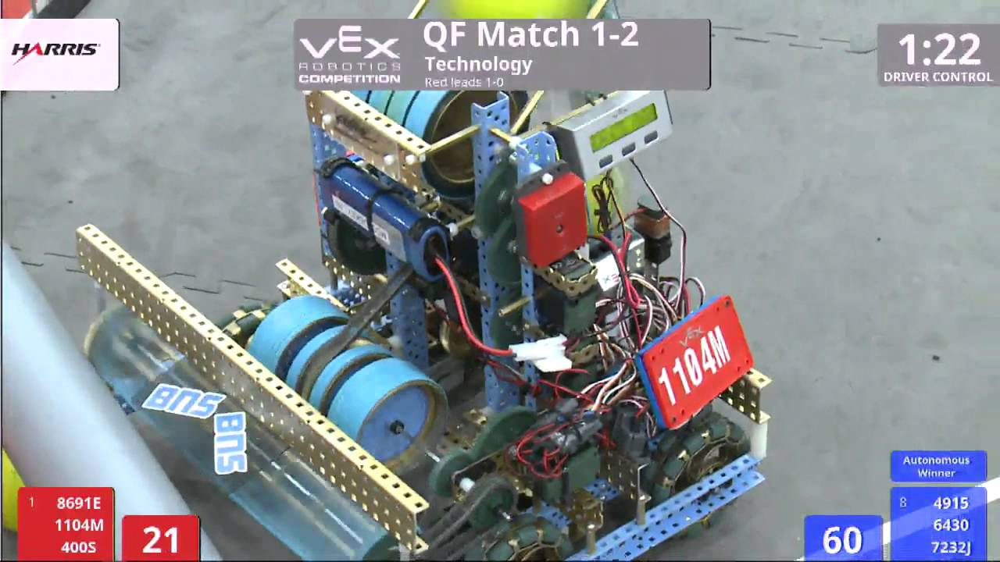

# Flywheel

## Single Flywheel

Nothing But Net's main lesson for the team was that single flywheels greatly outperform double flywheels. The majority of dominant teams in Nothing But Net had them, and our choice to go with double flywheels that season hurt us.

A single flywheel consists of one driven wheel and a lexan backplate bent into a shape that gives the desired launch angle. Ensuring low friction on the driven wheel's gearbox is extremely important. Additionally, having a fast indexer \(the set of rubberbanded wheels and chain in the middle of the above robot\) will help reduce the power draw on the flywheel when shooting. Take care to find the exact right amount of compression on the ball needed to fire it - more compression results in a farther shot for the given speed, but also a longer time to spin back up and more variability in the shot distance.

## Double Flywheel

This set of two horizontal flywheels also accomplishes the same goal, but with a few more drawbacks. The system is larger and heavier, but more importantly, it requires more compression on the ball given the smaller range of contact with the ball when firing it \(contact with the ball occurs right at the center between the two wheels as opposed to the length of the lexan for a single flywheel\). This causes a longer spin-up time and more variability in shot distance.

