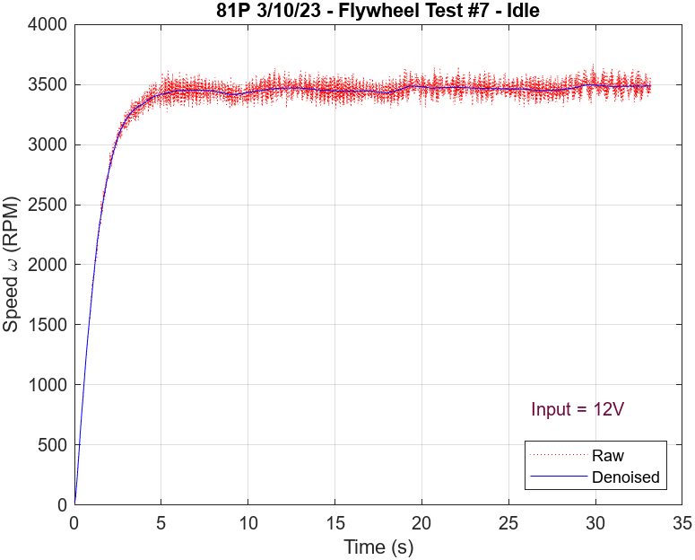
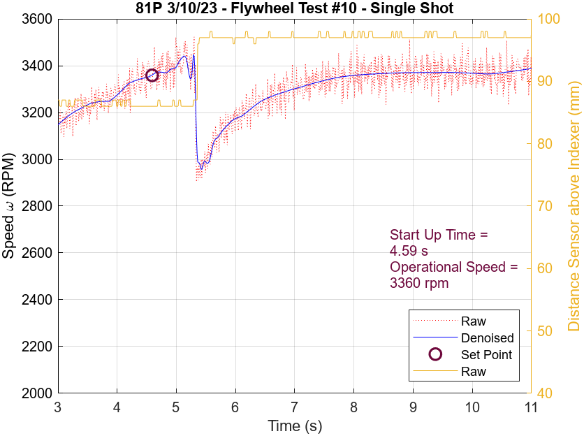
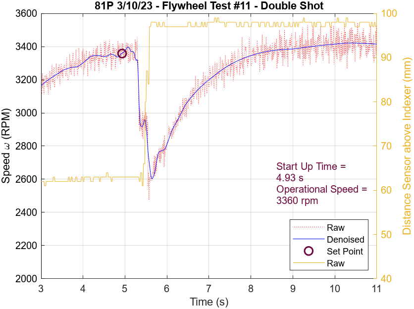
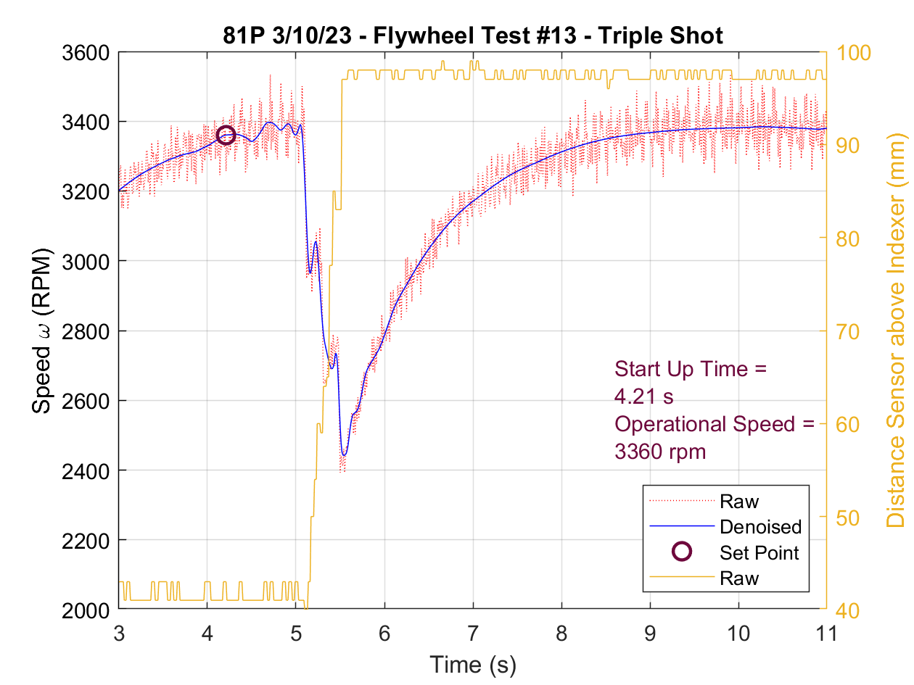

# Flywheel

A [flywheel ](https://en.wikipedia.org/wiki/Flywheel)is a mechanism that is designed to store rotational energy as efficiently as possible. This is done by spinning a wheel or disk at very high speeds with very little friction. In VEX, the main application is to launch objects long distances. They are often chosen over other shooting mechanisms for their ability to shoot at variable distances and with variable forces.

To control any type of flywheel, you have a few options. You can either max out the voltage/velocity, but if you would not like the maximum force of your motor, it is highly recommended to use a PID controller to keep the speed of your flywheel consistent. Without a PID controller, your flywheel will be in a loop of over and undershooting the speed, causing inaccurate results. 

## Single Flywheel

A single flywheel is by far the most common flywheel used in Vex because of its consistency and accuracy. Single flywheels use a single wheel spinning at high RPMs with a back plate (most commonly Lexan or ABS). The back plate is formed around the wheel and tuned for the right amount of compression (varies based on the object being fired) and cut to the desired launch angle of the object. The biggest benefits of single flywheels over double flywheels are their consistency, reduced use of motors, and distance because of greater backspin. They're consistent because of their back spin with the plate, and only tuning of one motor.

Single flywheels were the dominant design of Nothing But Net. Below is a picture of 1104M in the world finals with a single flywheel (3/6 finals teams in NBN were 1104 with essentially the same robot).

 (2) (1).png>)

[\
](https://photos.google.com/share/AF1QipNNjcP0x0m8bZmBkSu5inbOiscVHZwB8Fp6W825U3eTzoIW0\_acUYFtxjSFceFQ4w/photo/AF1QipNV5kItJyJIBCltrm17i8POyO5yCpN8sWXEORM2?key=UjBoUlJTVjR3djlObzFjQlRzREdSd2dYeHlYdnRn)This flywheel spun at extremely high RPMs and had the majority of the wheel’s mass on the very outside of the wheel which increased its moment of inertia thus making it easier to fire several balls in succession. This was paired with a ratchet and pawl that allowed the wheel to coast with no motor power and maintain most of its speed.

Single flywheels were also common in Turning Point where the main goal was precision and power. Robots like 169A chose flywheels because they are very consistent, and allowed for quick double shots (especially later in the season). 169A’s robot is shown below.

.png>)

\
This robot used many mechanics similar to what 1104 did in NBN. The biggest innovation of this robot was the addition of an angle-changing hood. This hood allowed for the robot to shoot 2 flags(of different heights) very quickly and very accurately.

\
Both above robots can be found in CAD designs [here](../../vex-cad/remembering-the-best/). (Courtesy of Zach from 929)

## Double Flywheel

A Double flywheel is similar to a single flywheel but instead of a backboard has another rotating wheel. These wheels are often placed horizontally next to each other (but have also been done vertically). They are much more advanced and allow for more tuning, most commonly changing the speed of a wheel to adjust the projectile’s path. When vertical, the wheels can have different speeds that allow for more/less backspin to make the object fly at different distances. Double flywheels are larger, and heavier, but most importantly need more compression because of the reduced contact time with the ball. This means that they take longer to spin up and put more strain on the motor. Double flywheels generally consume two motors, but can also be configured to only use one motor with a clever gearing scheme. In a one motor configuration, a seperate gear train is required to make sure the wheels are spinning in opposite directions.  

Below is VCAT Robotic’s nothing-but-net early season 15” VexU robot. It is one of the better-known double flywheels. They did however change the design soon after this to use a single flywheel.

.png>)

## Release Adjusters

Release adjusters deflect the game objects after it exits the flyhweel. They were commanly called angle shifters in Turning Point and bloopers or deflectors in Spin up.

#### Examples

<table data-view="cards"><thead><tr><th></th><th></th><th></th><th data-hidden data-card-cover data-type="files"></th></tr></thead><tbody><tr><td>91A</td><td></td><td></td><td><a href="../../.gitbook/assets/image (230).png">image (230).png</a></td></tr><tr><td>169A</td><td></td><td></td><td><a href="../../.gitbook/assets/image (233).png">image (233).png</a></td></tr><tr><td>315G</td><td></td><td></td><td><a href="../../.gitbook/assets/image (234).png">image (234).png</a></td></tr><tr><td>96969Y</td><td></td><td></td><td><a href="../../.gitbook/assets/IMG_1119.JPG">IMG_1119.JPG</a></td></tr><tr><td>BLRS2</td><td></td><td></td><td><a href="../../.gitbook/assets/image (229).png">image (229).png</a></td></tr><tr><td>4082B</td><td></td><td></td><td><a href="../../.gitbook/assets/IMG_3526.png">IMG_3526.png</a></td></tr></tbody></table>

## Refinement / Optimization

Before spending too much time on refinement, make sure the build quality of the flywheel is satisfactory. A well-built flywheel with no refinement should still be relatively consistent (even if it performs poorly). Because flywheels rotate at such high angular velocities, faults in build quality and programming will be significantly more apparent as they attempt to approach their top speed. Ensure that the structure of the flywheel is properly aligned, bearings are fully seated, and no shafts are bent to establish an efficient flywheel mechanism.

### General Optimization Design Process

1. Test and quantify the metrics of the flywheel.
2. Change a parameter.
3. Remeasure metrics.
4. Analyze results.
5. Repeat.

### Design Metrics: _variables that can be measured in testing_

<table data-full-width="true"><thead><tr><th width="197">Metrics</th><th width="136">Symbol (Unit)</th><th>Description</th></tr></thead><tbody><tr><td>Power Usage</td><td>P (Watt)</td><td>
Power (energy/time) used to maintain operational speed

Correlated with friction in flywheel system Generally, the less power usage, the better, since it means that the motor is not working as hard to maintain the speed of the flywheel and will thus be less likely to overheat or have unpredictable behavior.
</td></tr><tr><td>Start/Spin Up Time</td><td>(second)</td><td>Time duration between an unmoving wheel and reaching operational  speed</td></tr><tr><td>Rebound Time</td><td>(second)</td><td>
Time duration between shooting a projectile (or multiple) and reaching operational speed

After shooting each projectile, the rpm will decrease quickly, then pick back up.
</td></tr><tr><td>Accuracy &#x26; Precision</td><td>measurement / testing depends on current game</td><td></td></tr><tr><td>Landing Distance</td><td>(m)</td><td>Distance from the robot to where the projectile lands correlated with projectile speed</td></tr><tr><td>Projectile Speed</td><td>(m/s)</td><td>Speed at which the game object exits the robot</td></tr></tbody></table>

### Design Parameters: _variables that control the operation of the robot_

<table data-full-width="true"><thead><tr><th width="197">Parameters</th><th width="136">Symbol (Unit)</th><th>Description</th></tr></thead><tbody><tr><td><strong>META-PARAMETERS</strong></td><td>--------</td><td>Parameters that affect other parameters</td></tr><tr><td>Operational Speed</td><td>ω (<a href="../design-fundamentals/rpm.md">RPM</a> or rad/s)</td><td><ul><li>Desired angular velocity for the flywheel to be running at for the match</li><li>Usually not the max RPM the motor is capable of to reduce power usage, heat, rebound time</li><li>Optimal velocity to shoot game objects</li><li>Often called "set point" in program control</li></ul></td></tr><tr><td>Weight</td><td>m (kg)</td><td>Weight of disc</td></tr><tr><td>Dimensions</td><td>(meter)</td><td>Radius/diameter and thickness of disc</td></tr><tr><td>Edge Material</td><td>N/A</td><td>
Material at edge of wheel and surface of backing material

Examples:
<ul><li>Anti-slip mat</li><li>Foam</li><li>Silicone (flex wheel)</li><li>Rubber (bands)</li></ul></td></tr><tr><td><strong>PARAMETERS</strong></td><td>--------</td><td>Variables that affect metrics</td></tr><tr><td>Edge Velocity</td><td>v (meter / second)</td><td>
Tangential velocity at edge or disc

v = r x ω
</td></tr><tr><td><a href="https://en.wikipedia.org/wiki/Moment_of_inertia">Moment of Inertia</a></td><td>I (kg * meter^2)</td><td>
For discs in general:

 For most usable shapes: I ∝ m*r^2

For <a href="https://www.vexrobotics.com/276-8794.html#attr-vex_weight">V5 Flywheel Weight</a>: 0.3865 [lb in^2], 1.131 *10^-6 [kg * m^2]  Increasing moment of inertia increases start up time, decreases rebound time, and increases precision.
</td></tr><tr><td><a href="../../software/control-algorithms/">Control Algorithm</a> Type and Tuning Parameters</td><td>N/A</td><td>
Motor controllers often have tuning parameters that change how the motor responds to sudden drops in speed (like when shooting a game object). A properly tuned control algorithm can artificially maximize the angular velocity while it accelerates. This can decrease spin up time.

Examples:

<a href="../../software/control-algorithms/bang-bang.md">Bang Bang</a> - threshold

<a href="../../software/control-algorithms/pid-controller.md">PID</a> - kp, ki, kd

<a href="../../software/control-algorithms/take-back-half-tbh-controller.md">Take Back Half</a> - kp, ki
</td></tr><tr><td>Compression</td><td>N/A</td><td>
How much does a game element compress when it travels through the flywheel?

For single flywheels, compression increases as the distance between the 

backing and the flywheel decreases. For double flywheels, compression increases as the distance between the flywheels decreases.
<ol><li>
<a href="https://en.wikipedia.org/wiki/Deformation_(engineering)">Elasticity </a>/ Stiffness
<ol><li>depends on material meta-parameter</li></ol></li><li>
Where elastic materials were used in previous games:
<ol><li>flywheels</li><li>hoods in Nothing but Net and Turning Point</li><li>game elements in Nothing but Net and Spin Up</li><li>backings in Spin Up</li></ol></li><li>
Examples
<ol><li>If a 4" Nothing but Net ball (foam) must fit through a a 3.65" gap, it will bend or compress the backing material and/or itself by a total of 0.35".</li><li>If a 3" Turning Point ball (plastic) must fit through a 2.8" gap, it will likely bend or compress the backing material by 0.2".</li></ol></li><li>
Relations 
<ol><li>Higher compression increases precision and decreases projectile exit speed.</li></ol></li><li>
Notes
<ol><li>Compression can have varying effects based on build quality.</li><li>Too much compression will bend the supports or flywheel shafts</li></ol></li></ol></td></tr><tr><td>Grip</td><td>N/A</td><td>
How well does the flywheel and backing material hold on to the game element without slipping?

Depends on material meta-parameter Increasing grip increases the spin of the game element.
</td></tr></tbody></table>

### Examples of Flywheel Data Collection



<figure><figcaption>
Speed vs Time
</figcaption></figure>



<figure><figcaption>
Speed vs Time
</figcaption></figure>



<figure><figcaption>
Speed vs Time
</figcaption></figure>



<figure><figcaption>
Speed vs Time
</figcaption></figure>



### Vibration

When a flywheel [shakes or moves irregularly](https://youtu.be/Mh207FdkDCc?si=qv7yxcmPVjp6UaIg), it likely occurs because the flywheel is unevenly balanced or the shafts are not aligned properly or worn out.

_Flywheel balancing_ is a process that evenly distributes the mass of the wheel to prevent vibration or wobbling during operation. Balancing typically involves adjusting the weight distribution of the flywheel by adding or removing material, or by using counterweights, to achieve equilibrium and minimize vibrations.

#### Flywheel Balancing Testing Procedure ([example](https://www.emachineshop.com/dynamic-flywheel-balancing/))

1. Spin the flywheel at a constant input voltage or constant input rpm.
2. Measure the vibration through the following options. More useful metrics like flywheel speed and power usage can also be measured here.
   1. Use a mobile phone app. Tape the phone to the robot (near as possible to the flywheel) if necessary.
      1. As of 4/21/2024, Vibrometer, Sonic Tools ("VIB Scope"), or PhysicsToolbox ("Linear Accelerometer") on iOS can serve this purpose.
   2. Use the VEX Inertial Sensor. Save the accelerometer data to a csv file / SD card.
   3. Try feeling the vibration with a finger near the flywheel (be safe).
3. Quantify the vibration by analyzing accelerometer data.&#x20;
   1. Estimate the amplitude of the vibration waveform.
      1. Vibrometer gives an "Average" reading in the app.
      2. PhysicsToolbox or the VEX IMU allow users to export data to a csv file. From here, there are [many methods](https://www.desmos.com/calculator/zeo87wrraj) to estimate the degree of vibration.
   2. Frequency analysis can also be done through a Fourier or wavelet transform. Shifts in frequency often correlate with shifts in flywheel speed. This depends on the resonant frequencies of the robot.
4. Add or move a counterweight on the flywheel.
5. Repeat from step 1 until the the vibration is sufficiently low, flywheel speed is high enough, or power usage is lower, etc.&#x20;

<figure><figcaption>
Flywheel Balancing Testing Procedure 2.2: IMU next to flywheel
</figcaption></figure>


Flywheel Balancing Testing Procedure 3.1.2: Amplitude Estimation from Discrete Waveform ([https://www.desmos.com/calculator/zeo87wrraj](https://www.desmos.com/calculator/zeo87wrraj))


#### Example Testing

Below are _3 sample tests of many_ to show the effect of weight distribution on a flywheel (81P Spin Up)(2/18/23).

<table data-full-width="true"><thead><tr><th>Observations</th><th>Test #1</th><th>Test #2</th><th>Test #3</th></tr></thead><tbody><tr><td>Flywheel Balancing Configuration</td><td>6 aluminum nylocks</td><td>6 aluminum nylocks and 1 keps nut at hole index 2/6</td><td>6 aluminum nylocks and 1 steel nylock at hole index 2/6</td></tr><tr><td>Test Duration (s)</td><td>25</td><td>12</td><td>36</td></tr><tr><td>Angular Velocity (RPM)</td><td>
570 (on screen)

3420 (real)
</td><td>590-600 (on screen) 3540-3600 (real)</td><td>590-600 (on screen) 3540-3600 (real)</td></tr><tr><td>Power Usage (Watts)</td><td>8</td><td>7</td><td>6-7</td></tr><tr><td>Average Acceleration Amplitude (m/s^2)</td><td>0.6</td><td>0.2</td><td>0.2</td></tr></tbody></table>



<figure><figcaption>
Test 1 Weight Configuration
</figcaption></figure>

<figure><figcaption>
Test 1 Vibration Data  (App "Vibrometer")
</figcaption></figure>



<figure><figcaption>
Test 2 Weight Configuration
</figcaption></figure>

<figure><figcaption>
Test 2 Vibration Data  (App "Vibrometer")
</figcaption></figure>



<figure><figcaption>
Test 3 Weight Configuration
</figcaption></figure>

<figure><figcaption>
Test 3 Vibration Data (App "Vibrometer")
</figcaption></figure>




## Teams Contributed to this Article:

* [91A](https://www.vexmen.com/) VEXMEN: Archangel
* 81P VEXMEN: Pandemic
* [BLRS ](https://purduesigbots.com/)(Purdue SIGBots)
