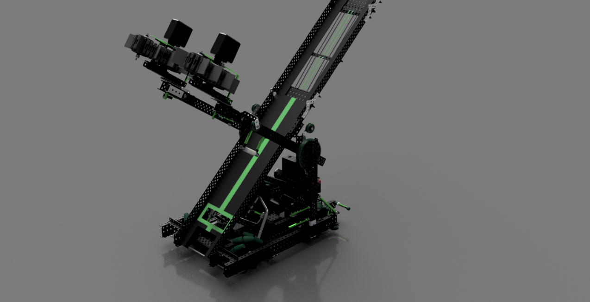

# Mecanum Drive

The Mecanum Drive is just as simple to build as the Tank Drive, but has the ability to drive sideways. It uses VEX mecanum wheels in order to drive, turn, and strafe.

<table><thead><tr><th>Pros</th><th>Cons</th><th data-hidden></th></tr></thead><tbody><tr><td>High forward traction</td><td>Slow compared to tank drive</td><td></td></tr><tr><td>Ability to strafe</td><td>Innefficient strafing</td><td></td></tr><tr><td></td><td>Space innefficient </td><td></td></tr></tbody></table>

The Mecanum Drive is compact and simple to construct as compared to other holonomic drives, but it can be difficult to push from the side and its strafing movement is slower than forward driving. The VEX mecanum wheels' limited roller sets (7) can result in a clunky driving experience, which may hinder programming autonomous functions using integrated motor encoders.

<figure><figcaption></figcaption></figure>

The Mecanum Drive was utilized by [7K's Tower Takeover Robot](https://www.youtube.com/watch?v=vGkMw4Nx-Ks). Mecanum wheels are especially effective in games like Tower Takeover which involve rows of game elements or aligning with the field perimeter.


To enable strafing in a Mecanum Drive, the wheels must be positioned correctly with the top rollers forming an "X" shape. It is essential that the rollers of wheels in opposite corners are aligned in the same direction.

