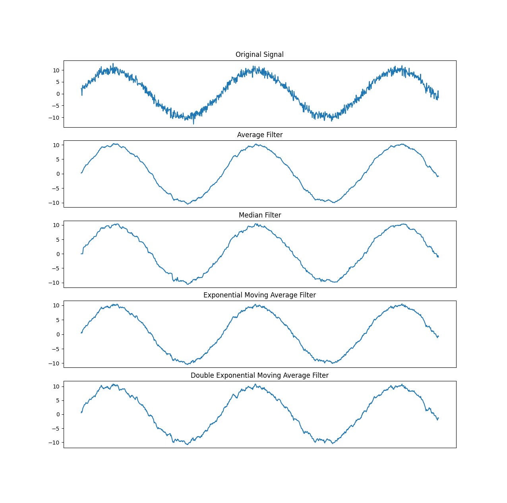
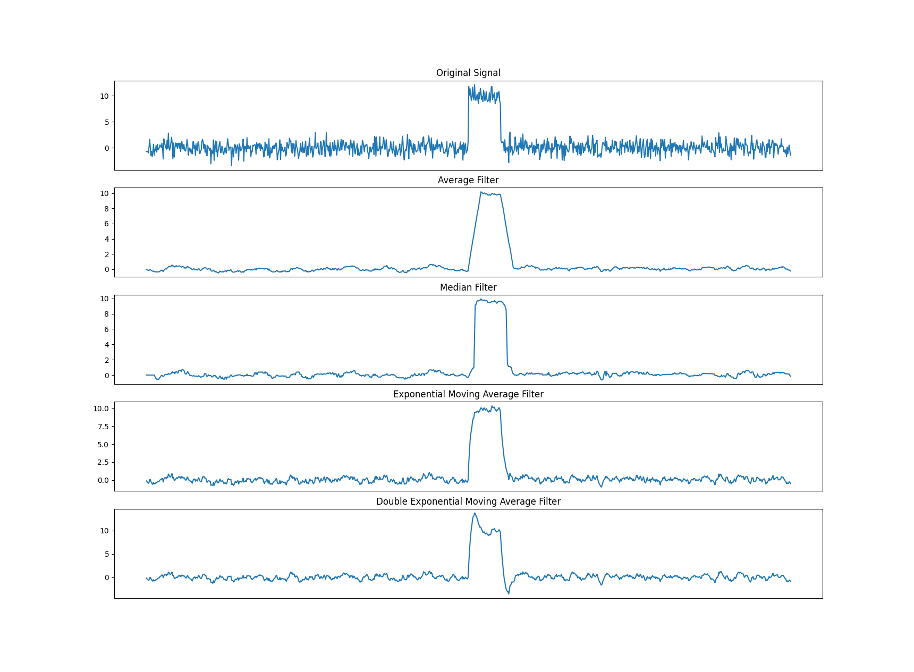

# Basic Filters

Most sensors return "noisy" data, which is can have spikes, dips, and other deviations from the real value that is being measured. This noise can prove to be a problem when using a sensor's data across applications from velocity measurement for flywheel control to checking for current spikes when a drivetrain got stuck. We can use filters to remove (some of) this noise from the data.

The [Okapilib](https://okapilib.github.io/OkapiLib/index.html) library, provided with [PROS](https://pros.cs.purdue.edu), contains a number of basic filters to choose from. Properly filtering your sensor data requires a bit of knowledge about which filter to use based on your use case, as well as a bit of knowledge about how to tune the filter.

A full list of the filters available with Okapilib can be found in its documentation: https://okapilib.github.io/OkapiLib/md_docs_api_filters.html.

## Sine Wave Example

We'll be comparing the filtered output from a four different OkapiLib filters given the same noisy sine wave input.



There are four filters shown above:

- Average Filter: This filter collects the last `window_size` samples and returns the average of them. `window_size` is a configurable parameter.
- Median Filter: This filter collects the last `window_size` samples and returns the median of them. `window_size` is a configurable parameter.
- Exponential Moving Average (EMA) Filter: This filter uses an exponential moving average to smooth the data. That average is computed as a weighted average of the current value from the sensor and the previous filtered value.
- Double Exponential Moving Average (DEMA) Filter: Effectively two EMA filters run in series.

Each of these four filters have some sort of tunable parameter(s) that can be adjusted to change the amount of smoothing.

The Average and Median Filters have one tunable parameter, the `window_size`. The window size determines how many values should be stored in the filter's average/median calculation. A larger window size will result in a smoother output, but will result in more "phase lag" (more on that in the next section). The examples above used a window size of 20, which provided _some_ smoothing but didn't completely remove the spikes and dips from the noise.

The moving average functions, EMA and DEMA, have one tunable parameter for each moving average calculation. This tuning parameter, called `alpha` for a single EMA, determines how much weight is given to the current value when computing the average. The larger the alpha, the more weight is given to the current value. The smaller the alpha, the more weight is given to the previous value. The examples above used alpha of 0.2, which means that the filter value at any given time step is 80% of the last filtered value and 20% of the current value from the sensor.

Let's retune the filters a bit to smooth out some more of the noise and compare the output of the four filters on that noisy sine wave.


Changing the tuning parameters to a window size of 40 and an alpha of 0.1 gives a smoother output, but at the cost of additional "phase lag".

Phase lag is the shift of the filtered output in the X direction. Each of the graphs in the plot above have a vertical line at the same X value of 500. On the original, noisy sensor value, we see that the peak of the sine wave is a bit before the vertical line. The window-based filters, the Average and Median filters, have the peak of the sine wave a bit _after_ the vertical line though.
The practical impact of this phase lag is that your program using the filtered data will react slower to changes in the sensor value. If you are using a filter on a velocity sensor for a flywheel, for example, this would mean that your [velocity controller](../control-algorithms/README.md) would have a bit of a delay in reacting to a drop in speed from shooting a game object.

The moving average filters, on the other hand, have a much smaller phase lag. The DEMA filter, in particular, is designed to have a nearly zero phase lag. These filters don't produce an output that's nearly as smooth as the window-based filters, but they are much better suited to systems like a flywheel that need to respond quickly to changes in the sensor value.

Does this mean that the DEMA filter is always the best filter to use? Not exactly, let's take a look at another example.

## Step Response Example



The graph above shows a noisy step function. This would be similar to the output of a current sensor on a drivetrain motor that hits something and gets stuck. We want to ignore the noise when the motor isn't stuck, but we want to be able to tell quickly if the motor's current has spiked and the motor got stuck.

The DEMA does _not_ perform nearly as well in this case. Sure, its response time is still a bit faster than the other filters, but the output of the filter contains a big spike after the sensor value steps up that's nearly 50% higher than the actual sensor value. The filter does a good job of responding quickly to the step in the sensor value, but it doesn't provide an accurate value for the current around the big changes in sensor value.

The Average Filter is limited by the window size and takes a while to slowly increment up to the actual sensor value. A larger window size would take even longer to linearly increment up to the actual sensor value.

The EMA and Median filters provide a bit of a middle-ground between the previously mentioned filters. They aren't quite as fast to respond as the DEMA filter, but they are still fast enough to respond reasonably quickly to changes in the sensor value for most use cases. Their output doesn't suffer from the same fluctuation in the output value after the sensor value steps up that the DEMA filter does; the output is more accurate to the sensor's value.

## Conclusion

Each of these filters provide a set of unique benefits and drawbacks.

- The Average Filter provides good smoothing of noisy data that isn't expected have real spikes in the input, at the cost of a longer response time and higher phase lag.
- The Median Filter provides good noise smoothing and a better response time, but still suffers from the same phase lag as the Average Filter.
- The EMA Filter typically lets more noise through than the previous filters, but provides a better response time and less phase lag.
- The DEMA Filter provides the best response time and phase lag at the expense of letting some more noise through and some weird output fluctuations around big changes in the sensor value.

## References

- [Okapilib's Filter Docs](https://okapilib.github.io/OkapiLib/md_docs_api_filters.html)

The code used to generate the example plots:

```python
from matplotlib import pyplot as plt
import numpy as np

def average_filter(input, window_size):
    output = []

    window = [0] * window_size
    index = 0
    for i in input:
        window[index] = i
        index += 1
        if index >= window_size:
            index = 0

        output.append(np.mean(window))

    return output

def median_filter(input, window_size):
    output = []

    window = [0] * window_size
    index = 0
    for i in input:
        window[index] = i
        index += 1
        if index >= window_size:
            index = 0

        output.append(np.median(window))

    return output

def ema_filter(input, alpha):
    output = []

    ema = 0
    for i in input:
        ema = alpha * i + (1 - alpha) * ema
        output.append(ema)

    return output

def dema_filter(input, alpha, beta):
    output = []

    ema = 0
    dema = 0
    for i in input:
        lastema = ema
        ema = alpha * i + (1 - alpha) * (ema + dema)
        dema = beta * (ema - lastema) + (1 - beta) * dema
        output.append(ema + dema)

    return output

t = np.linspace(1, 100, 1000)
signal = 10*np.sin(t/(2*np.pi)) # The sine wave
# signal = np.concatenate((np.zeros(500), np.ones(50) * 10, np.zeros(450))) # the step function
noise = np.random.normal(0, 1, len(signal))

plt.subplot(5, 1, 1)
plt.plot(noise + signal)
plt.title("Original Signal")
plt.axvline(x=500, color='r')
ax = plt.gca()
ax.axes.xaxis.set_visible(False)

# window size of 20 for example 1, 40 for example 2
ave = average_filter(noise + signal, 40)
plt.subplot(5, 1, 2)
plt.plot(ave)
plt.title("Average Filter")
plt.axvline(x=500, color='r')
ax = plt.gca()
ax.axes.xaxis.set_visible(False)

# window size of 20 for example 1, 40 for example 2
med = median_filter(noise + signal, 40)
plt.subplot(5, 1, 3)
plt.plot(med)
plt.title("Median Filter")
plt.axvline(x=500, color='r')
ax = plt.gca()
ax.axes.xaxis.set_visible(False)

# alpha of 0.2 for example 1, 0.1 for example 2
ema = ema_filter(noise + signal, 0.1)
plt.subplot(5, 1, 4)
plt.plot(ema)
plt.title("Exponential Moving Average Filter")
plt.axvline(x=500, color='r')
ax = plt.gca()
ax.axes.xaxis.set_visible(False)

# alpha of 0.2 for example 1, 0.1 for example 2
dema = dema_filter(noise + signal, 0.1, 0.1)
plt.subplot(5, 1, 5)
plt.plot(dema)
plt.title("Double Exponential Moving Average Filter")
plt.axvline(x=500, color='r')
ax = plt.gca()
ax.axes.xaxis.set_visible(False)

plt.show()
```

### Contributing Teams to this Article:

- [BLRS](https://purduesigbots.com) (Purdue SIGBots)
