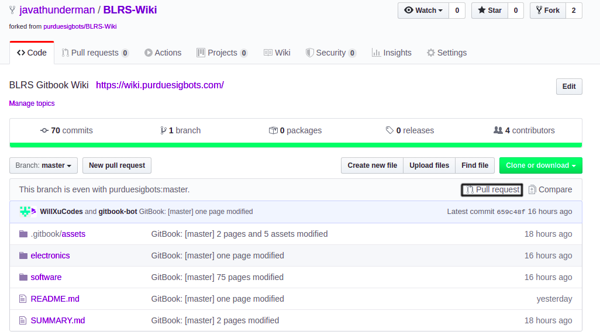

# Version Control

## Overview

Whenever you write some software, it’s good practice to use some sort of version control system. A version control system is a program used by developers to backup, archive, and track changes to code over time. There are many version control systems out there, including Subversion, Mercurial, and more, but the most popular is called Git.

Git works by tracking any change to your project - including file name changes, changes to where a file in your project is stored, and modifications to files in your project. Every so often, you will want to mark a certain version of your project. Git allows us to do this by making a commit, or capturing a snapshot of your project at a certain time. (Think back to a time when you were working on a large document, and you saved it periodically with a slightly different name). Each Git commit is timestamped, attributed to an author, and provides a list of changes made (a diff) since the last commit. You can also view all of the changes between two unique versions of your project, either side by side or line by line.

Commits in Git can be made locally (just on your computer), or pushed to a remote. A remote is a server that hosts Git projects, which are called repositories. There are quite a few Git hosting services out there, but the most popular one is GitHub. In addition to hosting an archive of your repository (particularly useful in case you accidentally delete your local repository, which will wipe your backups), GitHub allows you to easily share your code and collaborate with others.

While working on a VEXU or VAIC team with multiple source code contributers, it is important to sync with a remote, so eveyone has access to the latest version of the project. By default, Github repositories are make completely public. Users with free acounts can create private repostiories with a maximum of 3 total contributors.

There are a few different options for installing Git. GitHub has their own software client for Git, which you can install on Windows, Mac, or Linux. You can also download and install GitKraken, which is a great visual Git client.

However, the most versatile solution is using the Git command line tool, which you can install on any operating system. There are a few important commands to learn when using the command line tool:

* `git clone <url of your GitHub repository>`
  * This command will download your GitHub repository, including the log of changes made to each file.
* `git add`
  * This command adds files to a list of files that the Git command line tool will examine when making a new commit. Usually, you will want to add all of the files to this list, and you can do this by running `git add .` (space between “add” and the period).
* `git pull`
  * If you already have your Git repository on your computer, this command will allow you to download all changes made to the remote version of your repository. This command is especially important for avoiding merge conflicts, where commits made to one version of your repository are different from another.
* `git commit`
  *   This command will commit all tracked changes made to your repository. If you add the “-m” modifier after this command, followed by quotation marks, you can add a message to the commit that will be displayed in the changelogs. An example of this would be:

      `git commit -m “First commit”`
* `git push`
  * This command will upload new commits to the remote. In order to push code to your repository, you will need to login with your username and password. This also prevents other users from making changes to your code without your permission.
* `git status`
  * Running this command will give you all changes made to the local copy of the repository since the last commit. It will also tell you whether those changes are being monitored by Git for inclusion in the next commit.
* `git log`
  * `git log` will give you a list of all commits made to a repository since its creation. In order to exit this mode, press the `q` key.
* `git stash`
  * The stash command will undo all changes made since the last commit and hold them in a "stash", so they can be edited later. A stash only exists on the local copy of your repository - it is not synced with a remote.

Note to PROS users: If you are using the PROS editor, Atom has GUI based Github integration built in.

## Workflow

If you have already created a project locally (this is likely the case for PROS users), you can sync your local repository with a remote.

* Make a new repository on GitHub. Don't add anything to this repository (GitHub will ask if you want to add a README file or .gitignore, but you should not enable either of these.)
* Open a terminal on your computer. On Mac/Linux, this will be "Terminal"; on Windows, it may either be Command Prompt or the Git Bash program, depending on how you installed Git.&#x20;
* Navigate to your project
* Run `git init`
* Run `git add`, usually in the form of `git add .` so that Git knows to track all of the changes made to the project.&#x20;
* Run `git commit`, usually with the `-m` flag and a commit message in quotes
* Run `git remote add origin <link to repository>`.&#x20;
* Run `git push -u origin master`. You won't have to use the additional `-u origin master` flags in the future; this is just to make sure that Git associates the remote version of the repository with the local version of the repository.&#x20;
  * This step will ask for your username and password. If you have two factor authentication enabled, you will need to set up a Personal Access Token (which you can read about in GitHub’s documentation). You can also setup SSH and GPG keys in order to push code without entering a password and to make signed commits.

Some of these instructions are usually displayed when creating an empty repository on GitHub, so you can usually copy and paste the commands directly into your terminal.

Alternatively, if you don't already have a local project that you'd like to push to a remote, you can follow these steps:

* Make a new repository on GitHub
* Clone the repository using either the command line tool (`git clone <url of repository>`) or a Git client, like GitHub for Windows or GitKraken. If you already have the repository on your computer, run `git pull` to get any outstanding changes made to the remote copy before you begin working.
* Make all the changes you want
* Run `git add`, usually in the form `git add .` in order to make Git look for all new changes made to the code
* Run `git commit`, usually with the `-m` flag and a commit message in quotes
* Run `git push`
  * This step will ask for your username and password. If you have two factor authentication enabled, you will need to set up a Personal Access Token (which you can read about in GitHub’s documentation). You can also setup SSH and GPG keys in order to push code without entering a password and to make signed commits.

## Branches

One particularly useful feature of Git are repository branches. These allow to split off from the main record of commits (the "tree") and make commits without directly modifying the stable, master branch of your repository. For simple projects where there are only one or two authors, extra branches may not be necessary. However, for larger projects, branches are essential to coordinating different histories of the repository over time.

In order to use branches:

* `git branch`
  * The branch command lists all branches in a repository.
* `git checkout`
  * The checkout command allows you to switch between different branches of a repository. It is typically used in conjunction with the branch command.
* `git checkout -b <name of new branch>`
  * This command will copy the branch that you are currently on (usually the "master" branch) with a new name. You can make edits to the code on this branch without affecting the code in the master branch, and commits made to this branch will be synced with the remote copy of the repository.

Sometimes, you will want to merge changes made to one branch of your repository with the stable, master branch. In order to do this, GitHub has a feature called "pull requests":

Opening a pull request allows you to compare the changes made to the two branches, and allows for a review process before merging the two. Pull requests are also used when dealing with forks of a repository and third party contributions made to a project.

### .gitignore

You may have noticed that GitHub adds a .gitignore when creating your repository. This file tells Git to ignore certain files when tracking changes made to the local repository. The default .gitignore added to PROS projects includes files under the bin/ folder, since this contains machine code that is not critical for backups. In addition, a .gitignore can be used to avoid having sensitive information (such as API keys, information about your computer, etc.) uploaded to GitHub.

#### Contributing Teams to this Article:

* [4001A](https://github.com/phsengineering/)
* Udit S
