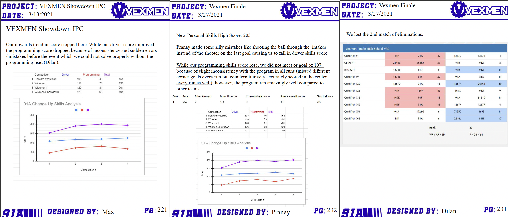

# Segments of the Notebook


The included notebook photos are from 91A Vexmen Archangel's 2020-21 competition notebook. While the notebook did win Excellence Award at the Eastern Pennsylvania State Championship, it should be noted that this is not a perfect notebook, though it is a good example to start with.


## Parts of a Notebook

### Table of Contents

The first section in this article, naturally, is about the first part of any notebook - the Table of Contents. While the main purpose of the Table of Contents is to describe the what, where, and when of each page in the notebook, there are many ways to further illustrate to readers exactly what and where everything is, making it as easy as possible to find information.

One technique that can be used to make the Table of Contents more concise and easy to read is the use of page ranges. While it is very important to include specific page locations for topics in the notebook, consolidating the page numbers of larger topics into the applicable range cuts down on repeating topic names, and uses fewer lines in the Table of Contents. Not running out of space in your Table of Contents for new topics is an absolute must! For an example, please see the Table of Contents depicted below.&#x20;

As for other organizational tips, color coding each general topic covered in the Table of Contents is a good way to make things easier to find, as well as to further illustrate the Engineering Design Process. For example, each step in the Engineering Design Process could be assigned a color, with each topic in the Table of Contents being assigned one of those colors. That way, it is much more evident for the judges that the Engineering Design Process is being continuously followed. Similarly, using colored pull tabs for major sections of the notebook can make it even easier for judges to find important information.

### The Team

Team introductions should be one of the first entries in a notebook, describing each team member. Start out with a photo of the whole team together (if possible) with a brief introduction. In addition to a professional photo, individual bios for each member should include topics such as their year in school, time in VEX, other interests, and goals for the season. At the end of this section, talk about team goals, as well as other projects the team works on - outreach, community projects, and the like.

### The Engineering Design Process

In this section, a thorough description and breakdown of the [Engineering Design Process](<../../../Team Administration/team-documentation/the-design-process.md>) (EDP) should be included, as well as how the team plans to implement this process. There are multiple key pieces of information to cover in this segment, none the least of which is a step-by-step breakdown of the EDP itself, as is pictured on the left below. It is key that each step of the EDP is broken down to illustrate that the team knows how to follow the steps, and the judges know what to expect within the rest of the notebook. Including each step as a graphic, as pictured, helps to illustrate the flow of the process, while further pages in this segment can specifically describe each step, how the team plans to follow the steps, as well as how the steps will be organized in the notebook.

Other useful information that can be included in this section could include the Notebook's Ideology, information on how the notebook will be formatted and why, as well as goals that the team aims to follow with the notebook. In addition to breaking down the EDP as written above, this segment of the notebook should also be used to establish the various formats of entries in the notebook, and how those tie into the EDP. For example, a page describing how testing will be conducted and recorded consistently could be tied directly into that step of the EDP, in order to establish a set procedure for any team member to follow in the future, as well as to show more organization to the judges. There are numerous topics and bits of information that can be included in this section, and many effective ways to tie those into the EDP.

### Game Analysis

Following the steps of the Engineering Design Process, the first main step a team will need to take will be to define the problem in their overarching seasonal design process, which is most commonly formatted into a Game Analysis segment. The Game Analysis segment of the notebook is where the game and overall design problem is analyzed. Add drawings, photos, descriptions, measurements, and more to make sure there is more than enough detail. The biggest thing to make note of when writing this section is that the Game Analysis segment is a game _analysis_, not a game description. Instead of word-for-word repetitions of the rules directly from the game manual, this segment should mainly be comprised of descriptions of how these rules could effect gameplay and design choices, or topics such as the implications of how game elements are constructed. Generally, Game Analysis segments of the notebook should include the following:

* Important rules and their implications.
* Strategies used in similar games, or games with similar aspects.
* How the autonomous period can be utilized most effectively.
* Ideas for match and design strategy.

### Research and Decision Matrices

Moving along the steps of the Engineering Design Process, the team will need to specify design requirements, research and brainstorm, as well as choose the optimal solution for the earlier defined problem. In these segments of the notebook, the team will need to effectively research solutions to the given problem, compare and contrast various ideas for a solution, and then effectively decide which solution provides the optimal way forward.

#### Research and Brainstorming

In this segment, ideas are generated in order to solve the defined problem from the previous segment. When doing initial brainstorming, it is best to break the robot down into different subsystems in order to create the most detailed ideas. For instance, subsystems could include Drive (how a robot will traverse the field), Manipulator (how a robot interacts with game elements), and scoring mechanisms (how a robot manipulates game elements into scoring zones). After the robot is broken down into subsystems, creating 3-5 (or more) ideas for each of the subsystems and documenting these in detail would be very effective. Draw sketches, annotate ideas, and take photos of mock-ups or other robots for inspiration. Anything goes here, just make sure that you cover each idea thoroughly and in detail. In addition to documenting ideas in detail, tying this section in with the Game Analysis could be an effective way to make the notebook more cohesive - referring back to and restating various strategies defined in the earlier segment, and how each idea or design could help implement or effectively follow such strategies.&#x20;

When researching various solutions to the previously stated problem, is it important to keep in mind that specific solutions should not be immediately copied from the source, but should rather be conceptualized to create a unique design. For instance, directly copying, or "holecounting," an entire robot from a reveal video online when starting the season may be a quick way to make a robot, but will not help the team learn through the steps of the Engineering Design Process, it would essentially be copying another team's work. The most effective way to research using resources from other VRC teams is to refer back to the problem described in the previous segment, and relate the design choices used by another team to those prompts - which specific mechanisms they used to solve a problem, how they were implemented, and why they were effective. From there, the team can plug these ideas into a decision matrix with other brainstormed or researched ideas, and decide whether that idea or implementation is the right way to proceed. From there, the team can follow the remaining steps of the Engineering Design Process, and effectively implement and put their own spin on these ideas, hopefully making them better than the original.

#### Selecting Approach

After several ideas or designs have been generated amongst the team, it is time to chose the optimal path forward for that particular problem. The optimal way to choose which idea to proceed with is to use charts and decision matrices. Decision matrices can take many forms, ranging from a simple pro/con list for each idea, comparing the various benefits and drawbacks in a simple bullet point format, to full charts with many different categories.&#x20;

Now, why should decision matrices be used if they're going to be these massive charts? In some cases, it may even be a simple enough decision to where a decision matrix may not seem necessary at all. Even so, it is highly recommended to illustrate the choice through a decision matrix regardless, for a myriad of reasons. Firstly, while choosing a particular subsystem or idea may seem obvious to the team, using a decision matrix can help make the reasoning behind a choice clear to other team members, advisors, and especially the judges. To people who may not have an instinctive grasp on VEX Robotics, decision matrices can help break down complex decisions to something more understandable. Secondly, reviewing the factors in an important team decision can help make sure that the team is absolutely certain of their decision, and to make sure that no pieces of information were overlooked. In this regard, decision matrices are very effective in organizing the thoughts and process behind a decision.

As for how decision matrices should be formatted in the notebook itself, there is not one clear answer. This is mainly due to the large degree of flexibility when designing a decision matrix, regarding their form, size, and attributes. For instance, a large table with various metrics for comparison may necessitate its own page in the notebook, while smaller tables or diagrams could be combined into one section. The main points to keep in mind are that decision matrices are distinguishable from one another, cover the intended information, and lead towards a written conclusion (we decided upon \_\_\_\_, because of \_\_\_\_ as shown in the above chart).

#### Project Management

One thing to consider before regular meetings to accomplish the goal defined in the previous segments is to outline a schedule and establish how the team will stay on track throughout the season. The first topic that should be established would be the outlining of meeting times, as well as weekly hours to put in. With the initial time to work with decided upon by the team, further outlines, goals to be set, and a rough timeline for the future can be decided upon.&#x20;

With the amount of time put in by the team set, the next step should be to create a schedule for the season including competitions, scrimmages, and time needed to complete parts of the robot (building, testing, programming, driving practice). While this step is fairly flexible with regards to adding and removing events, it is best to try and nail down as many prospective dates as early as possible, so as to accurately budget time, established earlier, for the season.

One effective way to keep track of all of this scheduling information is a GANTT Chart that shows goals and timelines. There is an example illustrated below, but generally, GANTT Charts show timelines of a set basis, using different rows for various tasks that need to be accomplished in that time. GANTT Charts can be created in programs such as Microsoft Excel, Google Sheets, and additional free online generators. From there, it is easy to mark the various goals and events along this set timeline. Be sure to keep it all realistic, given the previously decided upon time budget, and add additional updates to the goals and schedules as it seems necessary (monthly or after each competition is recommended).&#x20;

### Designing and Building

This segment is the place to document all progress on the robot, which can take numerous different forms. While there are many different forms that these entries can take, it is best to establish a format early on and stick with it for the rest of the season, as a consistent format makes the notebook considerably easier to read and document within.&#x20;

There are many different formats that these entries can take, from which the best format is usually the best for the specific team's individual circumstances. While there is a large degree of flexibility with regards to general entries, it is best to follow a select few best practices regardless. For instance, it is a highly recommended best practice for multiple team members to write in the notebook, each recording entries or information that they are primarily responsible for. This way, it is easy for the judges to see that all team members are actively contributing to the progression of the team as a whole, even if a large portion of the notebook is done by a dedicated member. Additionally, notebooks should always be written in pen, with the sole exceptions of digital notebooks or using pencil to write a rough draft, to be later erased and replaced with pen writing. Color is a valuable resource when writing entries, as different colors can be used to emphasize headings and important information - using colored pens, markers, and colored in illustrations is very nice to see.

As for specific entries, there are a few best practices that should be followed regardless of specific format as well. The title of each entry, for instance, should be describing what was done, rather than a generic "10/12 Mechanics Entry." In this way, it is easy to gain a sense of progression even just from reading page titles in the [Table of Contents](segments-of-the-notebook.md#table-of-contents). Additionally, it is recommended to begin each entry with the goals for the meeting, a basic timeline of what you want to accomplish, and everyone who attended the meeting. Add lots of well annotated photos, any [testing](segments-of-the-notebook.md#recording-testing-data) that occurs, and an analysis of the progress as well. The end each entry should include specifics of what was accomplished, and what should be accomplished by the next meeting. This does not need to be a full team report every time, for instance, if one person does something on their own, make sure it is logged. &#x20;

In this segment, one effective way to format information is using an already established format, one that has already been detailed earlier in the notebook: the [Engineering Design Process](segments-of-the-notebook.md#the-engineering-design-process). While the Engineering Design Process (EDP) is mainly used to outline large, major goals and iterations, **showcasing the EDP in minor tasks throughout the season is essential** as well. For instance, applying the EDP to something as simple as fixing a broken lift could provide a clear outline of progress in the notebook. Defining the problem at the beginning of the entry, identifying and implementing solutions, and following up with additional testing are just some of the steps that are taken within this small fix that are also key factors in the EDP. Using these steps as headings within an entry of any size is an easy and effective way to format.

### Programming Documentation

This segment is the place to document all of the progress in programming for the robot. It is important to show the process that was followed in development, and shows that all code was developed by the team, or references outside resources such as [Okapi](../../../software/vex-programming-software/pros/okapilib.md), [PROS](../../../software/vex-programming-software/pros/), [Pilons' Odometry Document](../../../software/odometry.md), etc. It is also recommended that the team heavily annotates all code in the notebook so that judges with little to no experience can understand it, and more experienced judges can better appreciate it. Because of all these factors, in addition to the fact that code development is largely separated from mechanics and general entries, mean that it is common for teams to create a separate notebook or binder just for programming documentation.

.png>)

In documenting your program, it is important to write about all facets of the code, describing the reasoning behind decisions using the Engineering Design Process in much the same fashion as mechanics entries. In addition to including a fully commented print of the code in the notebook, it is even more important to describe and highlight important pieces of the notebook separately, as well as describing the rational behind them. As an aside, main autonomous route planning, done with a specific robot in mind, should be included chronologically within the main notebook - separated entries should mainly be reserved for backend development on complex algorithms.

.png>)

### Recording Testing Data

One of the most overlooked areas in writing a competitive notebook, testing the changes made to a robot is an oft-completed task for any team, yet still needs to be effectively documented in the notebook. Documenting the testing data for a robot or program helps to showcase various areas for improvement, as well as illustrating a tangible record of improvement throughout the notebook. While testing may have its own entry in the notebook, the vast majority of testing will be done in conjunction with changes to the robot, and included within those entries. As such, it is important to establish a baseline procedure for documenting all testing early in your development process, recording this procedure in the notebook. An established procedure for performing and recording testing helps to ensure that all testing is consistent, accurate, and reflected well within documentation.

.png>)

As for how testing should be documented, that is largely specific to the subject of such testing. There are many different testing methods that can be researched and used, the main important things being that the process used for testing is documented in the notebook, and the process is used consistently to gather effective data. One way to help make the testing process more efficient is to make sure that the metrics used to test are real use-cases, and things that would need to be tested anyways. For instance, testing the speed at which a lift operates, or how fast an object cycles through the robot, are both easy to test and things that have a real impact on a robot's performance.

### Tournament Entries

The last major segment that should be included multiple times in any notebook are Tournament Entries. In this segment, the team will give an in-depth overview of how the tournament went, mainly covering these attributes:

* Summarize the match results (teammates, opponents, scores)
* What went well with the robot, code, and strategy
  * What didn't work or could be improved
* Strategies used for the Alliance Selection and Elimination Rounds
* Consistency of the autonomous routine

On a general basis, the Tournament Entries should serve as a general "what worked, what could be better" of an actual use-case for the robot. Tournaments are some of the best, most efficient testing available, and should be used to stress-test of the robot, and decided which strategies to use again, which to retire, and which to improve.
