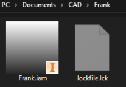

# Assemblies

Assemblies are files with the extension `.iam`. They let the user assemble multiple parts into a robot.  When creating anything with more then one part, we will use an assembly to put the parts together.

## Creating a New Assembly

Once Inventor is open, click `File` in the top left corner, `New`, then `Assembly`.

The first thing we do when creating any new file is to **save it** with `ctrl+s`. A window will pop up, name the assembly the name of the robot. Navigate to the robot folder you created in the previous article, click `Save` to save the new assembly.

When done, if we look in our robot folder, this is what you should see:  

## Contributors to this Article:

* Jess - EZ

