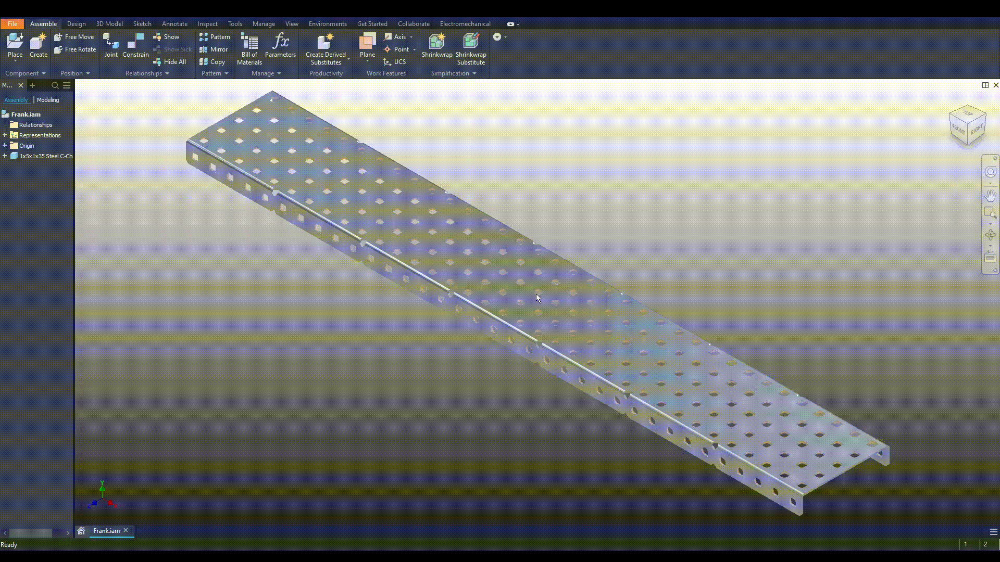
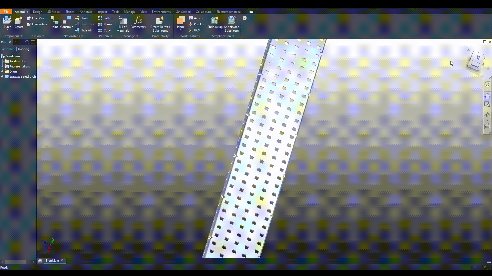

# Navigating CAD

## Using Mouse

### Zoom

Spin your scroll wheel to zoom in and out of your workspace.&#x20;

### Pan

Click your scroll wheel (or your middle mouse button) and move your mouse to pan in your workspace.

### Orbit

Click shift on your keyboard, select your scroll wheel (or middle mouse button) and move your mouse to orbit your workspace.

## Using Navigation Cube

### Home

At the top right of your workspace is the navigation cube.  Bringing your mouse near the cube makes a house appear.&#x20;

### Selecting Cube Faces

Hover over the face of the cube you want to view and left click.

## Contributors to this Article:

* Jess - EZ
