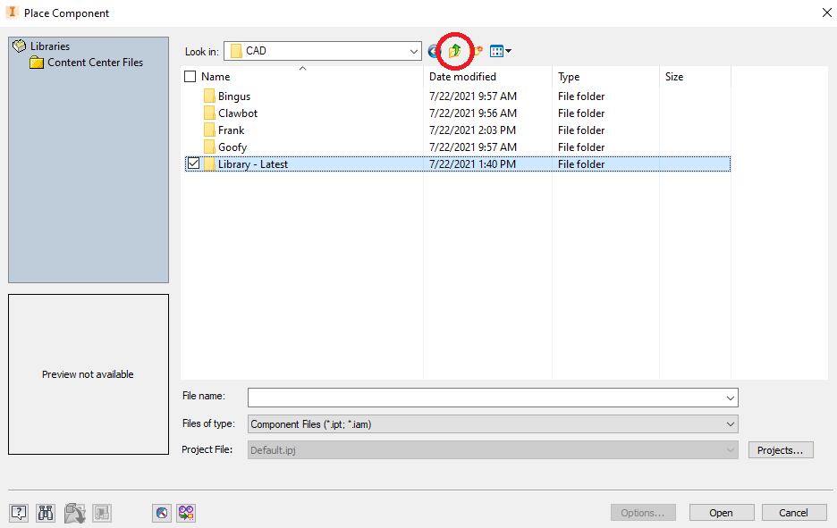

# Placing Parts

## Placing Parts

Make sure you're on the `Assemble` tab on the ribbon at the top left corner.  Under `File`, click the text `Place from Content Center`.  This is what it defaults to, but we want it to say `Place`.  Select `Place`.&#x20;

.png>)

The `Place Component` window will pop up.  Navigate to the CAD folder that we created previously.  It's best practice to use the button circled in red to go up a directory when navigating.

Always start with placing your main chassis cross brace.  I'm using a 35 hole steel 5 wide from `Structure/C-Channels/Steel 1x5x1/1x5x1x35 Steel C-Channel.ipt`. &#x20;

After selecting the part you want to place, the part appears slightly transparent.  If your part isn't in the correct orientation, you can right click and get the option to rotate your part in X, Y and Z axis by 90 degrees. &#x20;

Once your part is in the correct orientation, `Left Click` to place your part.  If you want more then one of this part, `Left Click` again.  Once you have all of your parts, press `Escape` on your keyboard.

.png>)

When done, this is what you should see:

.png>)


Remember to save!


## Contributors to this Article:

* Jess - EZ
