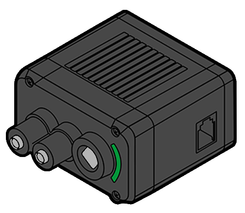
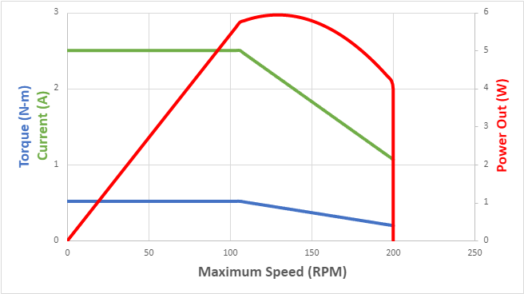

# VEX Motors

## VEX V5

### V5 Smart Motor (11W)

<figure><figcaption></figcaption></figure>

The VEX V5 Smart Motor is a [DC Motor ](../../electronics/general/dc-motor-basics.md)that converts stored electrical energy from the [VEX battery](vex-battery.md) into mechanical motion, and is controlled by the [V5 Brain](vex-v5-brain/).

The maximum continuous power output of the motor is 11W, and it can generate a maximum torque of 2.1 Nm. To maintain consistent performance across different motors and enable top speed even under heavy loads, the motor's free speed is software-limited by its processor. Metal gears are employed in high torque areas to ensure strength, while plastic gears are utilized in low-load, high-speed sections for smooth and efficient operation.

Users have the flexibility to change the internal gear cartridge, allowing for output gear ratios of 6:1, 18:1, and 36:1. The motor features a comprehensive internal circuit board with a full H-Bridge and its own Cortex M0 microcontroller, which monitors various parameters such as position, speed, direction, voltage, current, and temperature.

The microcontroller runs its own [PID (Proportional-Integral-Derivative)](../../software/control-algorithms/pid-controller.md) control system, which includes velocity control, position control, torque control, feedforward gain, and motion planning. PID calculations are performed internally at a 10-millisecond rate. VEX has pre-tuned the motor's PID values to ensure optimal performance under all operating conditions.

To manage heat and prevent unintended motor outages, the [stall](../../electronics/general/stalling.md) current is limited to 2.5A. This limitation eliminates the need for automatic resetting fuses ([PTC devices](../../electronics/general/resettable-fuse-ptc.md)) in the motor, which can disrupt operation. By restricting the stall current to 2.5A, the motor effectively avoids undesirable performance dips and ensures that users do not inadvertently cause stall situations.

Furthermore, the motor's internal temperature is constantly monitored for safety. If the motor approaches an unsafe temperature, the user receives a warning. In cases where the motor reaches its temperature limit, its performance is automatically reduced to prevent any damage from occurring.

#### Specs

|                                       | **V5 Smart Motor Specifications**                                                           |
| ------------------------------------- | ------------------------------------------------------------------------------------------- |
| Speed                                 | Approximately 100, 200 or 600 rpm                                                           |
| Peak Power                            | 11 W                                                                                        |
| Continuous Power                      | 11 W                                                                                        |
| Stall Torque (with 100 RPM cartridge) | 2.1 Nm                                                                                      |
| Low Battery Performance               | 100% Power Output                                                                           |
| Feedback                              | Position, Current, Voltage, Power, Torque, Efficiency, Temperature                          |
| Encoder                               | 1800 ticks/rev with 36:1 gears, 900 ticks/rev with 18:1 gears, 300 ticks/rev with 6:1 gears |
| Dimensions                            | 2.26” W x 2.82” L x 1.30” H, (57.3 mm W x 71.6 mm L x 33.0 mm H)                            |
| Weight                                | 0.342 lbs, 155 grams                                                                        |

### V5/EXP Smart Motor (5.5W)

<figure><figcaption></figcaption></figure>

The VEX V5/EXP Smart Motor is a [DC Motor ](../../electronics/general/dc-motor-basics.md)that converts stored electrical energy from the [VEX battery](vex-battery.md) into mechanical motion, and is controlled by the [V5 Brain](vex-v5-brain/). While similar to the VEX V5 Smart Motor, the V5/EXP Smart Motor has a maximum power of 5.5W, as opposed to the 11W of the V5 Smart Motor. Otherwise, the two motors have very similar functionality.

<figure><figcaption>
Graph and specs from kb.vex.com
</figcaption></figure>

The motor can deliver a continuous power output of 5.5W and produces a maximum torque of 0.5 Nm. To maintain consistent performance across different motors and ensure top-speed performance even under load, the motor's free speed is governed by its processor through software.

#### Specs

|                                       | **V5 Smart Motor Specifications**                                  |
| ------------------------------------- | ------------------------------------------------------------------ |
| Speed                                 | Approximately 200rpm                                               |
| Peak Power                            | 5.5 W                                                              |
| Continuous Power                      | 5.5 W                                                              |
| Stall Torque (with 100 RPM cartridge) | 0.5 Nm                                                             |
| Low Battery Performance               | 100% Power Output                                                  |
| Feedback                              | Position, Current, Voltage, Power, Torque, Efficiency, Temperature |
| Encoder                               | 900 ticks/rev                                                      |
| Dimensions                            | 2.25” W x 2.5” L x 1.3” H, (56.8mm W x 63.4mm L x 25.1mm H)        |
| Weight                                | 0.25 lbs, 114 grams                                                |

### Troubleshooting

One of the main issues that arises with the VEX V5 motors is dead motors. Many times, this means that a motor stops working often without any notice. Sometimes, the LED in the port compartment of a motor may flash red. This could be sign that the motor is dead, or there is a loose wire connection. A good idea to make sure a motor is dead is to test it with another wire and, if possible, test it with another [V5 Brain](vex-v5-brain/). If these steps are unsuccessful, there is as of right now no reproducible method of fixing a dead motor.

Static buildup in motors could be a reason for them dying suddenly. When this static buildup discharges (commonly referred to as electrostatic discharge, or ESD), the connected port on the [V5 Brain](vex-v5-brain/) may be permanently damaged. Please consider using our [ESD protection boards](../v5-esd-protection-board.md) to help ensure that you do not lose any ports on the [V5 Brain](vex-v5-brain/).

### Current Limiting

The VEX V5 Motors have a variable current limit that is determined by VEXos. Robots that use 8 or fewer 11W motors, the competition-legal max in VRC, will have a default current limit of 2.5A set for each motor. Robots using more than 8 motors, typical with VEXU teams, will have a lower default current limit per motor than 2.5A. That current limit is determined in VEXos by a calculation accounting for the number of motors plugged in, _and_ the user's manually set current limits. That calculation is described in [a Vex Forum post by James Pearman](https://www.vexforum.com/t/how-does-the-decreased-current-affect-the-robot-when-using-more-than-8-motors/72650/4) and used in the GUI below.&#x20;

The V5 Motor Current Calculator embedded below will display the VEXos current limit for each motor based on that calculation. Entering a value for the Current Limit field on any of the motors will limit that motor's current and recalculate the limits for the other motors.



####

## VEX Cortex Motors


This section refers to the old VEX Cortex Motors which are no longer competition legal.


Two-wire motors such as the 393 can be connected directly to the VEX Cortex by using one of the 2-wire motor connection ports. These motors can also be connected to a 3-wire port on either the Cortex or the VEX PIC Microcontroller by using a [VEX Motor Controller](../legacy/motor-controller.md). They also include internal [resettable fuses](../../electronics/general/resettable-fuse-ptc.md) that replace the now discontinued clutch that was needed to protect a 3-Wire Motor during a [stall](../../electronics/general/stalling.md).

While one might be tempted to design a mechanism based on the rated "stall" torque or free speed of the motor, **these are not actually realistic specifications**. For the most commonly used motors, the torque and speed at the points of maximum efficiency, power, and torque are listed. For the longest life and least power loss, motors should operate between the _maximum efficiency_ and _maximum power_ points during typical circumstances, with anything exceptional detected quickly by [operators](../../software/competition-specific/operator-control.md) or autonomous code. While running motors at the "maximum torque" operating point should not cause lasting damage, it wastes power and risks performance loss or a stall during routine operation.

Unfortunately, due to their nature, all VEX motor types are known to both cause and be affected by [Line Noise](../../electronics/general/line-noise.md).

The main workhorse of the VEX motion lineup, the **2-Wire Motor 393** is larger and has approximately 60% more torque than the visually similar 2-Wire Motor 269. These motors are primarily used in drive trains or heavy lifting scenarios. Only 4 motors of this type were allowed per robot in and before VEX Gateway, but in VEX Sack Attack and later, no restrictions are placed on the usage of this motor. Its high [Power Consumption](../../electronics/general/power-consumption.md) under load may cause problems if several 2-wire Motor 393s are used at the same time.

Despite the higher current consumption, these motors are more efficient and robust than the 2-Wire Motor 269 and actually consume less power for a given torque output than any similar motor. Care must only be taken that a [stall is detected](../../software/general/stall-detection.md) quickly.

The stock internal gears of the 2-Wire Motor 393 can be replaced with another set of "high speed" gears included with the motor. This reduces the output torque to the equivalent of a 2-Wire Motor 269, but increases the speed to 160 rpm, making it the fastest motor currently in production. Sets of replacement gears for both the low-speed and high-speed options are available separately as well.

| Operating Point    | Speed                 | Torque                               | Current                         |
| ------------------ | --------------------- | ------------------------------------ | ------------------------------- |
| Free (no load)     | 100 rpm _(160 rpm)\*_ | 0 **in**∗lbs                         | 0.15 A                          |
| Maximum Efficiency | 75 rpm _(120 rpm)\*_  | 3.7 **in**∗lbs _(2.25 **in**∗lbs)\*_ | 1.4 A                           |
| Maximum Power      | 50 rpm _(80 rpm)\*_   | 6.7 **in**∗lbs _(3.5 **in**∗lbs)\*_  | 2.5 A                           |
| Maximum Torque     | 40 rpm _(64 rpm)\*_   | 9.0 **in**∗lbs _(4.3 **in**∗lbs)\*_  | 3.0 A _(fuse trips eventually)_ |
| Stall              | 0 rpm                 | 13.5 **in**∗lbs _(8.4 **in**∗lbs)\*_ | 4.8 A _(fuse trips quickly)_    |

_\* Indicates specifications when using the "high speed" internal gearing option_

All motor specifications are at 7.2 volts. Actual motor specifications can fall within 20% of the values above.

### Teams Contributed to this Article:

* [BLRS](https://purduesigbots.com/) (Purdue SIGBots)
