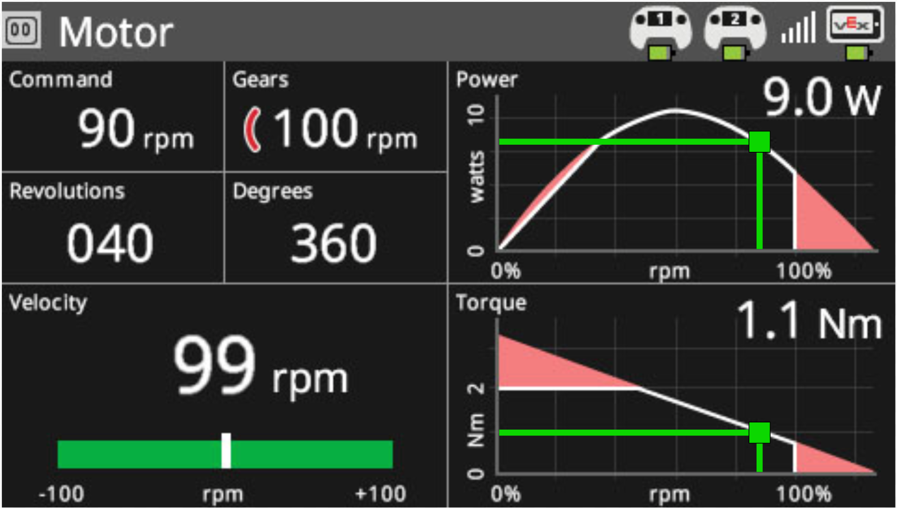
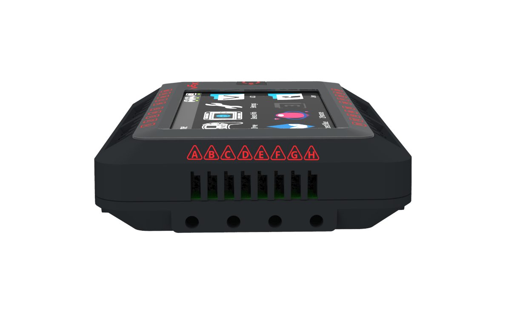

# VEX V5 Brain

.jpg>)

## Product Specs

|                    | **V5 Robot Brain Specifications**                               |
| ------------------ | --------------------------------------------------------------- |
| Motor Ports        | Any of the 21 Smart Ports                                       |
| Smart Sensor Ports | Any of the 21 Smart Ports                                       |
| Digital Ports      | Any of the 8 built-in 3-Wire Ports                              |
| Analog Ports       | Any of the 8 built-in 3-Wire Ports                              |
| VEXos Processor    | One Cortex A9 at 667 MHz Two Cortex M0 at 32 MHz each One FPGA1 |
| User Processor     | One Cortex A9 1333 Million Instructions per second (MIPS)       |
| RAM                | 128 MB                                                          |
| Flash              | 32 MB                                                           |
| User Program Slots | 8                                                               |
| USB                | 2.0 High Speed (480 Mbit/s)                                     |
| Color Touch Screen | 4.25”, 480 x 272 pixels, 65k colors                             |
| Expansion          | up to 16 GB, FAT32                                              |
| Wireless           | VEXnet 3.0 and Bluetooth 4.2                                    |
| System Voltage     | 12.8 V                                                          |
| Size               | 4.0” W x 5.5” H x 1.3” L (101.6 mm x 139.7 mm x 33.02 mm)       |
| Weight             | 0.63 lbs (285g)                                                 |

## Features

* Select and run one of 8 user programs
* Run built-in VEX programs
* Run practice matches
* Dark and Light Modes
* Screen rotation
* Dashboards

There is a built in dashboard for every connected sensor and device, from switches and potentiometers all the way up to motors and the battery.

## 3 Wire

The V5 Brain still has support for 3 wire devices. 3-Wire ports are now multi-purpose. Any 3-Wire port can be a digital input, digital output, analog input, or PWM motor control. A dedicated Cortex M0 microcontroller has the sole responsibility of reading inputs and toggling outputs. The data is reported to the user the moment it is measured. This means digital input changes trigger an immediate interrupt-based message to the user sensor memory to minimize latency. Analog inputs are pre-filtered for 5 milliseconds and then moved to the user sensor memory on a continual basis. The analog input is now 0-5V compatible to expand the number of compatible sensors. Future enhancements to the 3-Wire ports are planned to allow I2C and UART communication to non-VEX sensors as well.

| 3-Wire Specifications   | **V5 3-Wire Ports**                                                                |
| ----------------------- | ---------------------------------------------------------------------------------- |
| Digital Ports           | Use any of the 8 built-in 3-Wire Ports                                             |
| Analog Ports            | Use any of the 8 built-in 3-Wire Ports                                             |
| 3-Wire Expansion        | Add 8 more ports using a 3-Wire Expander. The 3-Wire Expander uses one Smart Port. |
| Message rate - digital  | On Change up to 1 kHz                                                              |
| Message rate - analog   | 5 mSec                                                                             |
| Digital Input           | High = 2.4 - 5.5 V Low = 0.0 - 1.0 V                                               |
| Digital Output          | High = 2.9 V min into a high impedance Low = 0.4 V max into a high impedance       |
| Analog Input            | 0 - 5 V                                                                            |
| Analog Input Resolution | 12-bit                                                                             |
| Power out               | 5v @ 2A total for all ports                                                        |

## Issues

The V5 has has some issues and other setback more can be seen in [V5 Electronics Observations](v5-electronics-observations.md).

## Future

VEX has stated that the V5 will bring a new batch of smart sensors:

* LiDAR
* 3-Wire Expander
* Rotation Sensor
* ~~The Bluetooth radio unlocks the ability of robot-to-robot communications along with custom iOS and Android apps written by users~~.

### Teams Contributed to this Article:

* [BLRS](https://purduesigbots.com) (Purdue SIGBots)
