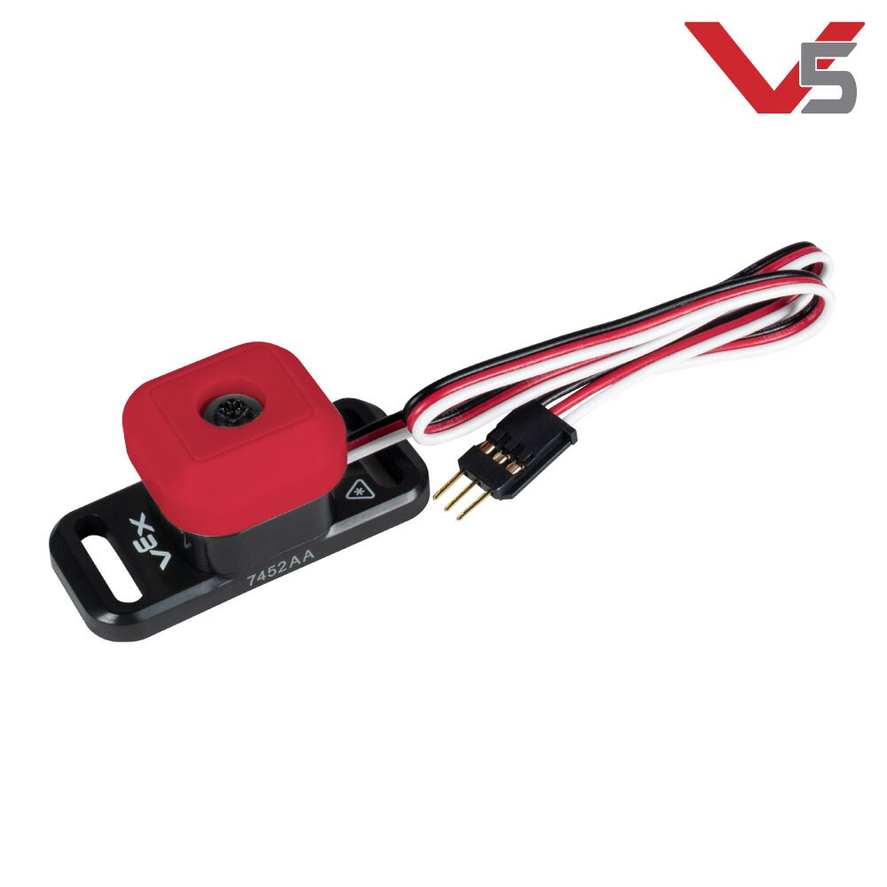

# Bumper Switch

The bumper switch is a pretty basic; in addition to being reliable and durable, it is easy to install and use. It falls into the category of “digital sensors,” meaning that it returns only two possible values: 1 or 0.

Triggering it requires a reasonable amount of force, so don’t plan to use this for a movement that will lightly touch or graze its target object.

There also used to be an older model that works the same exact way, but with a smaller button.

.png>)

## Teams Contributed to this Article:

* [BLRS](https://purduesigbots.com) (Purdue SIGBots)
