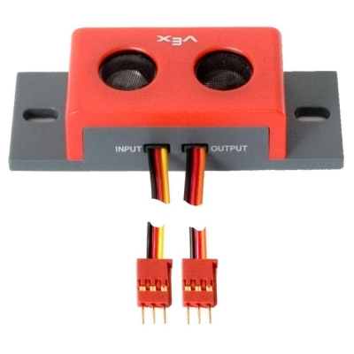

# Ultrasonic

The **VEX Ultrasonic Range Finder**, or simply the **VEX Sonar**, is a rangefinding device which uses pulses of high-frequency sound to estimate the distance to an object. It connects to the [VEX Cortex](../../legacy/vex-cortex.md) or [V5 Brain](../../vex-electronics/vex-v5-brain/) using two digital ports; one port to send a sound wave, and the other to receive it. The sensor runs continuously as long as it is being powered, meaning that even if no software is requesting the sensor's distance reading, it is still active. When the sensor is active, a faint and rapid ticking noise can be heard from the sensor.

In [VEXcode](../../../software/vex-programming-software/vex-coding-studio-vcs.md), the Ultrasonic Range Finder returns the distance in the unit of measure that the programmer chooses, since unit of measure is a parameter necessary to get the distance. However, in [PROS](../../../software/vex-programming-software/pros/), the Ultrasonic Range Finder returns the distance specifically in centimeters. The sensor's distance range is between 3cm and 300cm. According to the [VEX Robotics website](https://www.vexrobotics.com/276-2155.html), the sensor is sensitive enough to detect a pole with a diameter of 3cm at a distance greater than 2m.

Sound travels very slowly compared to the speed of a microprocessor clock. As such, distance is estimated by sending a 40kHz wave of sound lasting 250 microseconds via the ''OUTPUT'' signal. A change in the "INPUT" signal from high to low indicates that the wave has returned to the sensor. The equation for the Ultrasonic Range Finder's distance reading is $$d = t * 171.5$$ where "d" represents the distance between the sensor and the object found, "t" represents the time it took for the sound wave to return to the sensor, and 171.5 is half the speed of sound in meters per second.

Soft or rounded objects do not reflect sound as well and can confuse or elude the VEX Ultrasonic Range Finder. Using more than one VEX Ultrasonic Range Finder at a time can also cause interference.

## Teams Contributed to this Article:

* [BLRS](https://purduesigbots.com/) (Purdue SIGBots)
* [904U](https://www.youtube.com/channel/UCKvtsL9hJ\_x7bqrpl3nJ3Gg/) (B.E.S.T.I.E. Robotics)
