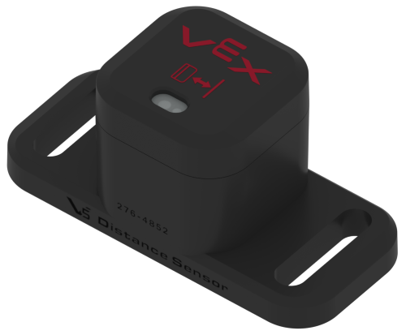

# Distance Sensor

## V5 Distance Sensor

The **V5 Distance Sensor** is a rangefinder which uses a Class 1 Laser reflecting off of an object to determine distance. It connects to the [V5 Brain](../../vex-electronics/vex-v5-brain/) through a Smart Port on the top of the sensor.

The Distance Sensor can return three types of data: the distance between the sensor and an object, the object's size, and the object's approach velocity. In [PROS](../../../software/vex-programming-software/pros/), the Distance Sensor can additionally return a "confidence" reading, which rates how accurate the distance returned from the sensor actually is on a scale from 0 - 63.

The range of the Distance Sensor's readings is between 20mm and 2,000mm. However, under optimal conditions, the Distance Sensor can push past the 2,000mm limit, occasionally reaching distances up to 2,100mm.

In order to measure the distance between an object and the sensor, the Distance Sensor's laser uses a method called "time of flight". An internal clock measures the time at which the laser is sent out, and the time at which the light receptor (also inside the sensor) receives the laser. The equation for time of flight is $$d = t / (2 * 2.998 * 10^8)$$ where "d" is the distance reading in meters and "t" is the time it takes for the laser to hit the light receptor in seconds. The accuracy of this sensor is limited, as it has around a 5% accuracy beyond 200 mm, and a +/- 15mm error with distances closer than 200mm meters.

the velocity of an object in relation to the sensor is calculated by taking the delta value of the distance divided by a small period of time.

### Teams Contributed to this Article:

* MTBR (Michigan Task Based Robotics)
* [904U](https://www.youtube.com/channel/UCKvtsL9hJ\_x7bqrpl3nJ3Gg) (B.E.S.T.I.E. Robotics)

