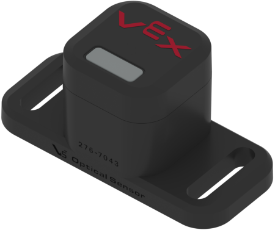

# Optical Sensor

The  **VEX V5 Optical** **Sensor** can be used to determine the color of an object or to detect gestures. It connects to the [V5 Brain](../../vex-electronics/vex-v5-brain/) through a Smart Port located at the top of the sensor.

The Optical Sensor possesses the ability to take in light and, based on this, determine the color of an object. It also utilizes infrared light, reflecting it off of an object in front of it to determine the proximity and directional movement of the object. Its color detecting feature works best if the object is closer than 100mm. One especially useful feature of the sensor is that it possesses a programmable white LED light. The LED can assist in occluding ambient lighting in order to minimize the amount of calibration needed for the sensor in preparation for a tournament, since lighting will vary drastically in different venues. Additionally, this LED functions with analog inputs, meaning users can set the brightness percentage of the LED from 0 - 100%.

When programming, the most ideal way to determine the color of an object using this sensor is to utilize its hue readings. While it is possible to obtain the RGB color of the object, it might be too difficult to discern what color the object might be because you have three values, all of which are additive towards each other, to interpret.

Hue is determined based on a color wheel. However, because this color wheel is a circle, there can be 360 degrees marked for each different color on the color wheel. This means that whenever you are programming, the sensor will return values in degrees with a range from 0 - 360, meaning a hue of between 350 and 10 is red. Because the range of colors is so large, it's better and simpler to be able to have a range of colors via hue to account for any ambient lighting differences that may change the hue readings.&#x20;

There are a few minor differences for the Optical Sensor's API in [VEXcode](../../../software/vex-programming-software/vex-coding-studio-vcs.md) and [PROS](../../../software/vex-programming-software/pros/). VEXcode allows the user to directly determine the color of an object, a feature which is not present in PROS. Of course, both programs still allow the user to obtain the hue and [RGB](https://en.wikipedia.org/wiki/RGB\_color\_model) value of the object. Unlike VEXcode, PROS is able to return the saturation of an object. Combined with brightness, it's entirely possible that PROS users could create an [HSV](https://en.wikipedia.org/wiki/HSL\_and\_HSV) value from this if necessary. PROS is also exclusively able to obtain an analog proximity reading from 0 - 255 (low values represent an object that's far, high values represent an object that's close) whereas VEXcode only tells whether an object is near the sensor or not.

## Teams Contributed to this Article:

* MTBR (Michigan Task Based Robotics)
* [BLRS](https://purduesigbots.com/) (Purdue SIGBots)
* [904U](https://www.youtube.com/channel/UCKvtsL9hJ\_x7bqrpl3nJ3Gg) (B.E.S.T.I.E. Robotics)
