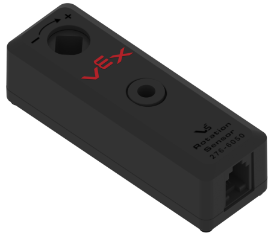

# Rotation Sensor

### Functionality

The  **V5 Rotation Sensor** is an smart sensor to determine the angle bound by \[0,36000) and the position in centidegrees, as well as the angular velocity in centidegrees / second.  The sensor connects to the [V5 Brain](../../vex-electronics/vex-v5-brain/) through a smart port, and functions similarly to a[ encoder](../3-pin-adi-sensors/encoder.md) or [potentiometer](../3-pin-adi-sensors/potentiometer.md).&#x20;

### How it Works

The measurement component of the sensor is comprised of a Hall Effect sensor that measures the magnetic field of 2 magnets to track the absolute angle (\[0,36000)) of the rotation sensor. The angle resets every full rotation of the rotation sensor. A chip inside the rotation sensor (a Cortex M0+) then keeps track of the total rotations which acts as the relative position measurement, which does not reset every rotation.

Since the rotation sensor angle ([get\_angle](https://pros.cs.purdue.edu/v5/pros-4/group__cpp-rotation.html#gac675e49bc52b4b25ce2351742b69b6cb)) is absolute, as it's based on the magnetic field generated, the angular position of the shaft will not reset when it loses power. However, since the chip loses power the position ([get\_position](https://pros.cs.purdue.edu/v5/pros-4/group__cpp-rotation.html#ga28a657dab4a1609b0bddc8ba0c345b57)), which is relative, of the rotation sensor is not tracked and it resets to zero every time the sensor is turned on.

#### Teams/Individuals Contributed to this Article:

* Alyssa Agarie (Former VEX Competitor)
* [BLRS](https://purduesigbots.com/) (Purdue SIGBots)
