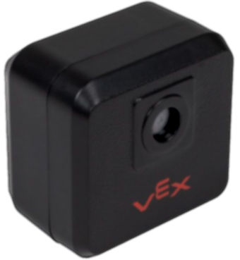

# GPS Sensor

## Sensor Description

The  VEX V5 GPS Sensor is a next step for getting robot position data with the VEX ecosystem. The sensor does have some confusion amongst the community.&#x20;

The name "GPS" can be misleading. It is not like the Global Positioning System, which uses time-of-flight from many known points(satellites) to determine position. The VEX GPS uses a QR-like system to develop unique patterns at different locations around the field. An onboard camera in the sensor can then determine position based on the sequence shown, and the relative size of the sequence.&#x20;

Second, the GPS is not a "learning failure" for robot positioning. Many in the community have wrongly assumed that this is not preparing students for a university education or a workforce position. Wheel/Encoder-based Odometry is not being widely used anymore, instead a QR based location system is being preferred as it is cheaper and does not have the potential for drift error. While the mathematical foundation of Wheel/Encoder-based Odometry is still important, the VEX GPS allows students and educators to work with modern equipment to determine robot position.&#x20;

​

## How it works

The GPS contains a camera and an integrated [IMU](https://app.gitbook.com/o/-M7yKuZ9tKe3dQn\_jauL/s/-M7yGVyBrcpSR8SDSikj/\~/changes/-Mh-onBeL4BrNyOz8rkD/vex-electronics/vex-sensors/smart-port-sensors/imu) as well as a camera to determine location. The IMU uses gyroscopic movement to track position, which is then cross referenced with the GPS's camera that tracks the wall strip around the field, by the corners of the black squares on the strip.

More information about this algorithm can be found on this patent document [here](https://docs.google.com/viewerng/viewer?url=https://patentimages.storage.googleapis.com/4f/74/30/eccf334da0ae38/WO2020219788A1.pdf).

## Use and Operation

.png>)

The VEX GPS sensor is remarkably simple to install and operate, Just make sure that the sensor is vertically on the same plane as the field strips, or roughly 10.5 inches off of the ground, and initial position values on field and offset values from center of rotation on robot are set correctly. The sensor's position, heading, total degrees rotated throughout the match can be then retrieved from it via whatever API the programming platform used provides.&#x20;

.png>)


PROS Documentation for GPS Sensor


Robot Position is the most fundamental data to use for autonomy, check out the [odometry article](../../../software/general/sensors-and-odometry-in-autonomous.md) to learn how to use this data effectively, and to see what type of algorithms this sensor abstracts.

## Deadzone

.png>)

Unfortunately, like all camera-based sensing, there is an effective range for the VEX GPS. The measured deadzone is shown to end at approximately 13.5 inches away from the wall. The signal also does not become clear until approximately 20 inches away from the wall. There is an onboard IMU to help with the deadzone and inconsistent read areas, but the accuracy is limited outside of the effective range. The end of the range is beyond 12 feet and is not an issue within the VEX field. &#x20;

#### Teams Contributed to this Article:

* Purdue SIGBots (BLRS)
* MTBR
